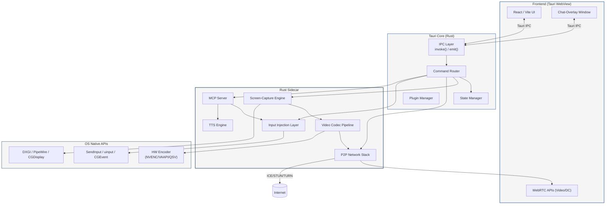
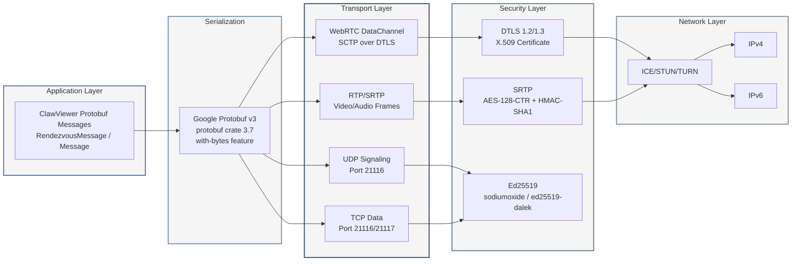
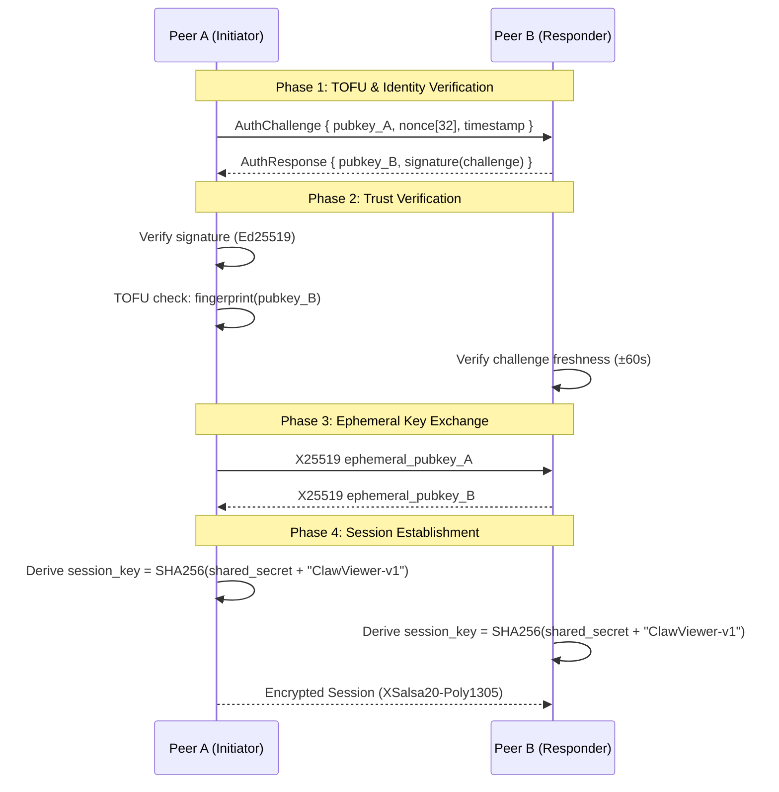
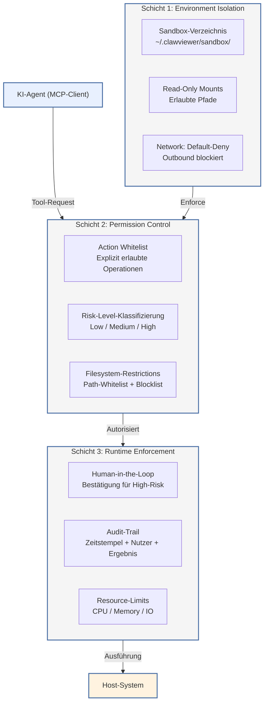
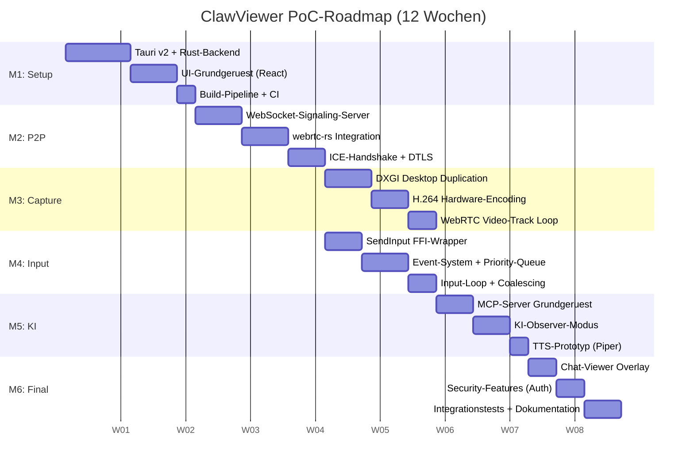

# ClawViewer – Technische Architektur-Dokumentation

## KI-gestutzte Remote-Desktop-Control-App mit P2P-Architektur und MCP-Server-Integration

**Projekt**: ClawViewer
**Version**: 1.0
**Datum**: 5. Juni 2026
**Autoren**: Multi-Agent Research & Writing Pipeline

---

## Executive Summary

### Projektziel und Kerninnovation

ClawViewer ist eine moderne, Open-Source-Remote-Desktop-Control-Anwendung, die drei bisher getrennte Technologiebereiche integriert: echte Peer-to-Peer-Remote-Desktop-Verbindungen, KI-gestutzte Co-Pilot-Funktionalitat und bidirektionale Human-plus-AI-Steuerung. Im Gegensatz zu klassischen Remote-Desktop-Tools, die entweder auf Client-Server-Architekturen oder einfache VNC-Pipes setzen, ermoglicht ClawViewer es beliebigen Nutzern (Mensch oder KI-Agent), sich direkt miteinander zu verbinden und gleichzeitig denselben Desktop zu steuern – wobei ein Event-Prioritatssystem sicherstellt, dass menschliche Eingaben stets Vorrang haben.

Die Kerninnovation liegt in der Architektur: Ein Tauri-v2-Desktop-Client (Rust-Backend, React-Frontend, ~5–15 MB Bundle) nutzt WebRTC fur P2P-Verbindungen mit automatischem NAT-Traversal, wahrend ein integrierter MCP-Server (Model Context Protocol) KI-Agenten den kontrollierten Zugriff auf den Remote-Desktop ermoglicht. Die Anwendung unterstutzt drei Einklink-Modi – Observer (KI sieht nur zu), Shared (gleichzeitige Steuerung mit Ghost-Cursor) und Full-Control (KI mit Sicherheits-Safeguards) – und implementiert eine lokale Text-to-Speech-Engine fur KI-Sprachausgabe.

### Vier Deliverables im Uberblick

Diese Dokumentation liefert vier integrierte Deliverables, die aus einer 12-dimensionalen Deep-Research-Phase mit uber 280 Web-Searches und der Analyse von sechs Open-Source-Projekten hervorgegangen sind:

**Deliverable 1 – Technische Architektur-Dokumentation** (Kapitel 1): Beschreibt die vollstandige Systemarchitektur mit Komponenten-Diagrammen, P2P-Handshake-Protokoll, Screen-Capture-Pipeline (DXGI/PipeWire), Event-Priorisierungssystem (P0–P3), MCP-Server-Integration und Chat-Viewer. Die Architektur basiert auf dem bewahrten Blueprint von RustDesk (hbbs/hbbr, Ed25519-Auth) und erganzt diesen mit WebRTC-NAT-Traversal und KI-Agent-Integration.

**Deliverable 2 – Sicherheitskonzept** (Kapitel 2): Definiert eine vierlagige Defense-in-Depth-Architektur: Ed25519-Kryptografie fur Transportsicherheit, sessionspezifische Einmalpassworter (6-stellige alphanumerische Worter oder 12-stellige Tokens) mit automatischer Rotation, OS-Keyring-Integration fur API-Key-Speicherung (BYOK: Bring Your Own Key) und eine dreischichtige KI-Sandbox mit Risk-Level-Klassifizierung und Human-in-the-Loop-Bestatigung fur alle High-Risk-Aktionen.

**Deliverable 3 – Code-Analyse-Report** (Kapitel 3): Analysiert sechs Open-Source-Projekte auf Quellcode-Ebene – RustDesk (P2P-Server und Client), FreeRDP (RDP-Protokoll-Implementierung), UltraVNC/TightVNC/LibVNCServer (RFB-Protokoll), xrdp (Linux RDP-Server mit Session-Management) und Remmina (Multi-Protokoll-Client mit Plugin-System). Extrahiert 113 konkrete Code-Referenzen und sechs wiederverwendbare Design-Patterns als direkte Blueprints fur die ClawViewer-Implementierung.

**Deliverable 4 – Proof-of-Concept-Plan** (Kapitel 4): Spezifiziert einen 12-wochigen Entwicklungsplan mit sechs zweiwochentlichen Meilensteinen, der von Tauri-Projekt-Setup (Woche 1–2) uber P2P-Verbindungsaufbau (Woche 3–4), Windows-Screen-Capture (Woche 5–6), Input-Injection (Woche 7–8), MCP-Server-Integration (Woche 9–10) bis zur Cross-Platform-Testphase (Woche 11–12) fuhrt. Definiert acht technische Risiken mit Mitigationen und quantifizierte Erfolgskriterien (<50 ms Video-Latenz, <10 ms Input-Latenz, >95% P2P-Stabilitat).

### Kernerkenntnisse aus der Recherche

Die 12-dimensionale Recherchephase, die uber 280 Web-Searches und die Analyse von sechs GitHub-Repositories umfasste, hat zehn cross-dimensionale Insights hervorgebracht, die die Architekturentscheidungen von ClawViewer pragen:

1. **RustDesk als Master-Blueprint**: Die Kombination aus Google Protobuf v3 fur das Wire-Protokoll, tokio fur asynchrone Netzwerkoperationen und ed25519-dalek fur Kryptografie in RustDesk bildet ein vollstandiges, produktionsreifes Muster, das sich direkt auf ClawViewer ubertragt.

2. **Plugin-Architektur = Multi-Controller-Architektur**: Remminas Plugin-Service-Pattern und xrdps dynamisches Modul-System demonstrieren das gleiche Pattern, das fur Human-plus-AI-Steuerung benotigt wird – ein Core-System delegiert Aktionen an registrierte Controller.

3. **Tauri + webrtc-rs als optimaler Stack**: Tauri v2's IPC-System ermoglicht die saubere Trennung zwischen Web-Frontend (UI) und Rust-Backend (P2P, Capture, Input). WebRTC-Signaling im Frontend, P2P-Transport im Backend via webrtc-rs.

4. **MCP-Server als universelle KI-Integrations-Schicht**: Das Model Context Protocol standardisiert die KI-Agenten-Anbindung und decoupled Sicherheitsentscheidungen von der UI-Implementierung.

5. **Event-Priorisierung als Differenzierungsfaktor**: Keines der analysierten Open-Source-Projekte implementiert echte bidirektionale gleichzeitige Steuerung mit Priorisierung. Forschung zu Shared Autonomy zeigt, dass Level-2-Interleaving die beste Success Rate (80%) erzielt.

6. **Cross-Platform-Input als FFI-Schichten-Problem**: Enigo-ahnliche Abstraktion uber Tauri's FFI mit plattformspezifischen Rust-Modulen (SendInput, uinput, CGEvent) ist das bewahrte Pattern.

7. **TTS lokal, nicht remote**: Piper TTS (~120 ms Latenz auf Intel i5) als lokale Engine mit direkter Audio-Wiedergabe via rodio/cpal, nicht als WebRTC-Stream.

8. **Screen-Capture-Codec-Pipeline vollstandig in Rust**: Capture -> Encode -> Packetize als Rust-interne Pipeline, Frontend empfangt nur WebRTC-Video-Frames.

9. **Chat als DataChannel-Overlay**: Chat-Nachrichten uber denselben WebRTC-DataChannel wie Input-Events, mit separatem Message-Type, keine zusatzliche Verbindung notig.

10. **Security-First durch Schichtentrennung**: Ed25519 (Transport) + Session-Passworter (Auth) + OS-Keyring (Credentials) + MCP-Sandbox (KI-Sicherheit) als vier unabhangige, auditierbare Schichten.

---

## 1. Technische Architektur-Dokumentation

### 1.1 Systemubersicht und Komponenten-Architektur

#### 1.1.1 Gesamtarchitektur

ClawViewer ist als Tauri v2 Desktop-Anwendung mit einem Rust-Backend und einem React-Frontend konzipiert. Das resultierende Anwendungsbundle erreicht eine Grösse von 3–15 MB ^1^ ^2^, was gegenuber Electron-basierten Alternativen (120–200 MB) eine Reduktion um den Faktor 10–40 darstellt. Die Architektur folgt einem mehrschichtigen Muster, das Web-Technologien fur die Benutzeroberflache mit nativem Rust-Code fur performancekritische Operationen verbindet ^3^.

Die zentrale Designentscheidung besteht in der Trennung zwischen dem Renderer-Prozess (WebView-basierte UI) und dem Main-Prozess (Tauri Core in Rust). Der Renderer-Prozess hostet das React-Frontend und kommuniziert uber Tauris IPC-System (Inter-Process Communication) mit dem Rust-Backend. Diese Trennung erlaubt es, sicherheitskritische und performancekritische Komponenten – wie Screen-Capture, P2P-Netzwerk und Input-Injection – in Rust zu implementieren, wahrend die UI die Flexibilitat von React nutzt ^4^.

Zusatzlich zum Hauptfenster existiert ein Rust-Sidecar-Prozess, der Screen-Capture, P2P-Netzwerkoperationen und Input-Injection kapselt. Dieser Sidecar ist notwendig, da WebViews aufgrund von Sandboxing-Restriktionen keinen direkten Zugriff auf System-APIs wie DXGI Desktop Duplication oder virtuelle Eingabegerate haben. Tauri v2 nutzt Tokio als Async-Runtime ^5^ ^6^, was eine nahtlose Integration mit async-fahigen Rust-Crates wie webrtc-rs oder str0m ermoglicht.

#### 1.1.2 Kernkomponenten

Die ClawViewer-Architektur umfasst sechs Kernkomponenten, die uber definierte Schnittstellen miteinander kommunizieren:

Die **Screen-Capture-Engine** erfasst Bildschirminhalte auf OS-Ebene. Unter Windows nutzt sie die DXGI Desktop Duplication API mit Hardware-beschleunigtem Capture ^7^, unter Linux PipeWire mit DMA-BUF fur Wayland ^8^und unter macOS CGDisplayStream. Die Capture-Latenz betragt fur 1080p-Auflosung typischerweise 1–3 ms ^7^.

Die **Video-Codec-Pipeline** kodiert die erfassten Frames in Echtzeit. Sie unterstutzt H.264, VP9 und AV1 mit automatischer Hardware-Encoder-Selektion ^9^. Die Priorisierung folgt dem Schema H.265 > H.264 > AV1 > VP9 > VP8, wobei Hardware-Encoding gegenuber Software-Codecs bevorzugt wird ^9^.

Der **P2P-Netzwerk-Stack** basiert auf WebRTC und implementiert NAT-Traversal mittels STUN/TURN/ICE. Die Rust-Implementierung verwendet webrtc-rs oder str0m ^10^ ^11^fur den Protokoll-Stack. Die Signalisierung erfolgt uber einen Rendezvous-Server im Stil von RustDesks hbbs ^12^.

Die **Input-Injection-Layer** simuliert Maus- und Tastaturereignisse auf dem Zielsystem. Sie abstrahiert OS-spezifische APIs uber ein enigo-ahnliches Interface: Windows SendInput ^13^, Linux uinput/XTest und macOS CGEvent ^14^.

Der **MCP-Server** (Model Context Protocol) stellt die Integrationsschicht fur KI-Agenten dar. Er kommuniziert uber JSON-RPC 2.0 via stdio oder SSE und exponiert 40+ Tools fur Bildschirmsteuerung und -analyse ^15^ ^16^.

Die **TTS-Engine** (Text-to-Speech) wandelt KI-Ausgaben in gesprochene Sprache um. Als primare Engine dient Piper uber das piper-rs Crate mit einer Latenz von ca. 120 ms auf Intel-i5-Hardware ^17^ ^18^, unterstutzt durch Cloud-Fallbacks (OpenAI TTS, ElevenLabs).

#### 1.1.3 Komponenten-Diagramm und Schnittstellen

Das folgende Diagramm zeigt die Module und ihre Schnittstellen:



Die nachfolgende Tabelle fasst die Komponenten, ihre Technologien und Verantwortlichkeiten zusammen:

| Komponente | Primartechnologie | Schnittstelle | Verantwortlichkeit |
|:---|:---|:---|:---|
| Screen-Capture-Engine | DXGI (Win), PipeWire (Linux), CGDisplay (macOS) | Rust FFI zum OS | Hardware-beschleunigte Bildschirmerfassung, 1–3 ms Latenz fur 1080p ^7^ ^8^|
| Video-Codec-Pipeline | hwcodec (FFmpeg), vpx, aom | Rust intern | H.264/VP9/AV1-Encoding mit Auto-Selektion, Frame-Pacing fur <50 ms E2E-Latenz ^9^|
| P2P-Netzwerk-Stack | webrtc-rs oder str0m, tokio | WebRTC DataChannel + Tauri IPC | NAT-Traversal, verschlusselter Transport, <100 ms P2P-Latenz ^10^ ^11^|
| Input-Injection-Layer | enigo-ahnliche Abstraktion | Tauri Commands + MCP | OS-native Eingabesimulation mit Event-Priorisierung P0–P3 ^13^ ^14^|
| MCP-Server | rmcp Crate, JSON-RPC 2.0 | stdio / SSE | KI-Agent-Integration, 40+ Tools, Safety-Safeguards ^15^ ^16^|
| TTS-Engine | piper-rs, rodio, cpal | Rust intern + Tauri Events | Lokale Sprachsynthese, ~120 ms Latenz, Audio-Wiedergabe ^17^ ^19^|

Die Architektur trennt klar zwischen der UI-Schicht (React im WebView), der Vermittlungsschicht (Tauri Core mit IPC und State Management) und der Ausfuhrungsschicht (Rust Sidecar mit OS-nativen APIs). Diese Drei-Schichten-Architektur ermoglicht unabhangige Testing, sicherheitskritische Isolierung und plattformspezifische Optimierung ohne Code-Duplikation.

#### 1.1.4 Prozess-Architektur

ClawViewer nutzt drei Prozesstypen, die durch Tauri v2 verwaltet werden:

Der **Main-Prozess** (Tauri Core) ist der Elternprozess, der das gesamte Anwendungsleben verwaltet. Er hostet den Command Router, das State Management und den Plugin Manager. Der Main-Prozess hat vollen Zugriff auf das Dateisystem, das Netzwerk und OS-native APIs ^4^.

Der **Renderer-Prozess** ist der WebView-Prozess, der die React-UI rendert. Jeder WebView lauft in einem separaten Renderer-Prozess mit eingeschrankten Berechtigungen. Fur ClawViewer existieren mindestens zwei WebView-Instanzen: das Hauptfenster (Screen-View) und das Chat-Overlay ^20^ ^21^.

Der **Rust-Sidecar** ist ein separater Prozess, der die performancekritischen Komponenten (Screen-Capture, P2P, Input-Injection) isoliert. Diese Isolierung ist notwendig, da Screen-Capture-Operationen unter Umstanden den Renderer-Prozess blockieren konnten. Der Sidecar kommuniziert uber Tauris Channel-API mit dem Main-Prozess ^4^.

### 1.2 P2P-Architektur und NAT-Traversal

#### 1.2.1 RustDesk-ahnliche P2P-Struktur

ClawViewer adaptiert die bewahrte P2P-Architektur von RustDesk, die aus drei Kernkomponenten besteht: dem Rendezvous-Server (hbbs-Analog), dem optionalen Relay-Server (hbbr-Analog) und der direkten Peer-Verbindung ^12^. Diese Struktur wurde in RustDesk uber mehrere Jahre produktiv erprobt und skaliert auf Millionen von Verbindungen.

Der **Rendezvous-Server** koordiniert die Peer-Discovery und das Signaling. Er lauft auf UDP-Port 21116 und TCP-Port 21116 und verwaltet die Registrierung von Peers uber protobuf-basierte Nachrichten ^22^. Jeder Peer registriert sich mit einer eindeutigen ID und seinem Ed25519-Public-Key. Der Server speichert Peer-Informationen sowohl im Speicher (HashMap) als auch persistent in SQLite ^23^ ^24^.

Der **Relay-Server** dient als Fallback, wenn die direkte P2P-Verbindung aufgrund von symmetrischem NAT oder Firewall-Restriktionen nicht moglich ist. Er leitet Daten bidirektional zwischen zwei Peers weiter und nutzt dabei Bandwidth-Limiting (1 Gbps Gesamt, 128 Mbps pro Verbindung) ^25^.

Die **direkte Peer-Verbindung** wird nach erfolgreichem NAT-Traversal aufgebaut und ubertragt alle Mediendaten (Video, Audio, Input-Events, Chat) ohne Umweg uber einen Server. Dies minimiert die Latenz und maximiert den Datendurchsatz.

#### 1.2.2 NAT-Traversal mit STUN/TURN/ICE

Das NAT-Traversal in ClawViewer basiert auf dem ICE-Framework (Interactive Connectivity Establishment), das STUN- und TURN-Server koordiniert ^16^. Die Implementierung nutzt entweder webrtc-rs ^11^oder str0m ^10^, beides produktionsreife Rust-Implementierungen des WebRTC-Standards.

**STUN** (Session Traversal Utilities for NAT) ermoglicht es Peers, ihre offentliche IP-Adresse und Port zu ermitteln. Ein STUN-Server wird als korrekt funktionierend betrachtet, wenn er Candidates vom Typ `srflx` (server reflexive) generieren kann ^26^.

**TURN** (Traversal Using Relays around NAT) bietet einen Fallback-Mechanismus, wenn direkte P2P-Verbindungen nicht moglich sind. Der TURN-Server weist dem Client eine Relay-Adresse zu, uber die der gesamte Medien-Traffic geleitet wird ^27^. Fur ClawViewer kommt turn-rs ^28^als reine Rust-Implementierung infrage, die einen Single-Thread-Durchsatz von bis zu 5 GiB/s und eine Forwarding-Latenz unter 35 Mikrosekunden erreicht ^29^.

**ICE** sammelt drei Kategorien von Candidates: Host Candidates (lokale IPs), Server Reflexive Candidates (uber STUN ermittelte offentliche IPs) und Relay Candidates (uber TURN zugewiesene Adressen). Die Candidate-Paare werden nach Prioritat gepruft: Host-Host-Verbindungen haben die hochste Prioritat (Type Preference 126), gefolgt von Server Reflexive (100) und Relay (0) ^30^ ^31^.

Das ICE Transport State Management folgt einer strengen Zustandsmaschine: `new` -> `checking` -> `connected` -> `completed` ^15^. Kritische Ruckwartsubergange (Back Edges) sind der Ubergang von `connected` zu `checking` bei Consent-Widerruf und von `connected` zu `disconnected` bei transienten Netzwerkunterbrechungen.

#### 1.2.3 Verbindungsaufbau: 6-Schritt-Handshake

Der Verbindungsaufbau zwischen zwei ClawViewer-Peers folgt dem RustDesk-Punch-Hole-Handshake ^22^ ^32^:

**Schritt 1 – RegisterPeer:** Beide Peers registrieren sich beim Rendezvous-Server uber UDP. Die Nachricht enthalt die Peer-ID und eine Seriennummer. Der Server antwortet mit `RegisterPeerResponse`, das bei Bedarf eine Public-Key-Registrierung anfordert ^22^.

**Schritt 2 – PunchHoleRequest:** Der initierende Peer (A) sendet eine `PunchHoleRequest` an den Rendezvous-Server mit der ID des Ziel-Peers (B). Die Nachricht enthalt den NAT-Typ des Initiators, einen optionalen Lizenzschlussel und den Verbindungstyp ^22^.

**Schritt 3 – PunchHole:** Der Server leitet eine `PunchHole`-Nachricht an Peer B weiter. Diese enthalt die offentliche Adresse von A sowie die Adresse des Relay-Servers als Fallback ^22^.

**Schritt 4 – PunchHoleSent:** Peer B bestatigt den Erhalt durch `PunchHoleSent` an den Server. B initiiert gleichzeitig einen TCP-Verbindungsversuch zu seiner eigenen Adresse uber denselben lokalen Port, den er fur die Serverkommunikation nutzt – dies ist die zentrale Lochbohr-Technik ^32^.

**Schritt 5 – PunchHoleResponse:** Der Server leitet Bs Bestatigung an A weiter, erganzt um Bs offentliche Adresse und den signierten Public-Key (`IdPk`-Signatur mit Ed25519) ^22^.

**Schritt 6 – Direct Connect:** A versucht eine direkte TCP-Verbindung zu B. Gleichzeitig fuhrt B UDP-Hole-Punching durch, falls aktiviert. Bei Erfolg entsteht eine direkte P2P-Verbindung; bei Misserfolg erfolgt der Fallback auf Relay ^32^.

Sind beide Peers im selben lokalen Netzwerk, optimiert der Server den Verbindungsaufbau durch direkten Austausch der lokalen Adressen via `FetchLocalAddr` statt Hole Punching ^22^.

#### 1.2.4 Protokoll-Stack

Das folgende Diagramm zeigt den vollstandigen Protokoll-Stack von ClawViewer:



ClawViewer verwendet **Google Protocol Buffers v3** als Wire-Format fur alle Signalisierungsnachrichten. Die `RendezvousMessage` ist als `oneof`-Union definiert und enthalt alle moglichen Nachrichtentypen vom `RegisterPeer` bis zum `RequestRelay` ^33^. Nach dem Verbindungsaufbau wird ein separates `Message`-Protokoll fur die eigentlichen Remote-Desktop-Daten (VideoFrames, MouseEvents, KeyEvents, AudioFrames, Clipboard) verwendet ^34^. Die Serialisierung nutzt das `protobuf`-Crate (Version 3.7) mit dem `with-bytes`-Feature, das Zero-Copy-Deserialisierung via `Bytes` und `BytesMut` ermoglicht ^35^.

Der Transportlayer verwendet **WebRTC** mit **DTLS-SRTP** fur die Verschlusselung. Der DTLS-Handshake findet uber den von ICE verifizierten Pfad statt: SDP-Fingerprint-Exchange, ClientHello/ServerHello, Zertifikatsverifikation und Schlusselableitung via `use_srtp`-Extension ^6^. Alle nachfolgenden Medienpakete werden mit AES-128-CTR verschlusselt und mit 80-bit HMAC-SHA1 authentifiziert. Das WebRTC-Okosystem migriert aktiv von DTLS 1.2 zu DTLS 1.3 (RFC 9147), wobei DTLS 1.3 den Handshake von zwei auf einen Round-Trip reduziert ^6^.

#### 1.2.5 Port-Konfiguration und Netzwerk-Topologie

| Komponente | Port | Protokoll | Funktion |
|:---|:---|:---|:---|
| Rendezvous-Server (hbbs) | 21115/tcp | TCP | NAT-Typ-Test ^22^|
| Rendezvous-Server (hbbs) | 21116/udp | UDP | Haupt-Signaling (RegisterPeer, PunchHole) ^22^|
| Rendezvous-Server (hbbs) | 21116/tcp | TCP | TCP-Hole-Punching + Verbindungsservice ^22^|
| Relay-Server (hbbr) | 21117/tcp | TCP | Daten-Relay mit Bandwidth-Limiting ^25^|
| WebSocket (hbbs) | 21118/tcp | TCP | WebSocket fur Web-Client-Konnektivitat ^22^|
| WebSocket (hbbr) | 21119/tcp | TCP | WebSocket-Relay fur Web-Clients ^25^|

Die Port-Belegung folgt direkt dem RustDesk-Schema ^12^, das sich in der Praxis bewahrt hat. Der Rendezvous-Server hort auf drei TCP-Ports und einen UDP-Port gleichzeitig, wobei `tokio::select!` alle Listener in einer einzigen Event-Loop bedient ^22^. Die WebSocket-Ports ermoglichen die Konnektivitat von Web-Clients, die das Tauri-Frontend via WebView2 (Windows) oder WebKit (macOS) nativ unterstutzt.

### 1.3 Screen-Capture und Video-Pipeline

#### 1.3.1 Windows: DXGI Desktop Duplication API

Auf Windows-Systemen nutzt ClawViewer die DXGI Desktop Duplication API als primaren Capture-Mechanismus ^7^. Diese API, die Teil von DirectX 11 ist, erfasst nur geanderte Bildschirmbereiche (Deltas) statt des gesamten Frames, was die Bandbreite massiv reduziert.

Die Initialisierung erstellt ein D3D11-Device, das mit dem Adapter des Ziel-Displays verbunden ist. Anschliessend wird `DuplicateOutput()` aufgerufen, um die Desktop-Duplication-Session zu starten ^7^. Bei Fehlern (z.B. Remote-Desktop-Sitzung ohne GPU-Zugriff) erfolgt ein automatischer Fallback auf GDI (BitBlt).

Frames werden uber `AcquireNextFrame()` abgerufen. Die GPU-Texture wird bei Bedarf in CPU-lesbaren Staging-Speicher kopiert ^7^. Bei rotierten Displays (Tablets, Convertibles) ubernimmt ein D3D11 VideoProcessor die hardwarebeschleunigte Rotation. Die typische Capture-Latenz betragt 1–3 ms fur 1080p-Auflosung bei 60 Hz.

#### 1.3.2 Linux: PipeWire und DMA-BUF

Unter Linux implementiert ClawViewer zwei Capture-Pfade. Fur Wayland-Systeme wird PipeWire uber das xdg-desktop-portal verwendet ^8^. Der Capture-Flow umfasst drei Schritte: Session-Erstellung via `org.freedesktop.portal.ScreenCast`, Quellenauswahl und Capture-Start. Der resultierende PipeWire File Descriptor wird in eine GStreamer-Pipeline (`pipewiresrc -> videoconvert -> appsink`) eingespeist, die Frame-Daten im BGRx/RGBx-Format liefert ^8^.

Fur X11-Systeme dient die MIT-SHM (Shared Memory) Extension als Fallback. Diese ermoglicht Zero-Copy-Zugriff auf den Framebuffer ohne Datenkopie durch den X-Server.

#### 1.3.3 macOS: CGDisplayStream

Auf macOS nutzt ClawViewer `CGDisplayStream` als Capture-Methode. Diese CoreGraphics-API liefert Frame-Daten als IOSurface-Objekte, die direkt mit VideoToolbox-Encodern kompatibel sind. Die Implementierung folgt dem Pattern aus RustDesks `libs/scrap/src/quartz/`-Modul ^36^.

#### 1.3.4 Codec-Pipeline und Frame-Pacing

Die Video-Codec-Pipeline implementiert eine automatische Encoder-Selektion mit folgender Prioritat: H.265 (HEVC) > H.264 > AV1 > VP9 > VP8 ^9^. Die Selektion berucksichtigt dabei die Hardware-Unterstutzung des jeweiligen Systems:

| Codec | Hardware-Encoder | Software-Encoder | Einsatzgebiet |
|:---|:---|:---|:---|
| H.264 | NVENC, QSV, VAAPI, VideoToolbox | libx264 | Kompatibilitat, Hardware verfugbar |
| H.265 | NVENC, QSV, VAAPI, VideoToolbox | libx265 | Beste Kompression bei Hardware-Support |
| VP9 | — | libvpx (VPXEncoder) | Lizenzfreie Alternative |
| AV1 | — | aom (AomEncoder) | Zukunftssicherung |

Die Hardware-Codec-Implementierung basiert auf FFmpeg uber das externe `rustdesk-org/hwcodec`-Repository ^37^. Fur NVIDIA-GPUs steht zudem VRAM-Encoding (Direct GPU Texture Encoding via D3D11) zur Verfugung, das Frames direkt im GPU-Speicher kodiert ohne CPU-Roundtrip ^9^.

Das Frame-Pacing-System zielt auf eine End-to-End-Latenz von unter 50 ms ab. Der Capture-Encode-Send Loop aus RustDesks `video_service.rs` ^38^passt dynamisch FPS und Qualitat an die Netzwerkbedingungen an. Bei schwankender Bandbreite wird die Bitrate uber den GCC-Algorithmus (Google Congestion Control) reguliert ^39^ ^40^.

#### 1.3.5 Video-Streaming uber WebRTC

Die kodierten Video-Frames werden uber einen WebRTC Video-Track ubertragen. Der RTCP-Feedback-Mechanismus umfasst NACK (Negative Acknowledgement) fur einzelne verlorene Pakete, PLI (Picture Loss Indication) fur vollstandig verlorene Frames und Transport-Wide Congestion Control (TWCC) fur senderseitige Bandbreitenschatzung ^41^ ^40^.

Fur Remote-Desktop-Anwendungen ist die Optimierung des Playout-Delay kritisch. Der Standard-Jitter-Buffer von 10 Sekunden wird auf 0 ms gesetzt, was eine Latenzreduktion von ca. 90 ms bewirkt – die grosste Einzelverbesserung in der Pipeline ^42^. Zusatzlich wird die Degradation-Preference auf `maintain-resolution` gesetzt, damit bei Bandbreitenrestriktionen die Framerate reduziert wird, nicht die Auflosung ^43^.

### 1.4 Input-Weiterleitung und Event-System

#### 1.4.1 OS-native Input-Injection

Die Input-Injection-Layer von ClawViewer abstrahiert plattformspezifische APIs uber ein einheitliches Rust-Interface. Auf Windows verwendet sie `SendInput()` mit `MOUSEINPUT`- und `KEYBDINPUT`-Strukturen ^13^. Die Enigo-Implementierung setzt `dwExtraInfo` auf einen konstanten Wert (`ENIGO_INPUT_EXTRA_VALUE = 100`), um injizierte Events von echten Hardware-Events zu unterscheiden. Absolute Mauspositionen werden uber den virtuellen Desktop mit `MOUSEEVENTF_ABSOLUTE | MOUSEEVENTF_VIRTUALDESK` berechnet ^13^.

Unter Linux existieren drei Input-Pfade: uinput (Kernel-Level, fur Wayland), XTest (X11) und das RemoteDesktop Portal (Wayland ohne Root-Rechte) ^14^. Die Auswahl erfolgt zur Laufzeit basierend auf der verfugbaren Display-Server-Umgebung.

Auf macOS mussen Input-Events im Main-Thread ausgefuhrt werden, da das System sonst ab macOS 10.15 einen Crash verursacht. Die Implementierung verwendet `dispatch_async` auf die Main-Queue mit einem 12 ms Sleep pro Key-Event ^14^.

#### 1.4.2 JSON-Event-Schema

Alle Input-Events verwenden ein einheitliches JSON-Schema mit Quellendiskriminierung:

```json
{
  "id": "uuid-v4",
  "source": "human" | "ai" | "system",
  "type": "mouse" | "keyboard" | "scroll",
  "priority": "P0" | "P1" | "P2" | "P3",
  "payload": { "x": 1200, "y": 800, "button": "left" },
  "timestamp": 1704067200000,
  "sequence": 42,
  "sessionId": "session-uuid"
}
```

Das Schema erweitert die W3C UI Events-Spezifikation ^44^um die Felder `source`, `priority` und `aiContext`. Das `source`-Feld identifiziert den Ursprung des Events (Human, KI oder System), das `priority`-Feld steuert die Verarbeitungsreihenfolge, und `aiContext` enthalt bei KI-Events zusatzliche Metadaten wie `agentId`, `confidence` und `intent`.

#### 1.4.3 Event-Prioritats-System

Das Event-System implementiert vier Prioritatsstufen, die eine deterministische Conflict-Resolution ermoglichen:

| Prioritat | Bezeichnung | Quelle | Verhalten |
|:---|:---|:---|:---|
| P0 | Emergency Stop | Human (Hotkey) | Sofortige Ausfuhrung, alle anderen Events abbrechen, AI-Events blockieren ^45^|
| P1 | Human Input | Human (Maus/Tastatur) | Immer Vorrang vor KI, unterbricht laufende AI-Aktionen |
| P2 | AI mit Bestatigung | KI (explizit bestatigt) | Ausfuhrung nur nach Human-Approval, visuelle Bestatigung erforderlich |
| P3 | AI autonom | KI (autonom) | Ausfuhrung nur wenn kein Human-Input aktiv, wird bei Human-Interaktion pausiert |

Die Forschung zu Shared Autonomy (SARI-Framework) zeigt, dass Level-2-Interleaving (AI assistiert, Human kann intervenieren) die hochste Erfolgsrate von 80,0 % bei einer durchschnittlichen Ausfuhrungszeit von 424,8 s erreicht ^46^. Dieses Ergebnis rechtfertigt die Entscheidung, P1 (Human Input) immer Vorrang vor P2/P3 (AI) zu geben.

#### 1.4.4 Event-Merging und Ghost-Cursor

Bei gleichzeitiger Human- und AI-Steuerung implementiert ClawViewer ein Ghost-Cursor-System. Der Human-Cursor wird als primarer Zeiger mit voller Deckkraft dargestellt, wahrend der KI-Cursor als halbtransparentes Overlay (60–80 % Deckkraft) in Orange (#FF6B35) oder Lila (#9333EA) gerendert wird ^47^.

Die Event-Koaleszenz-Strategie verwendet das **Last-Wins**-Muster fur Mouse-Move-Events (nur die letzte Position im Zeitfenster wird behalten), **Accumulate** fur Scroll-Deltas (Deltas werden addiert) und **Throttle** fur KI-High-Frequency-Updates (maximal N Events pro Sekunde) ^48^. Diese Strategien minimieren die Netzwerklast bei gleichzeitig flussiger Benutzererfahrung.

#### 1.4.5 Ubertragung via WebRTC DataChannel

Input-Events werden uber den WebRTC DataChannel ubertragen, der SCTP (Stream Control Transmission Protocol) uber DTLS verwendet ^49^. Der DataChannel fur Input-Events ist als `ordered: true, reliable: true` konfiguriert, was garantiert, dass Tastatureingaben in korrekter Reihenfolge ankommen und keine Events verloren gehen. Mouse-Move-Events konnen auf einem separaten ungeordneten Kanal mit `maxPacketLifeTime: 50` gesendet werden, um veraltete Positionsupdates zu verwerfen ^50^.

### 1.5 KI-Agent-Integration und MCP-Server

#### 1.5.1 Einklink-Modi

ClawViewer definiert drei Einklink-Modi fur KI-Agenten, die an das QuickDesk-Modell angelehnt sind ^16^:

Im **Observer-Modus** analysiert die KI den Bildschirmstrom (Screenshots), gibt Empfehlungen aus und fuhrt keine Aktionen aus. Dieser Modus nutzt Tools wie `get_ui_state` und `screen_verify` mit Human-in-the-Loop fur alle Entscheidungen ^51^.

Im **Shared-Modus** fuhrt die KI Aktionen aus, wahrend der Benutzer alles sieht und jederzeit eingreifen kann. Jede Mausbewegung und jeder Tastenanschlag der KI ist in Echtzeit sichtbar. Der Benutzer kann den Steuerungsmodus uber den globalen Emergency-Stop-Hotkey (Ctrl+Shift+F12) sofort auf Human-Only zuruckschalten ^16^.

Im **Full-Control-Modus** hat die KI volle Kontrolle mit aktivierten Safeguards. Der Benutzer kann jederzeit die Kontrolle zuruckubernehmen. Kritische Aktionen (Dateiloschung, Systemeinstellungsanderungen, Passworteingaben, Transaktionsbestatigungen, sudo-Commands) erfordern trotzdem explizite Bestatigung.

#### 1.5.2 MCP-Server-Architektur

Das Model Context Protocol (MCP) ist ein offenes Protokoll, das im November 2024 von Anthropic als Open Source eingefuhrt wurde und von der Linux Foundation betreut wird ^15^ ^52^. Es standardisiert die Integration zwischen LLM-Anwendungen und externen Tools.

Der MCP-Server in ClawViewer verwendet JSON-RPC 2.0 als Nachrichtenformat ^53^und unterstutzt beide Transportmethoden: **stdio** (fur lokale KI-Clients, die ClawViewer als Subprozess starten) und **SSE** (Server-Sent Events uber HTTP, fur Multi-Client-Zugriff) ^54^. Der Server-Lifecycle umfasst drei Phasen: Initialisierung (Capability-Verhandlung), Operation (Tool-Aufrufe) und Shutdown ^55^.

Die Rust-Implementierung basiert auf dem `rmcp`-Crate (offizielles Rust SDK) ^56^, das Schema-Definitionen, Transport-Layer und High-Level-Server-Implementierungen bereitstellt.

#### 1.5.3 MCP-Tool-Ubersicht

Der MCP-Server von ClawViewer exponiert uber 40 Tools, die in funf Kategorien gruppiert sind ^16^:

| Kategorie | Tools | Beschreibung |
|:---|:---|:---|
| Input/Control | `mouse_click`, `mouse_drag`, `mouse_move`, `mouse_scroll`, `keyboard_type`, `keyboard_hotkey` | Grundlegende Eingabesimulation |
| Screen-Analyse | `screenshot`, `get_ui_state`, `find_element`, `screen_diff_summary`, `screen_verify`, `ocr_recognize`, `ui_element_detect` | Bildschirmerfassung und Analyse |
| Clipboard | `clipboard_read`, `clipboard_write` | Zwischenablagen-Zugriff |
| Event-Driven | `wait_for_event`, `wait_for_screen_change`, `wait_for_clipboard_change` | Asynchrone Ereignisuberwachung |
| System | `sys-info`, `file-ops`, `shell-runner` | Host-System-Informationen und -Operationen |

Jedes Tool wird mit einem strukturierten Schema definiert, das `inputSchema` (Parameter), `outputSchema` (Ruckgabe) und `annotations` (Verhaltenshinweise wie `readOnlyHint`, `destructiveHint`) enthalt ^2^ ^57^. Tool-Annotations dienen dem Trust & Safety: Clients mussen sie als nicht-vertrauenswurdig betrachten, es sei denn, sie stammen von vertrauenswurdigen Servern ^57^.

#### 1.5.4 Safety-Safeguards

Die Sicherheitsarchitektur fur KI-Agenten implementiert ein mehrschichtiges Permission-Modell. Kritische Aktionen, die die KI **niemals** ohne explizite Bestatigung ausfuhren darf, umfassen: Dateien loschen, Systemeinstellungen andern, Passworter eingeben, Transaktionen bestatigen und sudo-Commands ausfuhren ^16^.

Das MCP-Elicitation-Feature erlaubt dem Server, strukturierte Bestatigungen vom Benutzer anzufordern ^58^. Beispiel: Vor dem Loschen einer Datei sendet der Server eine `elicitation/requestInput`-Nachricht mit einem Schema, das eine Ja/Nein-Antwort erfordert. Das Task-Centric Access Control (TCAC) Modell gewahrt minimale temporare Berechtigungen pro Aufgabe mit TTL und automatischer Aufhebung nach Task-Ende ^6^.

#### 1.5.5 BYOK-Modell

ClawViewer implementiert das BYOK-Prinzip (Bring Your Own Key): Benutzer bringen ihre eigenen API-Keys fur KI-Provider (OpenAI, Anthropic, Google) mit ^59^ ^60^. Dies eliminiert Vendor Lock-in, gibt volle Kostenkontrolle und erhoht die Privatsphare, da API-Keys nie mit dem Anwendungsanbieter geteilt werden.

Die Speicherung erfolgt im OS-Keyring uber das `keyring`-Crate v4, das plattformubergreifend DPAPI (Windows), Keychain (macOS) und D-Bus Secret Service (Linux) unterstutzt ^61^. Die API-Keys sind fur die Anwendung selbst zuganglich, aber durch das Betriebssystem vor externem Zugriff geschutzt.

### 1.6 Chat-Viewer und Real-Time-Kommunikation

#### 1.6.1 Chat-Fenster als separates WebviewWindow

Der Chat-Viewer wird als separates `WebviewWindow` in Tauri implementiert, ahnlich dem MS-Teams-Chat-Fenster ^20^. Das Fenster ist konfiguriert als `always_on_top: true`, `transparent: true` und `decorations: false`, was ein Overlay-Erlebnis ermoglicht, das den Remote-Desktop nicht verdeckt. Die Erstellung erfolgt uber `WebviewWindowBuilder` mit einem eigenen Capability-Set, das minimale Berechtigungen hat ^20^.

#### 1.6.2 Nachrichten-Format und Ubertragung

Chat-Nachrichten verwenden ein JSON-Format mit Typdiskriminierung und werden uber denselben WebRTC DataChannel wie Input-Events ubertragen:

```json
{
  "type": "chat" | "system" | "ai-action" | "human-override",
  "sender": "user-id" | "ai-agent-id",
  "content": "Nachrichtentext",
  "timestamp": 1704067200000,
  "metadata": { "aiConfidence": 0.85, "actionId": "uuid" }
}
```

Die Wiederverwendung des bestehenden DataChannel fur Chat-Nachrichten vermeidet zusatzliche WebSocket-Verbindungen und nutzt die bereits etablierte P2P-Verbindung mit DTLS-Verschlusselung. Chat-Nachrichten werden auf einem separaten SCTP-Stream mit `ordered: true, reliable: true` ubertragen ^49^.

#### 1.6.3 UI-Komponenten

Der Chat-Viewer umfasst vier UI-Komponenten: den Nachrichten-Thread (chronologische Darstellung aller Chat-Nachrichten mit Quellendiskriminierung), den KI-Status-Indikator (animierter Indikator basierend auf SAP Fiori AI Progress Pattern ^62^), die Session-Info (Verbindungsstatus, Latenz, Bandbreite) und das Passwort-Display ( temporarer Session-Code mit Auto-Refresh).

#### 1.6.4 Real-Time-Chat-Architektur

Die primare Transportmethode fur Chat-Nachrichten ist der WebRTC DataChannel mit SCTP-Transport. Als Fallback dient ein WebSocket-Channel, der uber den Rendezvous-Server geroutet wird, wenn der P2P-DataChannel vorubergehend unterbrochen ist. Die Chat-Nachrichten sind von den Input-Events getrennt, verwenden aber denselben SCTP-Association, was die Verbindungsverwaltung vereinfacht.

Der SCTP-Transport unterstutzt bis zu 65.534 parallele Streams pro Association ^49^. ClawViewer nutzt diese Multi-Streaming-Fahigkeit, indem Input-Events auf Stream-ID 0 (hoechste Prioritat, ordered) und Chat-Nachrichten auf Stream-ID 1 (ordered, reliable) ubertragen werden. Diese Trennung gewaehrleistet, dass Chat-Nachrichten nicht durch eine grosse Anzahl von Input-Events verzoegert werden und umgekehrt. Der WebSocket-Fallback wird automatisch aktiviert, wenn der ICE-Transport-Zustand von `connected` auf `disconnected` wechselt ^15^, und deaktiviert, sobald die P2P-Verbindung wiederhergestellt ist. Der Rendezvous-Server leitet WebSocket-Nachrichten transparent an den Ziel-Peer weiter, ohne sie zu entschluesseln oder zu modifizieren ^22^.

### 1.7 Tech-Stack-Ubersicht

#### 1.7.1 Vollstandiger Stack

| Layer | Primartechnologie | Alternative | Begrundung |
|:---|:---|:---|:---|
| Desktop-Framework | Tauri v2 | Electron, Flutter | 3–15 MB Bundle, Rust-Backend, native Performance ^1^ ^2^|
| UI-Framework | React + Vite | Vue, Svelte | Komponenten-basiert, grosse Okosystem, TypeScript-Support |
| Frontend-Routing | React Router | TanStack Router | De-facto-Standard, Tauri-kompatibel |
| IPC | Tauri invoke/emit | Custom WebSocket | Stark typisiert, integriert in Tauri ^4^|
| Async-Runtime | tokio | async-std | Produktionsreif, grosses Okosystem, Tauri-Default ^5^|
| Screen-Capture | scrap-ahnlich (Rust) | Native C++ Libs | DXGI/PipeWire/CGDisplay Abstraktion ^7^ ^8^|
| Video-Codec | hwcodec (FFmpeg) | OpenH264, libvpx | Hardware-Encoder Auto-Selektion ^37^ ^9^|
| P2P-Transport | webrtc-rs oder str0m | libwebrtc (C++) | Reine Rust-Implementierung, async-fahig ^10^ ^11^|
| NAT-Traversal | ICE/STUN/TURN (turn-rs) | coturn (C) | turn-rs: 5 GiB/s Single-Thread, <35 us Latenz ^28^ ^29^|
| Krypto | ed25519-dalek, x25519-dalek | sodiumoxide | Moderne Rust-Crates, constant-time ^12^|
| Input-Injection | enigo-ahnlich | Custom FFI | Plattformabstraktion fur SendInput/uinput/CGEvent ^13^ ^14^|
| MCP-Server | rmcp Crate | Custom JSON-RPC | Offizielles Rust SDK, spec-konform ^56^|
| TTS | piper-rs | edge-tts, openai-tts | Lokal, ~120 ms, kostenlos, offline ^17^ ^18^|
| Audio-Wiedergabe | rodio + cpal | miniaudio, cubeb | 5.3M Downloads, Cross-Platform ^19^ ^63^|
| Protokoll-Format | protobuf v3 | MessagePack, JSON | Binary, effizient, schema-evolution ^33^ ^35^|
| State-Management | Tauri Managed State | Redux, Zustand | Rust-seitig, typed, persistent ^4^|
| Bundler | Vite | Webpack | Schneller HMR, Tauri-Default |

Diese Tabelle zeigt den vollstandigen Technologie-Stack von ClawViewer. Die Auswahl jedes Elements basiert auf der Kriterienkombination aus Produktionsreife, Rust-Integration, Performance und Wartbarkeit. Die wesentliche Architekturentscheidung – Tauri v2 mit Rust-Backend statt Electron mit Node.js-Backend – reduziert die Bundle-Grosse um den Faktor 10–40 und die RAM-Nutzung im Leerlauf von 150–400 MB auf 40–80 MB ^2^ ^64^.

#### 1.7.2 Rust-Crate-Okosystem

Das Rust-Backend von ClawViewer baut auf einem koharenten Crate-Okosystem auf:

| Crate | Version | Funktion |
|:---|:---|:---|
| `tokio` | 1.44 | Async-Runtime mit Full-Features ^12^|
| `webrtc-rs` | 0.12+ oder `str0m` | WebRTC-Implementierung ^11^ ^10^|
| `ed25519-dalek` | 2.x | Ed25519-Signaturen fur Authentisierung |
| `keyring` | 4.x | OS-Keyring fur API-Key-Speicherung ^61^|
| `piper-rs` | 0.1.9+ | Lokale TTS-Synthese ^65^|
| `rodio` | 0.21 | High-Level Audio-Wiedergabe ^19^|
| `cpal` | 0.15 | Low-Level Audio-I/O ^66^|
| `enigo` | 0.2+ | Input-Injection-Abstraktion ^13^|
| `protobuf` | 3.7 | Protobuf-Serialisierung mit with-bytes ^35^|
| `rmcp` | 0.11+ | MCP-Server-Implementierung ^56^|
| `bytes` | 1.10 | Zero-Copy-Byte-Buffer ^12^|
| `serde` + `serde_json` | 1.0 | JSON-Serialisierung ^12^|

Die Kombination dieser Crates bildet ein konsistentes Okosystem: tokio als gemeinsame Async-Runtime, serde/protobuf fur die Serialisierung, WebRTC-Crates fur den Transport und spezialisierte Crates fur TTS, Audio und Input. Alle Crates verwenden die MIT- oder Apache-2.0-Lizenz und sind damit mit der Open-Source-Lizenzierung von ClawViewer kompatibel.

Besonders hervorzuheben ist die Interoperabilitaet zwischen den Crates: `tokio::sync::mpsc` ermoeglicht die Kommunikation zwischen der WebRTC-Event-Loop und dem Tauri-Command-System, waehrend `serde` eine einheitliche Serialisierung fur IPC-Nachrichten (zwischen Rust-Backend und React-Frontend) sowie fur DataChannel-Payloads (zwischen Peers) bereitstellt. Das `bytes`-Crate wird sowohl von `protobuf` (Zero-Copy-Deserialisierung) als auch von `webrtc-rs` (Frame-Buffers) genutzt, was Memory-Allokationen reduziert. Die Tauri-eigene State-Management-Funktion `Managed State` erlaubt es, Singleton-Instanzen der P2P-Engine, des MCP-Servers und der TTS-Queue im Main-Prozess zu halten und von allen Commands aus zugreifbar zu machen ^4^.

#### 1.7.3 Frontend-Stack

Das React-Frontend nutzt Vite als Build-Tool, was gegenuber Webpack deutlich schnelleres Hot Module Replacement (HMR) und kurzere Build-Zeiten bietet. Die WebRTC-APIs werden direkt im Browser-Kontext verwendet, da Tauris WebView (WebView2 auf Windows, WebKit auf macOS, WebKitGTK auf Linux) vollstandige WebRTC-Unterstutzung bietet ^3^. Die Kommunikation mit dem Rust-Backend erfolgt ausschliesslich uber Tauris IPC-System: `invoke()` fur Requests vom Frontend zum Backend und `listen()` fur Events vom Backend zum Frontend ^4^. Diese Trennung erlaubt es, die UI unabhangig vom Backend zu entwickeln und zu testen.

Fur das State-Management im Frontend kommt Zustand zum Einsatz, eine leichtgewichtige Alternative zu Redux, die besonders gut mit der Tauri-Architektur harmoniert. Der globale Anwendungszustand umfasst die aktive P2P-Verbindung, den Steuerungsmodus (Human-Only, AI-Assisted, AI-Supervised, Full-AI), die KI-Agent-Konfiguration und die Chat-Nachrichtenhistorie. Video-Frames vom Remote-Peer werden direkt in ein `<video>`-Element gerendert, das den WebRTC-MediaStream konsumiert, ohne dass Frames uber das Tauri-IPC-System transferiert werden muessen. Dieser Ansatz vermeidet den Performance-Overhead einer Frame-Kopie durch die IPC-Grenze und nutzt die Hardware-Decodierung des WebView direkt.
# 2. Sicherheitskonzept

Das Sicherheitskonzept von ClawViewer baut auf einer vierlagigen Schichtenarchitektur auf, bei der jede Schicht unabhängig von den übrigen operiert und auditierbar ist. Die Kombination aus Ed25519-Kryptographie für die Transportsicherheit, sessionspezifischen Einmalpasswörtern für die Authentifizierung, dem OS-Keyring für die Credential-Isolierung und einer dreischichtigen KI-Sandbox für die Agenten-Sicherheit bildet ein Defense-in-Depth-Modell, das auf den bewährten Patterns von RustDesk ^67^, QuickDesk ^16^und dem Model Context Protocol (MCP) ^52^basiert. Die nachfolgenden Abschnitte analysieren jede Schicht im Detail und leiten konkrete Implementierungsentscheidungen für den Rust-Code-Stack her.

## 2.1 Authentifizierungs-Architektur

### 2.1.1 Ed25519-Key-Pairs für jede Installation

ClawViewer generiert bei der ersten Installation ein eindeutiges Ed25519-Key-Pair, das als dauerhafte Identität des Geräts dient. Ed25519, ein auf Curve25519 basierendes Signaturverfahren, bietet gegenüber ECDSA mehrere operationale Vorteile: Die Verifikation ist etwa zehnmal schneller, Signaturen sind kompakt (64 Bytes) und Public Keys klein (32 Bytes). Die deterministische Signaturerstellung eliminiert zudem die Abhängigkeit von einem Zufallszahlengenerator während des Signiervorgangs, wodurch Nonce-Kollisionsangriffe ausgeschlossen werden ^68^.

Die Implementierung nutzt das `ed25519-dalek` Crate, das mit über 20 Millionen Downloads pro Monat zu den am weitesten verbreiteten Rust-Kryptographie-Bibliotheken gehört und in 9.562+ abhängigen Crates eingesetzt wird ^69^. Die Key-Pair-Generierung erfolgt über den Betriebssystem-CSPRNG (Cryptographically Secure Pseudorandom Number Generator), der in Rust durch `rand_core::OsRng` abstrahiert wird und auf Linux den `getrandom(2)`-Syscall, auf Windows `ProcessPrng` und auf macOS `getentropy()` nutzt.

Der private Schlüssel wird in der Datei `id_ed25519` (64 Bytes, Base64-kodiert), der öffentliche Schlüssel in `id_ed25519.pub` (32 Bytes, Base64-kodiert) persistiert. Das Speicherformat folgt der Konvention von sodiumoxide, bei der der öffentliche Schlüssel die zweite Hälfte des 64-Byte-Geheimschlüssels bildet ^67^. Für die Speichersicherheit wird das `zeroize`-Feature aktiviert, das beim Drop des Schlüsselmaterials den Heap-Speicher mit Nullen überschreibt und Compiler-Optimierungen verhindert ^70^.

Die kryptographische Verbindung zwischen Ed25519 und X25519 ermöglicht es, dasselbe Key-Pair sowohl für Signaturen als auch für den Diffie-Hellman-Key-Exchange zu verwenden. Die mathematische Konversion zwischen der Montgomery-Curve (Curve25519 für X25519) und der twisted-Edwards-Curve (Ed25519) ist in RFC 7748 spezifiziert und kryptographisch sicher ^71^ ^72^.

### 2.1.2 Trust-On-First-Use (TOFU)

ClawViewer implementiert ein TOFU-Modell (Trust-On-First-Use) im Stil von SSH, bei dem der öffentliche Schlüssel eines Peers beim ersten Verbindungsaufbau gespeichert und bei nachfolgenden Verbindungen verglichen wird ^73^ ^74^. Der Ablauf gestaltet sich wie folgt:

1. **Erste Verbindung:** Der Client berechnet den SHA-256-Fingerprint des empfangenen Public Keys (erste 128 Bits, hex-kodiert) und speichert ihn zusammen mit der Peer-ID in einem lokalen Trust Store.
2. **Nachfolgende Verbindungen:** Der Fingerprint des eingehenden Public Keys wird mit dem gespeicherten Wert verglichen. Bei Übereinstimmung wird die Verbindung automatisch fortgesetzt.
3. **Mismatch:** Weicht der empfangene Key vom gespeicherten ab, wird eine Warnung angezeigt und die Verbindung blockiert, bis der Nutzer aktiv bestätigt.

Der Fingerprint wird als SHA-256-Hash über die 32 Bytes des Public Keys berechnet, wobei die ersten 16 Bytes (128 Bits) als menschenlesbare hexadezimale Zeichenkette dargestellt werden. Dieses Verfahren bietet einen ausreichenden Kollisionswiderstand bei gleichzeitig kompakter Darstellung.

Die Stärken des TOFU-Ansatzes liegen in der Unabhängigkeit von einer zentralen Certificate Authority (CA), der geringen Infrastruktur-Overhead und der Eignung für rein dezentrale P2P-Netzwerke ^75^. Als ergänzende Maßnahme zur Abschwächung des bekannten Schwachpunkts – die erste Verbindung ist prinzipiell einem Man-in-the-Middle-Angriff ausgesetzt – unterstützt ClawViewer die Out-of-Band-Verifikation des Fingerprints über QR-Code-Scanning oder Telefon.

### 2.1.3 Challenge-Response-Auth

Die gegenseitige Authentifizierung zwischen zwei Peers erfolgt über ein Challenge-Response-Protokoll unter Verwendung von Protobuf-Nachrichten. Der vollständige Auth-Flow umfasst vier Schritte und kombiniert Ed25519-Signaturen mit einem X25519-Ephemeral-Key-Exchange:



Die Challenge enthält einen 32-Byte-Nonce, der über `OsRng` generiert wird, sowie einen Unix-Timestamp zur Replay-Schutz. Eine Challenge gilt als abgelaufen, wenn der Timestamp mehr als 60 Sekunden vom aktuellen Systemzeitpunkt abweicht. Die Signatur erstreckt sich über die Konkatenation von Nonce und Timestamp, wodurch Replay-Angriffe mit abgefangenen Challenges ausgeschlossen werden. Die Protobuf-Serialisierung nutzt das `protobuf`-Crate in Version 3.7 mit `with-bytes`-Feature für zero-copy Deserialisierung ^67^.

### 2.1.4 Multi-Faktor-Auth

ClawViewer implementiert eine gestufte Authentifizierung, die drei unabhängige Faktoren kombiniert:

1. **Besitzfaktor:** Das Ed25519-Key-Pair, das auf dem Gerät persistiert ist und nicht exportiert werden kann.
2. **Wissensfaktor:** Ein sessionspezifisches Passwort, das der Host für jeden Sitzungsaufbau neu generiert (siehe Abschnitt 2.2).
3. **Optionaler TOTP-Faktor:** Zeitbasierte Einmalpasswörter gemäß RFC 6238, die über Authentifizierungs-Apps wie Google Authenticator oder Bitwarden generiert werden.

Die Verifikation erfolgt in sequentieller Reihenfolge: Zunächst wird die Ed25519-Challenge-response geprüft (Faktor 1), anschließend das Session-Passwort (Faktor 2) und bei Aktivierung das TOTP-Token (Faktor 3). Ein Fehlschlag in einer beliebigen Stufe bricht den Authentifizierungsvorgang ab und erzeugt einen Eintrag im Audit-Log. Die TOTP-Implementierung verwendet das `totp-rs` Crate mit SHA-256 als Hash-Funktion und einem 30-Sekunden-Zeitfenster.

## 2.2 Session-basierte Authentifizierung und Passwort-Generierung

### 2.2.1 Session-Passwort-Generierung

ClawViewer generiert für jede Session ein neues, kryptographisch sicheres Passwort. Das System unterstützt zwei Modi, die der Nutzer vor Sitzungsbeginn wählen kann:

| Passworttyp | Format | Entropie | Brute-Force-Widerstand |
|-------------|--------|----------|------------------------|
| Diceware-Phrase | 6 Wörter (zufällig aus 7.776-Wörterliste) | ~78 Bit | Sehr stark |
| Alphanumerisches Token | 12 Zeichen (A-Z, a-z, 0-9 ohne 0, O, I, l) | ~71 Bit | Stark |
| Numerisches OTP | 8 Ziffern | ~27 Bit | Moderat ^76^|

Die Standardeinstellung ist die 6-Wort-Diceware-Phrase, die durch das `chbs`-Crate (Correct Horse Battery Staple) generiert wird. Dieses Crate implementiert die EFF-Wörterlisten-Methode mit `OsRng` als Entropiequelle und erzeugt menschenlesbare, aber kryptographisch starke Passphrasen ^77^. Das alphanumerische Token wird ebenfalls über `OsRng` mit der `rand::distributions::Alphanumeric`-Verteilung erzeugt, wobei visuell verwechselbare Zeichen (0, O, I, l) ausgeschlossen werden, um Übertragungsfehler zu minimieren.

Die Passwortlänge ist konfigurierbar. In Unternehmensumgebungen mit erhöhten Sicherheitsanforderungen kann die Token-Länge auf 16 Zeichen (~95 Bit Entropie) erhöht werden. Die Entropieberechnung für ein $n$-stelliges alphanumerisches Passwort über einem Alphabet der Größe $|\Sigma|$ folgt der Formel $H = n \cdot \log_2(|\Sigma|)$, wobei $|\Sigma| = 58$ für das reduzierte Alphabet gilt.

### 2.2.2 Passwort-Rotation

Ein zentrales Sicherheitsmerkmal von ClawViewer ist die automatische Passwort-Rotation: Bei jedem Sitzungsaufbau wird ein neues Passwort generiert, und es existieren keine persistenten Credentials. Dieses Prinzip minimiert das Angriffsfenster erheblich – selbst bei Kompromittierung eines Passworts ist dieses nach Sitzungsende wertlos.

Die Rotation erfolgt implizit durch die Session-Erstellung. Der Host-Client generiert das Passwort über `rand::OsRng` und zeigt es im UI an. Der Controller-Client muss das Passwort während des Verbindungsaufbaus eingeben. Ein manuelles Zurücksetzen ist jederzeit über einen "Neues Passwort"-Button möglich, der das aktuelle Passwort sofort invalidiert und ein neues generiert.

### 2.2.3 Session-Lifecycle

Der Lebenszyklus einer Session durchläuft fünf definierte Zustände mit klaren Übergangsbedingungen:

| Zustand | Dauer | Übergangsbedingung | Aktion |
|---------|-------|-------------------|--------|
| **Created** | $< 1$ s | Passwort generiert, Verbindungsannahme aktiv | Timer starten, Passwort anzeigen |
| **Active** | Variabel (Nutzer-definiert) | Erfolgreiche Auth + Datenfluss | Verschlüsselte Übertragung, Input-Weiterleitung |
| **Idle** | Max. 5 Min. | Kein Datenverkehr für konfigurierbares Timeout | Bildschirm dimmen, Wiederverbindungsangebot |
| **Expired** | Permanent | Idle-Timeout überschritten oder manuelle Beendigung | Verbindung trennen, Schlüssel zeroizen |
| **Cleanup** | $< 500$ ms | Nach Expired | Speicher bereinigen, Audit-Log finalisieren |

Der Idle-Timeout ist standardmäßig auf 5 Minuten konfiguriert und kann in den Einstellungen zwischen 1 und 60 Minuten variiert werden. Beim Übergang in den Zustand **Expired** werden alle Session-Keys durch `zeroize::ZeroizeOnDrop` sicher überschrieben, und das Passwort wird aus dem Arbeitsspeicher entfernt ^70^.

### 2.2.4 Rust-Implementierung

Die Implementierung der Passwort-Generierung und Session-Verwaltung nutzt folgende Rust-Crates:

```rust
use rand::{Rng, distributions::Alphanumeric};
use rand::rngs::OsRng;
use chbs::prelude::*;
use zeroize::{Zeroize, Zeroizing};

/// Generiert eine Diceware-Passphrase (6 Wörter, ~78 Bit Entropie)
fn generate_diceware_passphrase() -> Zeroizing<String> {
    let mut config = BasicConfig::default();
    config.words = 6;
    config.word_separator = "-".to_string();
    let scheme = config.to_scheme();
    Zeroizing::new(scheme.generate())
}

/// Generiert ein alphanumerisches Token (12 Zeichen, ~71 Bit Entropie)
fn generate_alphanumeric_token(length: usize) -> Zeroizing<String> {
    const CHARSET: &[u8] = b"ABCDEFGHJKLMNPQRSTUVWXYZ\
                            abcdefghijkmnopqrstuvwxyz\
                            23456789";
    let mut rng = OsRng;
    Zeroizing::new(
        (0..length)
            .map(|_| CHARSET[rng.gen_range(0..CHARSET.len())] as char)
            .collect()
    )
}
```

Das `Zeroizing`-Wrapper-Typ sorgt dafür, dass der String-Inhalt beim Verlassen des Scopes automatisch mit Nullen überschrieben wird. Dies ist kritisch, da Rusts Move-Semantik im regulären Betrieb Kopien von sensiblen Daten auf dem Stack erzeugen kann. Die Verwendung von `Zeroizing` auf dem Heap garantiert die sichere Löschung ^78^.

## 2.3 API-Key-Management mit OS-Keyring

### 2.3.1 BYOK-Architektur

ClawViewer folgt dem BYOK-Prinzip (Bring Your Own Key): Die Benutzer bringen ihre eigenen API-Keys für KI-Provider (z. B. OpenAI, Anthropic, Google) mit, und die Anwendung speichert diese ausschließlich lokal. Es findet zu keinem Zeitpunkt eine Übertragung von API-Keys an ClawViewer-Server oder Dritte statt ^59^ ^60^.

Diese Architekturentscheidung hat mehrere sicherheitsrelevante Implikationen. Erstens entsteht kein Vendor Lock-in, da die Nutzer jederzeit ihre Keys wechseln oder mehrere Provider parallel nutzen können. Zweitens bleibt die volle Kostenkontrolle beim Nutzer, da keine Abrechnung über einen zentralen Dienst erfolgt. Drittens – und dies ist der zentrale Sicherheitsvorteil – wird die Angriffsfläche auf das lokale Gerät reduziert: Ein Kompromittierung von ClawViewer-Infrastruktur hätte keinen Zugriff auf API-Keys.

### 2.3.2 OS-Keyring-Integration

Die Speicherung der API-Keys erfolgt im jeweiligen plattformspezifischen Credential Store des Betriebssystems, nie im Dateisystem oder in einer Datenbank der Anwendung:

| Plattform | Backend | Technologie | Sicherheitseigenschaft |
|-----------|---------|-------------|----------------------|
| Windows | Windows Credential Manager | DPAPI (Data Protection API) | AES-256-Verschlüsselung, an Benutzerprofil gebunden |
| macOS | Keychain Services | Security Framework | Hardware-geschützte Enklave verfügbar |
| Linux | Secret Service (D-Bus) | AES-256-GCM, Argon2 | GNOME Keyring oder KWallet als Backend |
| iOS | Protected Data Store | FileProtectionComplete | Hardware-verschlüsselt |

Das `keyring` Crate in Version 4.0 bietet eine Cross-Platform-API, die die plattformspezifischen Unterschiede abstrahiert ^79^ ^80^. Auf Windows nutzt es die DPAPI (Data Protection API), die Daten mit AES-256 verschlüsselt und sie an das aktuelle Benutzerprofil bindet. Verschlüsselte DPAPI-Daten können nicht auf einem anderen Rechner oder von einem anderen Benutzer entschlüsselt werden ^81^. Auf macOS wird der System-Keychain über das Security Framework angesprochen, wobei optional die Secure Enclave für Hardware-geschützte Schlüssel genutzt werden kann. Auf Linux kommuniziert das Crate über D-Bus mit dem Secret Service, der von GNOME Keyring oder KWallet implementiert wird.

Der Service-Name für alle Einträge ist konstant `"clawviewer"`, während der Account-Name pro Provider variiert: `"api_key_openai"`, `"api_key_anthropic"`, `"api_key_google"` etc. Diese Namenskonvention ermöglicht eine eindeutige Zuordnung und verhindert Kollisionen.

### 2.3.3 Rust-Implementierung

```rust
use keyring::Entry;

/// Speichert einen API-Key im OS-Keyring
pub fn store_api_key(provider: &str, key: &str) -> Result<(), String> {
    let entry = Entry::new("clawviewer", &format!("api_key_{}", provider))
        .map_err(|e| e.to_string())?;
    entry.set_password(key).map_err(|e| e.to_string())
}

/// Liest einen API-Key aus dem OS-Keyring
pub fn retrieve_api_key(provider: &str) -> Result<zeroize::Zeroizing<String>, String> {
    let entry = Entry::new("clawviewer", &format!("api_key_{}", provider))
        .map_err(|e| e.to_string())?;
    let password = entry.get_password().map_err(|e| e.to_string())?;
    Ok(zeroize::Zeroizing::new(password))
}

/// Löscht einen API-Key aus dem OS-Keyring
pub fn delete_api_key(provider: &str) -> Result<(), String> {
    let entry = Entry::new("clawviewer", &format!("api_key_{}", provider))
        .map_err(|e| e.to_string())?;
    entry.delete_credential().map_err(|e| e.to_string())
}
```

Der Rückgabetyp `Zeroizing<String>` stellt sicher, dass der API-Key nach Verwendung aus dem Arbeitsspeicher gelöscht wird. Der `keyring` v4 API-Entrypoint `Entry::new()` erfordert einen Service-Namen und einen Account-Namen und abstrahiert die plattformspezifischen Backend-Auswahl über Feature-Flags ^80^.

### 2.3.4 Key-Rotation und Revocation

Für produktive Einsatzszenarien empfiehlt ClawViewer eine Key-Rotation alle 30 bis 90 Tage. Die Rotation erfolgt manuell über die UI: Der Nutzer erzeugt einen neuen Key beim Provider, gibt ihn in ClawViewer ein, und der alte Eintrag wird überschrieben. Die Revocation ist jederzeit über den "Key Löschen"-Button möglich, der den Eintrag aus dem OS-Keyring entfernt und zusätzlich eine Löschbestätigung im Audit-Log vermerkt.

Die One-Click-Revocation ist als Notfallmaßnahme konzipiert: Ein Klick auf den "Alle Keys Sperren"-Button löscht sämtliche API-Key-Einträge aus dem Keyring, invalidiert die lokalen Provider-Konfigurationen und trennt aktive KI-Sessions sofort. Diese Funktion ist über ein Tastaturkürzel (Ctrl+Shift+K) auch während einer laufenden Session erreichbar.

## 2.4 KI-Sandbox und Safety-Safeguards

### 2.4.1 Drei-Schichten-Sandbox

Die Sicherheitsarchitektur für KI-Agenten in ClawViewer basiert auf einem dreischichtigen Modell, das auf den Best Practices für AI-Agent-Sandboxing aufbaut ^82^ ^83^:



**Schicht 1 – Environment:** Die KI operiert innerhalb eines Sandbox-Verzeichnisses (`~/.clawviewer/sandbox/`), das als Arbeitsbereich für Dateioperationen dient. Das Host-Dateisystem wird nur über explizit definierte Mountpoints sichtbar gemacht, wobei sensible Pfade (`/etc`, `~/.ssh`, System-Verzeichnisse) grundsätzlich ausgeschlossen sind. Netzwerkverbindungen sind im Default-Deny-Modus konfiguriert; ausgehender Traffic bedarf einer expliziten Whitelist-Regel ^83^.

**Schicht 2 – Permissions:** Jede vom KI-Agenten angeforderte Aktion wird einer Risk-Level-Klassifizierung unterzogen (siehe Abschnitt 2.4.2). Die Permission-Engine implementiert ein Default-Deny-Modell: Nur explizit erlaubte Aktionen werden durchgeführt, alle nicht gelisteten Operationen werden abgelehnt. Das Filesystem-Permission-Modell kombiniert eine Whitelist erlaubter Pfade mit einer Blocklist sensibler Verzeichnisse und unterstützt Read-Only-Markierungen für bestimmte Pfade ^84^.

**Schicht 3 – Runtime Enforcement:** Während der Ausführung überwacht die Runtime-Engine alle Aktionen in Echtzeit. High-Risk-Operationen erfordern eine explizite Human-in-the-Loop-Bestätigung. Jede Aktion wird mit Zeitstempel, ausführendem Agenten, Parametern und Ergebnis in den Audit-Trail geschrieben. Ressourcelimits (CPU-Zeit, Speicherverbrauch, IO-Rate) verhindern Denial-of-Service-Szenarien.

### 2.4.2 Risk-Level-Klassifizierung

Jede vom KI-Agenten initiierte Aktion wird vor der Ausführung einer Risikobewertung unterzogen. Das Klassifizierungsschema orientiert sich am Vellum Permission Model ^84^:

| Risk-Level | Farbe | Beispiel-Aktionen | Verhalten |
|------------|-------|-------------------|-----------|
| **Low** | Grün | Screenshot aufnehmen, Text lesen, UI-Element finden, Zwischenablage lesen | Automatische Ausführung ohne Bestätigung |
| **Medium** | Gelb | Text eingeben, Datei öffnen, Maus bewegen/klicken, Zwischenablage schreiben | Ausführung mit Logging, ggf. Bestätigung abhängig von Kontext |
| **High** | Rot | Datei löschen, Shell-Befehl ausführen, System-Command, Datei überschreiben, Privilegienelevation | Immer Bestätigungsdialog vor Ausführung ^85^|

Ein kritischer Sicherheitsdetail ist das Verhalten bei unbekannten Tool-Namen: Wenn ein KI-Agent einen nicht in der Whitelist definierten Tool-Namen halluziniert, wird diese Aktion automatisch als **High**-Risk klassifiziert und blockiert, bis ein menschlicher Nutzer sie explizit freigibt ^85^. Dieses Default-Deny-Verhalten verhindert, dass unautorisierte Operationen durch Ausnutzung von Sprachmodell-Halluzinationen ausgeführt werden.

Die Risk-Level-Zuweisung erfolgt über eine statische Map, die jedem registrierten Tool-Namen einen Level zuordnet. Diese Map wird beim Start des MCP-Servers geladen und kann über eine Konfigurationsdatei angepasst werden. Die Zuordnung ist deterministisch und nicht durch den KI-Agenten beeinflussbar.

### 2.4.3 Human-in-the-Loop

Für alle Aktionen der Risk-Kategorie **High** erzwingt ClawViewer einen Bestätigungsdialog. Die Implementierung nutzt das MCP-Elicitation-Pattern ^58^ ^41^, bei dem der Server eine strukturierte Benutzereingabe anfordert:

```json
{
  "method": "elicitation/requestInput",
  "params": {
    "message": "Die KI möchte den Shell-Befehl 'rm -rf /home/user/temp' ausführen. Zulassen?",
    "schema": {
      "type": "object",
      "properties": {
        "confirmation": {
          "type": "string",
          "enum": ["Zulassen", "Ablehnen", "Bearbeiten"]
        },
        "reason": {
          "type": "string",
          "description": "Optional: Grund für die Entscheidung"
        }
      },
      "required": ["confirmation"]
    }
  }
}
```

Der Bestätigungsdialog zeigt den vollständigen Methodennamen, die Parameter im JSON-Format und eine menschenlesbare Beschreibung der Aktion. Die Antwortmöglichkeiten sind "Zulassen" (einmalige Ausführung), "Ablehnen" (Aktion abgebrochen) und "Bearbeiten" (Parameter können vom Nutzer modifiziert werden). Die Auswahl "Zulassen" gilt nur für die aktuelle Anfrage; bei wiederholtem Aufruf derselben Aktion wird erneut bestätigt.

### 2.4.4 Action-Whitelist

Das Permission-Modell basiert auf einer expliziten Whitelist erlaubter Aktionen. Alle nicht gelisteten Operationen werden standardmäßig abgelehnt (Default-Deny). Die Whitelist wird als JSON-Datei konfiguriert und enthält für jedes Tool den Tool-Namen, den Risk-Level und optionale Parameter-Constraints:

```json
{
  "tools": {
    "screenshot": { "level": "low", "params": { "scale": { "max": 1.0 } } },
    "mouse_move": { "level": "medium", "params": {} },
    "mouse_click": { "level": "medium", "params": { "button": { "enum": ["left", "right"] } } },
    "keyboard_type": { "level": "medium", "params": { "text": { "max_length": 1000 } } },
    "file_read": { "level": "low", "params": { "path": { "prefix": "~/.clawviewer/sandbox/" } } },
    "file_delete": { "level": "high", "params": {} },
    "shell_execute": { "level": "high", "params": { "command": { "deny_patterns": ["sudo", "rm -rf /"] } } }
  }
}
```

Parameter-Constraints unterstützen Präfix-Prüfungen (für Dateipfade), Maximallängen (für Texteingaben), Enum-Werte (für diskrete Optionen) und Deny-Patterns (für gefährliche Substrings in Shell-Befehlen). Die Whitelist-Datei wird beim Start geladen und kann zur Laufzeit neu geladen werden, ohne den MCP-Server neu zu starten.

### 2.4.5 Audit-Trail

Jede KI-Aktion wird umfassend protokolliert. Der Audit-Trail umfasst folgende Felder pro Eintrag:

| Feld | Beschreibung | Beispiel |
|------|-------------|----------|
| `timestamp` | Unix-Timestamp mit Millisekundenpräzision | `1718901234567` |
| `session_id` | UUID der aktuellen Session | `550e8400-e29b-41d4-a716-446655440000` |
| `tool_name` | Name des aufgerufenen Tools | `keyboard_type` |
| `risk_level` | Klassifizierter Risk-Level | `medium` |
| `params_hash` | SHA-256-Hash der Parameter | `a3f5...` |
| `user_confirmation` | Bestätigungsstatus | `auto_approved` / `approved` / `rejected` |
| `result` | Ausführungsergebnis | `success` / `error: PermissionDenied` |
| `duration_ms` | Ausführungsdauer in Millisekunden | `45` |

Die Audit-Logs werden lokal in einer SQLite-Datenbank gespeichert und sind über die UI durchsuchbar. Die Logs enthalten keine sensiblen Daten (z. B. keine vollständigen API-Keys, keine Passwörter, keine Kreditkartennummern), sondern lediglich Hashes der Parameter. Eine Export-Funktion ermöglicht die Erstellung von Compliance-Berichten im CSV-Format.

Die Datenbank wird mit einer Größenbeschränkung von 100 MB konfiguriert; bei Überschreitung werden älteste Einträge automatisch archiviert und komprimiert. Die Archivierung verwendet eine rotierende Dateinamenskonvention (`audit_YYYY-MM.log`), die es ermöglicht, historische Daten über mehrere Monate vorzuhalten, ohne die aktive Datenbank zu belasten. Dieses Design stellt sicher, dass der Audit-Trail sowohl für Echtzeit-Überwachung als auch für nachträgliche Forensik verfügbar ist.

## 2.5 Transport-Sicherheit und Verschlüsselung

### 2.5.1 DTLS-SRTP

Alle P2P-Datenströme in ClawViewer werden über WebRTC mit obligatorischer DTLS-SRTP-Verschlüsselung übertragen. Dies umfasst sowohl die Videodaten (Bildschirmübertragung) als auch die DataChannel-Nachrichten (Input-Events, Chat, KI-Aktionen). Die Verschlüsselung ist nicht optional und kann nicht deaktiviert werden ^6^ ^86^.

Der DTLS-Handshake (Datagram Transport Layer Security) findet über den von ICE etablierten Pfad statt. Jeder Peer enthält den SHA-256-Fingerprint seines selbstsignierten DTLS-Zertifikats im SDP-Austausch. Während des DTLS-Handshakes wird das empfangene Zertifikat gegen den im SDP kommunizierten Fingerprint verifiziert. Ein Angreifer müsste daher sowohl den DTLS-Handshake als auch den Signaling-Channel kompromittieren, um einen Man-in-the-Middle-Angriff durchzuführen ^6^.

Nach erfolgreichem DTLS-Handshake werden die SRTP-Schlüssel (Secure Real-time Transport Protocol) über die DTLS-SRTP-Key-Derivation abgeleitet. Die Migration von DTLS 1.2 zu DTLS 1.3 (RFC 9147) reduziert den Handshake von zwei auf einen Round-Trip und verbessert damit die Verbindungsaufbaugeschwindigkeit ^6^.

### 2.5.2 TLS 1.3

Die Verbindung zum Signaling-Server (Rendezvous) nutzt TLS 1.3 über das `rustls`-Crate. Die Implementierung unterstützt Forward Secrecy durch ECDHE mit Curve25519 und bietet die Cipher Suites AES128-GCM, AES256-GCM sowie ChaCha20-Poly1305 ^87^ ^88^. Bewusst nicht unterstützt werden veraltete Protokolle (SSLv1-3, TLS 1.0/1.1) und unsichere Algorithmen (RC4, DES, 3DES, Non-PFS-Cipher-Suites). Für die post-quantume Sicherheit unterstützt `rustls` mit dem `aws-lc-rs`-Backend den X25519MLKEM768 Key Exchange ^87^.

Der Signaling-Channel muss zwingend über WSS (WebSocket Secure) oder HTTPS erfolgen. Unverschlüsselte WebSocket-Verbindungen (`ws://`) werden von ClawViewer abgelehnt, da ein kompromittierter Signaling-Channel den gesamten DTLS-SRTP-Schutz untergräbt ^6^.

### 2.5.3 Rust-Crypto-Stack

Der kryptographische Stack von ClawViewer ist vollständig in Rust implementiert und nutzt eine kuratierte Auswahl geprüfter Crates:

| Komponente | Crate | Version | Verwendung |
|------------|-------|---------|------------|
| Ed25519-Signaturen | `ed25519-dalek` | ^3.0 | Geräteauthentifizierung, Challenge-Response |
| X25519-Key-Exchange | `x25519-dalek` | ^2.0 | Ephemeral Diffie-Hellman für Session-Keys |
| Authentisierte Verschlüsselung | `crypto_box` | ^0.9 | NaCl crypto_box (XSalsa20-Poly1305) ^89^|
| TLS 1.3 | `rustls` | ^0.23 | Signaling-Server-Verbindung |
| Sicheres Memory-Clearing | `zeroize` | ^1.8 | Löschung sensibler Daten im Arbeitsspeicher ^70^|
| Hashing | `sha2` | ^0.10 | Fingerprint-Berechnung, Key-Derivation |
| Passwort-Generierung | `rand` (OsRng) | ^0.8 | CSPRNG für Session-Passwörter |

Das `crypto_box` Crate wurde im Jahr 2024 durch Cure53 auf Sicherheitslücken geprüft; es wurden keine signifikanten Schwachstellen gefunden ^90^. Die Kombination aus Ed25519 für Signaturen und X25519 für den Key-Exchange orientiert sich direkt am kryptographischen Stack von RustDesk, der auf NaCl (Networking and Cryptography library) basiert und sich in Produktionsumgebungen über mehrere Jahre bewährt hat ^67^.

### 2.5.4 Security-Header und Hardening

Zusätzlich zur Transportverschlüsselung implementiert ClawViewer mehrere Hardening-Maßnahmen:

**Certificate Pinning:** Der Fingerprint des Signaling-Server-Zertifikats kann in der Client-Konfiguration hinterlegt werden. Bei jedem Verbindungsaufbau wird das empfangene Zertifikat gegen den gepinnten Fingerprint verglichen. Ein Mismatch führt zur sofortigen Verbindungsverweigerung.

**Perfect Forward Secrecy (PFS):** Für jede Session werden neue ephemeral X25519-Key-Pairs generiert. Die Kompromittierung eines langfristigen Ed25519-Private-Keys ermöglicht nicht die Entschlüsselung vergangener Session-Daten, da die ephemeral Keys nach Sitzungsende gelöscht werden.

**Anti-Replay-Schutz:** Die Challenge-Response-Authentifizierung verwendet 32-Byte-Nonces, die zufällig generiert und für die Dauer der Challenge-Gültigkeit (60 Sekunden) in einer lokalen HashMap gespeichert werden. Wiederholte Übertragung derselben Challenge wird erkannt und abgelehnt.

**Rate Limiting:** Der Signaling-Server implementiert Rate-Limiting für Auth-Versuche: Maximal 5 fehlgeschlagene Authentifizierungen pro IP-Adresse und Minute. Nach Überschreitung wird die IP-Adresse für 15 Minuten blockiert. Diese Maßnahme erschwert Brute-Force-Angriffe auf das Session-Passwort.

**Memory-Hardening:** Alle sensiblen Datenstrukturen (Private Keys, Session-Keys, API-Keys, Passwörter) verwenden `ZeroizeOnDrop`, das beim Verlassen des Gültigkeitsbereichs den Speicher mit Nullen überschreibt. Das `Zeroizing`-Wrapper-Typ wird für alle String-Typen eingesetzt, die sensitive Daten tragen könnten ^70^ ^91^.

Die Kombination dieser Maßnahmen mit der vierlagigen Sicherheitsarchitektur (Ed25519-Auth, Session-Passwörter, OS-Keyring, KI-Sandbox) bildet ein umfassendes Sicherheitskonzept, das auf bewährten kryptographischen Primitiven und modernen Rust-Crates basiert und speziell auf die Anforderungen einer KI-gestützten Remote-Desktop-Anwendung zugeschnitten ist.

Die gewählte Architektur adressiert dabei gezielt die spezifischen Bedrohungsszenarien eines KI-gestützten Remote-Desktop-Systems: Die Ed25519-Challenge-Response schützt gegen unautorisierte Geräteverbindungen, die Session-Passwörter mit automatischer Rotation minimieren das Exposure-Fenster bei Credential-Leaks, der OS-Keyring isoliert KI-Provider-Keys von der Anwendungsebene, und die dreischichtige KI-Sandbox verhindert, dass ein kompromittierter oder fehlgeleiteter KI-Agent Schaden auf dem Host-System anrichten kann. Die mandatorische DTLS-SRTP-Verschlüsselung gewährleistet zudem, dass weder der Signaling-Server noch ein potenzieller Relay-Server Zugriff auf die übertragenen Daten hat – ein Grundprinzip der End-to-End-Verschlüsselung, das für den Schutz sensibler Bildschirminhalte und Eingabedaten unverzichtbar ist.
## 3. Code-Analyse-Report der Open-Source-Projekte

Dieses Kapitel analysiert sechs etablierte Open-Source-Remote-Desktop-Projekte auf Quellcode-Ebene. Ziel ist die Extraktion konkreter Implementierungsmuster, Architektur-Patterns und Code-Strukturen, die als direkter Blueprint fuer die ClawViewer-Implementierung dienen koennen. Jede Analyse umfasst Repository-Struktur, Kernkomponenten mit Dateipfaden und Funktionsnamen, identifizierte Design-Patterns und eine Abbildung auf ClawViewer-spezifische Anforderungen. Die Analyse basiert auf dem jeweils aktuellen master-Branch der untersuchten Repositorys (Stand Juni 2026).

### 3.1 RustDesk Server (hbbs/hbbr) – P2P-Architektur und Relay

#### 3.1.1 Repository-Struktur: rustdesk/rustdesk-server, 6 Hauptmodule, tokio-async-Runtime

Das Repository `rustdesk/rustdesk-server` (https://github.com/rustdesk/rustdesk-server) implementiert zwei Server-Komponenten in Rust: den Rendezvous-Server hbbs (ID-Registrierung, Peer-Discovery, NAT-Traversal-Koordination) und den Relay-Server hbbr (Datenweiterleitung bei P2P-Fehlschlag). Die Codebasis umfasst sechs Hauptmodule, die ueber eine gemeinsame tokio-Async-Runtime (Version 1.44) orchestriert werden ^12^.

Die Repository-Struktur gliedert sich wie folgt:

```
rustdesk-server/
├── Cargo.toml              # Workspace-Manifest
├── src/
│   ├── main.rs             # hbbs-Entrypoint (RendezvousServer::start)
│   ├── hbbr.rs             # hbbr-Entrypoint (relay_server::start)
│   ├── lib.rs              # Library-Exports
│   ├── common.rs           # CLI-Argumente, Ed25519-Key-Gen (gen_sk)
│   ├── rendezvous_server.rs # Kern-hbbs: Peer-Registrierung, Punch-Hole-Koordination
│   ├── relay_server.rs     # Kern-hbbr: UUID-basiertes Pairing, Bandbreiten-Limiting
│   ├── peer.rs             # Peer-Datenmodell: HashMap + SQLite-Persistenz
│   └── database.rs         # SQLite-Schema, async-Queries via sqlx + deadpool
├── libs/
│   └── hbb_common/         # Git-Submodule: Protobuf-Defs, TCP/UDP-Wrapper
│       ├── protos/
│       │   ├── rendezvous.proto   # Signaling-Protokoll (RendezvousMessage oneof)
│       │   └── message.proto      # Datenkanal-Protokoll (Video, Input, Audio)
│       └── src/
```

Die tokio-Runtime wird in `src/main.rs` ueber `#[tokio::main]` initialisiert; der RendezvousServer wird durch den Aufruf `RendezvousServer::start(port, serial, &key, rmem)` gestartet ^92^. Der hbbr-Entrypoint in `src/hbbr.rs` parsed CLI-Argumente via clap und ruft `relay_server::start()` mit Port- und Schluesselparametern auf ^93^.

#### 3.1.2 Rendezvous-Server (hbbs): RegisterPeer, RegisterPk, SQLite-Persistenz, In-Memory-Cache

Der Rendezvous-Server koordiniert den gesamten P2P-Verbindungsaufbau. In `src/rendezvous_server.rs` wird in der Funktion `handle_udp()` ein zentraler Dispatch auf alle eingehenden Protobuf-Nachrichten durchgefuehrt ^22^. Die zwei zentralen Registrierungsoperationen sind:

**RegisterPeer** (Code-Referenz: `src/rendezvous_server.rs::handle_udp()`, RegisterPeer-Arm): Ein Client sendet eine UDP-Nachricht `RegisterPeer { id, serial }`. Der Server speichert die Socket-Adresse via `self.update_addr(rp.id, addr, socket)` und prueft, ob eine Konfigurationsaktualisierung erforderlich ist (`if self.inner.serial > rp.serial`). Die Antwort ist eine `RegisterPeerResponse`, die gegebenenfalls die Public-Key-Registrierung anfordert ^22^.

**RegisterPk** (Code-Referenz: `src/rendezvous_server.rs::handle_udp()`, RegisterPk-Arm sowie `src/peer.rs::PeerMap::update_pk()`): Der Client sendet `RegisterPk { id, uuid, pk }` mit seinem Ed25519-Public-Key. Der Server validiert die UUID, fuehrt Rate-Limiting durch (maximal 2 Versuche pro 6 Sekunden) und persistiert den Schluessel. Die Antwort ist `RegisterPkResponse::OK` bei erfolgreicher Registrierung ^22^.

Die Persistenzschicht in `src/peer.rs` implementiert ein Dual-Storage-Pattern: eine In-Memory-Struktur `PeerMap { map: Arc<RwLock<HashMap<String, LockPeer>>>, db: Database }` kombiniert schnelle Lesezugriffe mit SQLite-Persistenz. Das SQLite-Schema in `src/database.rs::create_tables()` definiert die Tabelle `peer` mit den Feldern `guid` (UUIDv4, Primaerschluessel), `id`, `uuid`, `pk`, `created_at`, `user`, `status`, `note` und `info` (JSON) ^24^. Die Datenbankverbindung wird ueber sqlx mit deadpool-Connection-Pooling (Default: 1 Verbindung) verwaltet.

Die nachfolgende Tabelle fasst die API-Endpunkte des hbbs-Protokolls zusammen.

| Nachrichtentyp | Richtung | Zweck | Code-Referenz |
|---|---|---|---|
| `RegisterPeer` | Client → hbbs | ID-Registrierung mit Socket-Adresse | `rendezvous_server.rs::handle_udp()` |
| `RegisterPeerResponse` | hbbs → Client | Konfig-Update oder PK-Anforderung | `rendezvous_server.rs::handle_udp()` |
| `RegisterPk` | Client → hbbs | Ed25519-Public-Key-Registrierung | `rendezvous_server.rs::handle_udp()` + `peer.rs::update_pk()` |
| `RegisterPkResponse` | hbbs → Client | OK, UUID_MISMATCH, TOO_FREQUENT | `rendezvous_server.rs::handle_udp()` |
| `PunchHoleRequest` | Client A → hbbs | Verbindungsanfrage an Peer B | `rendezvous_server.rs::handle_punch_hole_request()` |
| `PunchHole` | hbbs → Client B | Weiterleitung von A's Adresse an B | `rendezvous_server.rs::handle_punch_hole_request()` |
| `PunchHoleSent` | Client B → hbbs | B bereit fuer Direktverbindung | `rendezvous_server.rs::handle_hole_sent()` |
| `PunchHoleResponse` | hbbs → Client A | B's Adresse fuer direkten Verbindungsversuch | `rendezvous_server.rs::handle_hole_sent()` |
| `RequestRelay` | Client → hbbs | Relay-Fallback-Anfrage | `rendezvous_server.rs::handle_tcp()` |
| `RelayResponse` | hbbs → Client | Relay-Server-Zuweisung | `rendezvous_server.rs::handle_tcp()` |
| `TestNatRequest` | Client → hbbs | NAT-Typ-Bestimmung (Port 21115) | `rendezvous_server.rs::handle_listener2()` |
| `ConfigUpdate` | hbbs → Client | Server-Konfigurationsaktualisierung | `rendezvous_server.rs::handle_udp()` |

Die Tabelle dokumentiert 12 Nachrichtentypen fuer die vollstaendige P2P-Koordination. Alle Nachrichten verwenden das `RendezvousMessage`-Protobuf-Envelope mit einem `oneof union`-Pattern, das in `libs/hbb_common/protos/rendezvous.proto` definiert ist ^33^. Dieses Entwurfsmuster ermoeglicht die Erweiterung des Protokolls um neue Nachrichtentypen ohne Breaking Changes, da unbekannte Union-Arme ignoriert werden. Die Kombination aus In-Memory-Cache (`HashMap` unter `RwLock`) und SQLite-Persistenz stellt sicher, dass der Server auch nach einem Neustart die Peer-Registrierungen wiederherstellen kann, waehrend Hot-Path-Lookups im Arbeitsspeicher erfolgen.

#### 3.1.3 Relay-Server (hbbr): UUID-basiertes Peer-Pairing, bidirektionale tokio::select!-Weiterleitung, Bandbreiten-Limiting

Der Relay-Server in `src/relay_server.rs` uebernimmt die Datenweiterleitung, wenn direkte P2P-Verbindungen aufgrund symmetrischer NAT-Typen oder Firewall-Restriktionen nicht moeglich sind. Das zentrale Paarungsverfahren basiert auf UUIDs ^25^.

Die Funktion `make_pair_()` in `src/relay_server.rs` implementiert ein Warte-Pattern: Der erste Peer, der eine `RequestRelay`-Nachricht mit einer bestimmten UUID sendet, wird in einer globalen HashMap `PEERS.lock().await.insert(rf.uuid.clone(), Box::new(stream))` eingetragen und wartet bis zu 30 Sekunden. Wenn ein zweiter Peer mit identischer UUID eintrifft, werden beide Streams gepaart und bidirektional verbunden ^25^.

Die eigentliche Datenweiterleitung erfolgt in der Funktion `relay()`, die ein `tokio::select!`-Pattern fuer gleichzeitiges Lesen von beiden Streams einsetzt:

```rust
async fn relay(...) -> ResultType<()> {
    let limiter = <Limiter>::new(sb);
    loop {
        tokio::select! {
            res = peer.recv() => { /* Weiterleitung an stream */ },
            res = stream.recv() => { /* Weiterleitung an peer */ },
            _ = timer.tick() => { /* Timeout-Check (30s) */ }
        }
    }
}
```

Diese Implementierung nutzt `async_speed_limit::Limiter` fuer Bandbreiten-Limiting (Default: 128 Mbps pro Verbindung, 1 Gbps Gesamt, 32 Mbps Blacklist-Limit) ^25^. Die `tokio::select!`-Makro ermoeglicht gleichzeitiges Polling beider Streams in einem einzigen async-Task, was die Ressourceneffizienz maximiert. WebSocket-Verbindungen werden auf Port 21119 via `tokio-tungstenite` akzeptiert und separat behandelt.

#### 3.1.4 P2P-Handshake: 6-Schritt-Protokoll mit TCP/UDP-Hole-Punching, jittered retries, Relay-Fallback

Der P2P-Verbindungsaufbau zwischen zwei RustDesk-Clients folgt einem sechsstufigen Protokoll, das TCP- und UDP-Hole-Punching kombiniert ^22^ ^32^.

**Schritt 1 – Registrierung:** Beide Peers registrieren sich ueber UDP bei hbbs via `RegisterPeer` und `RegisterPk`. Der Server speichert ihre Socket-Adressen und Public Keys.

**Schritt 2 – PunchHoleRequest:** Der initiierende Peer A sendet `PunchHoleRequest { id: B's_id, nat_type, licence_key, conn_type }` an hbbs. Der Server validiert den Lizenzschluessel (`if !key.is_empty() && ph.licence_key != key { return LICENSE_MISMATCH; }`) und prueft, ob Peer B online ist (Timeout: 30 Sekunden) ^22^.

**Schritt 3 – PunchHole-Weiterleitung:** hbbs sendet `PunchHole { socket_addr: A's_addr, relay_server, nat_type }` an Peer B. Falls beide Peers im gleichen LAN sind, wird stattdessen `FetchLocalAddr` verwendet.

**Schritt 4 – TCP-Hole-Punching:** Peer B empfaengt `PunchHole` und fuehrt in `src/rendezvous_mediator.rs::handle_punch_hole()` ein simultanes TCP-Connect durch: Zuerst wird eine Verbindung zu hbbs aufgebaut (`connect_tcp(&host, timeout)`), dann wird die lokale Adresse ermittelt (`socket.local_addr()`) und von derselben lokalen Portnummer aus ein direkter Verbindungsversuch zu Peer A gestartet (`connect_tcp_local(peer_addr, Some(local_addr), 30)`) ^32^.

**Schritt 5 – UDP-Hole-Punching mit Jittered Retries:** Wenn UDP aktiviert ist, fuehrt Peer B in `punch_udp_hole()` zusaetzlich ein UDP-Hole-Punching durch. Dabei werden bis zu 3 Pakete mit jittered Delays von 10-30 ms gesendet (`hbb_common::time_based_rand() % 20 + 10`) ^32^.

**Schritt 6 – Relay-Fallback:** Wenn alle Hole-Punching-Versuche fehlschlagen (erkannt an SYMMETRIC-NAT-Typ, Timeout oder explizitem `force_relay`-Flag), sendet Peer A `RequestRelay` an hbbs, das hbbr mit der UUID informiert. Die Verbindung wird ueber den Relay-Server aufgebaut ^22^.

#### 3.1.5 Ed25519-Auth: sodiumoxide::crypto::sign, TOFU mit UUID, License-Key-Parameter

Die kryptographische Authentifizierung basiert auf Ed25519-Signaturen via `sodiumoxide::crypto::sign` ^94^. In `src/common.rs::gen_sk()` werden Schluesselpaare generiert: Der 64-Byte-Secret-Key wird in `id_ed25519` (Base64) gespeichert, der 32-Byte-Public-Key in `id_ed25519.pub`. Der Public-Key entspricht dabei den letzten 32 Bytes des Secret-Keys (sodiumoxide-Konvention) ^23^.

Der Server signiert in `src/rendezvous_server.rs::get_pk()` das Tupel `IdPk { id, pk }` mit seinem eigenen Secret-Key. Die Signatur wird dem anfragenden Peer waehrend des Punch-Hole-Prozesses uebermittelt, sodass dieser die Authentizitaet des Gegenuebers verifizieren kann ^22^.

Das Trust-on-First-Use (TOFU)-Modell implementiert folgende Regeln: Die erste `RegisterPk`-Registrierung fuer eine ID wird akzeptiert. Spaetere Registrierungen mit derselben UUID aber geaendertem IP/PK werden mit Rate-Limiting erlaubt. Eine abweichende UUID fuehrt zu `UUID_MISMATCH`, was auf Client-Seite eine ID-Neugenerierung ausloest ^22^. Der optionale Lizenzschluessel wird ueber den CLI-Parameter `-k` / `--key` konfiguriert und in `PunchHoleRequest.licence_key` geprueft.

#### 3.1.6 Blueprint fuer ClawViewer: Protobuf-Protokoll, tokio-Runtime, Ed25519-Auth-Modul

Aus der RustDesk-Server-Analyse lassen sich drei direkt uebernehmbare Architekturkomponenten ableiten. Erstens das Protobuf-basierte Wire-Protokoll mit `oneof union`-Pattern als Nachrichten-Envelope, das eine saubere Protokollversionierung ermoeglicht. Zweitens die tokio-basierte Async-Runtime mit `tokio::select!` fuer Multi-Listener-Architektur (UDP + TCP + WebSocket simultan). Drittens das Ed25519-Auth-Modul mit TOFU-Semantik, das sich als separates Rust-Crate abspalten laesst. Die hbbs/hbbr-Trennung in Signaling- und Relay-Server bildet zudem die direkte Vorlage fuer ClawViewer's entsprechende Komponenten. Die Port-Belegung (21115-21119) und das NAT-Typ-Enum (`UNKNOWN_NAT=0`, `ASYMMETRIC=1`, `SYMMETRIC=2`) aus `protos/rendezvous.proto` koennen weitgehend unveraendert uebernommen werden.

### 3.2 RustDesk Client – Screen-Capture und Input

#### 3.2.1 Repository: rustdesk/rustdesk, Workspace-Struktur mit libs/scrap, libs/enigo

Das Client-Repository `rustdesk/rustdesk` organisiert die Plattformabstraktion in separaten Workspace-Crates. Die beiden zentralen Bibliotheken fuer ClawViewer-relevante Funktionalitaet sind `libs/scrap` (Screen-Capture) und `libs/enigo` (Input-Injection) ^93^.

```
rustdesk/
├── libs/
│   ├── scrap/              # Screen-Capture-Library
│   │   ├── src/dxgi/mod.rs     # Windows: DXGI Desktop Duplication
│   │   ├── src/x11/            # Linux/X11: MIT-SHM
│   │   ├── src/wayland/        # Linux/Wayland: PipeWire
│   │   ├── src/quartz/         # macOS: CoreGraphics
│   │   └── src/common/codec.rs # Encoder-Abstraktion
│   └── enigo/              # Input-Injection-Library
│       ├── src/win/win_impl.rs # Windows: SendInput
│       ├── src/linux/          # Linux: uinput/XTest
│       └── src/macos/          # macOS: CGEvent
├── src/server/
│   ├── video_service.rs    # Capture-Encode-Send Loop
│   └── input_service.rs    # Input-Event-Verarbeitung
```

#### 3.2.2 DXGI-Capture: Capturer-Struktur mit ID3D11Device + IDXGIOutputDuplication, GDI-Fallback

Die Windows-Screen-Capture-Implementierung in `libs/scrap/src/dxgi/mod.rs` definiert die `Capturer`-Struktur mit Direct3D 11-Objekten ^7^:

```rust
pub struct Capturer {
    device: ComPtr<ID3D11Device>,
    context: ComPtr<ID3D11DeviceContext>,
    duplication: ComPtr<IDXGIOutputDuplication>,
    fastlane: bool,
    gdi_capturer: Option<CapturerGDI>,  // GDI-Fallback
    // ...
}
```

Die Initialisierung in `Capturer::new()` (Zeilen 69-173) versucht zunaechst, ein D3D11-Device zu erstellen (`D3D11CreateDevice`) und die Desktop Duplication zu starten (`DuplicateOutput`). Bei Fehler wird automatisch auf den GDI-Capturer (`display.create_gdi()`) zurueckgegriffen ^7^. Die Frame-Erfassung in `load_frame()` ruft `AcquireNextFrame(timeout, &mut info, &mut frame)` auf. Bei `fastlane=true` erfolgt direkter Speicherzugriff via `MapDesktopSurface`; bei `fastlane=false` wird eine Staging-Texture erstellt und `CopyResource` fuer den GPU-zu-CPU-Transfer verwendet ^7^. Die Funktion `ohgodwhat()` (Zeilen 313-340) implementiert diesen Transfer durch Erstellen einer CPU-lesbaren Staging-Texture mit `D3D11_USAGE_STAGING` und `D3D11_CPU_ACCESS_READ`.

#### 3.2.3 PipeWire-Integration: GStreamer-Pipeline, DBus xdg-desktop-portal, Restore-Token

Die Wayland-Capture auf Linux verwendet PipeWire via xdg-desktop-portal. Die Struktur `PipeWireRecorder` in `libs/scrap/src/wayland/pipewire.rs` implementiert eine GStreamer-Pipeline (`pipewiresrc -> videoconvert -> appsink`) ^8^. Der Portal-Flow in `request_remote_desktop()` fuehrt sequentiell DBus-Aufrufe durch: Session erstellen (`screencast_portal::create_session`), Quellen auswaehlen (`select_sources`), Capture starten (`screencast_portal::start`), und PipeWire-FD oeffnen (`open_pipe_wire_remote`). Der Rueckgabewert enthaelt einen Restore-Token fuer wiederholte Sitzungen ^8^.

#### 3.2.4 Codec-Pipeline: 4 Encoder-Backends (VPX, AOM, HWRAM, VRAM), Auto-Selektion H265>H264>AV1>VP9>VP8

Die Codec-Abstraktion in `libs/scrap/src/common/codec.rs` definiert den Enum `EncoderCfg` mit vier Backends: `VPX(VpxEncoderConfig)` fuer VP8/VP9 via libvpx, `AOM(AomEncoderConfig)` fuer AV1 via aom, `HWRAM(HwRamEncoderConfig)` fuer Hardware-Encoding via FFmpeg (NVENC, VAAPI, QSV, VideoToolbox), und `VRAM(VRamEncoderConfig)` fuer Direct GPU Texture Encoding auf Windows ^9^.

Die Auto-Selektion in `codec.rs` (Zeilen 167-260) implementiert eine Prioritaetskaskade: H265 wird bevorzugt, wenn `h265_useable` wahr ist, ansonsten H264, ansonsten AV1 (falls `av1_useable && av1_test`), ansonsten VP9, mit VP8 als ultimativen Fallback ^9^. Der `Decoder` haelt simultan Instanzen aller moeglichen Decoder (vp8, vp9, av1, h264_ram, h265_ram, h264_vram, h265_vram) und waehlt zur Laufzeit basierend auf dem empfangenen Codec-Format.

#### 3.2.5 Input-Injection: Enigo-Abstraktion mit SendInput/uinput/CGEvent, serverseitige input_service.rs

Die Enigo-Bibliothek abstrahiert Input-Injection ueber drei Plattform-Backends. Auf Windows verwendet `libs/enigo/src/win/win_impl.rs` die Win32-API `SendInput()` mit `MOUSEINPUT`- und `KEYBDINPUT`-Strukturen ^13^. Die Funktion `mouse_event()` setzt `dwExtraInfo = ENIGO_INPUT_EXTRA_VALUE` (100), um injizierte Events zu markieren. Absolute Mauspositionen werden mittels `MOUSEEVENTF_ABSOLUTE | MOUSEEVENTF_VIRTUALDESK` mit Normalisierung auf 65535x65535-Koordinaten gesetzt ^13^.

Auf Linux werden drei Modi unterstuetzt: uinput (Kernel-Level, fuer Wayland), XTest (X11), und RemoteDesktop Portal (Wayland ohne Root) ^14^. Die Funktion `handle_mouse_()` in `src/server/input_service.rs` (Zeilen 700-800) dispatched Events nach Typ: `MOUSE_TYPE_MOVE` fuer absolute Positionierung, `MOUSE_TYPE_MOVE_RELATIVE` fuer relative Bewegungen (mit Clamp auf +/-10000), `MOUSE_TYPE_DOWN` fuer Button-Presses, und `MOUSE_TYPE_WHEEL` fuer Scroll-Events ^14^.

Die nachfolgende Tabelle fasst die Platform-Implementierungen von Capture und Input zusammen.

| Plattform | Capture-API | Input-API | Quelldatei (Capture) | Quelldatei (Input) |
|---|---|---|---|---|
| Windows | DXGI Desktop Duplication, GDI-Fallback | SendInput (winuser) | `libs/scrap/src/dxgi/mod.rs` | `libs/enigo/src/win/win_impl.rs` |
| Linux/X11 | MIT-SHM (Shared Memory) | XTest (xdo) | `libs/scrap/src/x11/` | `libs/enigo/src/linux/` |
| Linux/Wayland | PipeWire (xdg-desktop-portal) | uinput (Kernel) | `libs/scrap/src/wayland/pipewire.rs` | `src/server/uinput.rs` |
| Linux/Wayland (alt.) | — | RemoteDesktop Portal | — | `src/server/rdp_input.rs` |
| macOS | Quartz Display Services | CGEvent (VirtualInput) | `libs/scrap/src/quartz/` | `libs/enigo/src/macos/` |

Die Tabelle zeigt, dass RustDesk fuer jede Plattform separate Capture- und Input-Implementierungen bereithaelt, die ueber eine gemeinsame Rust-API abstrahiert werden. Der GDI-Fallback auf Windows stellt sicher, dass die Anwendung auch auf Systemen funktioniert, auf denen die Desktop Duplication API nicht verfuegbar ist (z.B. aeltere GPUs oder Remote-Sessions). Die Linux-Unterstuetzung ist mit drei alternativen Input-Pfaeden die komplexeste, da Wayland aus Sicherheitsgruenden keine globalen Input-Injection ohne Portal oder Root erlaubt. Fuer ClawViewer ist diese Plattform-Matrix die direkte Referenz, welche OS-APIs auf welchem System verwendet werden muessen.

#### 3.2.6 Blueprint fuer ClawViewer: scrap-Crate-Struktur, Enigo-Abstraktion, Codec-Auto-Selektion

Der RustDesk-Client liefert drei uebernehmbare Architekturmuster. Die Crate-Struktur von `scrap` (plattformspezifische Module unter `src/dxgi/`, `src/x11/`, `src/wayland/`, `src/quartz/` mit gemeinsamer Codec-Abstraktion in `src/common/`) bildet das Template fuer ClawViewer's Capture-Crate. Die Enigo-Abstraktion mit plattformspezifischen Implementierungsdateien und einheitlicher API (`mouse_move_to()`, `key_down()`, etc.) wird direkt auf ClawViewer's Input-System uebertragen. Die Codec-Auto-Selektionslogik (H265 > H264 > AV1 > VP9 > VP8) mit simultaner Multi-Decoder-Instanziierung minimiert Codec-Negotiation-Overhead. Der `video_service.rs`-Loop (Capture → Encode → Send) mit QoS-Anpassung und FPS-Limiting bildet zudem die Referenz fuer ClawViewer's Haupt-Streaming-Thread.

### 3.3 FreeRDP – RDP-Protokoll-Implementierung

#### 3.3.1 Repository: FreeRDP/FreeRDP, CMake-Build, libfreerdp + winpr + client

Das Repository `FreeRDP/FreeRDP` (13.3k Stars, 432+ Contributors) enthaelt ca. 87.6% C-Code und implementiert das vollstaendige RDP-Protokoll in einer geschichteten Architektur ^7^. Die drei Hauptkomponenten sind `libfreerdp/` (Core-Bibliothek mit Protokoll, Codecs, GDI, Krypto), `winpr/` (Windows Portable Runtime: SSPI, Krypto, Threads, I/O), und `channels/` (30+ virtuelle Kanaele).

```
FreeRDP/
├── libfreerdp/
│   ├── core/           # RDP-State-Machine: rdp.c (3.227 ZL), connection.c (2.259 ZL)
│   ├── codec/          # Alle Grafikcodecs: h264.c, rfx.c, progressive.c, nsc.c
│   ├── gdi/            # GDI-Grafikengine: gdi.c (1.544 ZL), gfx.c (2.114 ZL)
│   ├── cache/          # GDI-Objekt-Cache: Bitmap, Brush, Glyph, Pointer
│   └── crypto/         # TLS, Zertifikate
├── winpr/libwinpr/
│   ├── sspi/           # NTLM, Kerberos, Negotiate
│   ├── crypto/         # AES, DES, RC4, SHA
│   └── utils/          # wStream, WLog, ASN.1
├── channels/
│   ├── drdynvc/        # Dynamic Virtual Channel Manager
│   ├── rdpgfx/         # Graphics Pipeline (H.264, RemoteFX)
│   ├── cliprdr/        # Clipboard
│   ├── rdpsnd/         # Audio
│   └── rdpdr/          # Device Redirection
├── client/
│   ├── SDL/            # SDL2/3-Client (neuer Standard)
│   ├── X11/            # xfreerdp
│   └── Wayland/        # wlfreerdp
```

#### 3.3.2 RDP-State-Machine: libfreerdp/core/rdp.c (3.227 ZL), connection.c (2.259 ZL), state.h

Die zentrale Protokoll-State-Machine ist in `libfreerdp/core/rdp.c` (3.227 Zeilen) implementiert ^95^. Der Enum `state_run_t` in `libfreerdp/core/state.h` definiert die Zustaende: `STATE_RUN_ACTIVE` (Verbindung aktiv), `STATE_RUN_REDIRECT` (Weiterleitung), `STATE_RUN_SUCCESS` (erfolgreich abgeschlossen), `STATE_RUN_FAILED` (fehlgeschlagen) und `STATE_RUN_TRY_AGAIN` (Wiederholen) ^96^.

Die Connection Sequence in `libfreerdp/core/connection.c` (2.259 Zeilen) implementiert den vollstaendigen RDP-Verbindungsaufbau als State-Machine: X.224 Connection Request/Confirm, MCS Connect-Initial mit GCC Conference Create Request, MCS Channel Join, Security Negotiation, Licensing, Capability Exchange und Session Activation ^97^. Die Client-Connection-States in `connection.h` umfassen `CLIENT_STATE_INITIAL`, `CLIENT_STATE_PRECONNECT_PASSED` und `CLIENT_STATE_POSTCONNECT_PASSED` ^98^.

#### 3.3.3 H264-Codec: Multi-Backend (FFmpeg, VAAPI, DXVA, VideoToolbox, MediaCodec), AVC444-Modus

Der H264-Codec-Container in `include/freerdp/codecs.h` definiert `struct rdp_codecs` mit Zeigern auf alle unterstuetzten Codecs: `RFX_CONTEXT* rfx`, `NSC_CONTEXT* nsc`, `H264_CONTEXT* h264`, `CLEAR_CONTEXT* clear`, `PROGRESSIVE_CONTEXT* progressive` ^99^. Codec-Flags ermoeglichen Feature-Detection: `FREERDP_CODEC_AVC420` (0x80) fuer H.264 4:2:0 und `FREERDP_CODEC_AVC444` (0x100) fuer H.264 4:4:4.

Die H264-Implementierung in `libfreerdp/codec/h264.c` (894 Zeilen) abstrahiert ueber ein Backend-Interface, das mehrere Implementierungen ermoeglicht ^100^: `h264_ffmpeg.c` (869 Zeilen, FFmpeg mit VAAPI/VideoToolbox/DXVA-Unterstuetzung) ^101^, `h264_openh264.c` (Cisco OpenH264), `h264_mediacodec.c` (Android MediaCodec), und `h264_mf.c` (Windows Media Foundation). Der AVC444-Modus fuer Windows 8.1+ wird in `h264.c` durch die Funktion `avc444_ensure_buffer()` implementiert.

#### 3.3.4 Virtual-Channel-System: 30+ Kanaele, DVC ueber channels/drdynvc/, GFX ueber channels/rdpgfx/

FreeRDP's virtuelles Kanaelsystem unterscheidet statische Kanaele (waehrend Connection Sequence eingerichtet) und Dynamic Virtual Channels (DVC), die ueber den `drdynvc`-Kanal zur Laufzeit erstellt werden ^102^. Der GFX-Kanal `channels/rdpgfx/` implementiert die RDP 8.1+ Graphics Pipeline mit Surface Management, Frame Acknowledgement und WireToSurface-Komprimierung ^103^.

Kanaele sind als separate CMake-Projekte mit `ChannelOptions.cmake` organisiert und koennen als Shared Libraries geladen werden. Das PubSub-Event-System in `winpr/utils/pubsub.h` verbindet Kanaele mit dem Core ueber `ChannelConnectedEventArgs` und `ChannelDisconnectedEventArgs` ^104^.

#### 3.3.5 Security: NLA in nla.c (2.475 ZL), CredSSP, TLS, RDP-Encryption in security.c

Die Sicherheitsarchitektur umfasst mehrere Schichten. Die Security Negotiation in `libfreerdp/core/nego.c` handelt zwischen RDP (RC4, deprecated), TLS (1.0-1.3 via OpenSSL/mbedTLS), NLA (CredSSP/NTLM/Kerberos) und Azure AD Authentication ^105^. NLA ist in `libfreerdp/core/nla.c` (2.475 Zeilen) mit CredSSP-Implementierung umgesetzt ^106^. Die RDP-Verschluesselung in `libfreerdp/core/security.c` (1.004 Zeilen) unterstuetzt RC4 mit 40/56/128-Bit-Schluesseln, FIPS 140-1 (3DES/SHA-1) und SHA-256-basierte Key-Derivation ^107^.

Die nachfolgende Tabelle fasst die Kernkomponenten von FreeRDP zusammen.

| Komponente | Datei | Zeilen | Verantwortlichkeit |
|---|---|---|---|
| Haupt-State-Machine | `libfreerdp/core/rdp.c` | 3.227 | PDU-Verarbeitung, Daten-PDUs, Verbindungszustand |
| Connection Sequence | `libfreerdp/core/connection.c` | 2.259 | X.224, MCS, GCC, Activation, Capability Exchange |
| NLA/CredSSP | `libfreerdp/core/nla.c` | 2.475 | Network Level Authentication, SSPI, NTLM, Kerberos |
| RDP-Verschluesselung | `libfreerdp/core/security.c` | 1.004 | RC4, FIPS, Key-Derivation, Client/Server Random |
| Instanzverwaltung | `libfreerdp/core/freerdp.c` | 1.615 | FreeRDP-Instanz, Event-Loop, Callbacks |
| Capability Exchange | `libfreerdp/core/capabilities.c` | ~2.000 | BitmapCodec, VirtualChannel, Input, GFX Capabilities |
| Fast-Path I/O | `libfreerdp/core/fastpath.c` | 1.441 | Optimierter Input/Output-Pfad |
| H264-Codec-Core | `libfreerdp/codec/h264.c` | 894 | H264-Context, AVC444, YUV-Puffer |
| FFmpeg-Backend | `libfreerdp/codec/h264_ffmpeg.c` | 869 | libavcodec-Integration, HW-Decoding |
| RemoteFX | `libfreerdp/codec/rfx.c` | 2.508 | Wavelet-Codec, 64x64-Tiles, DWT |
| GFX-Integration | `libfreerdp/gdi/gfx.c` | 2.114 | Surface Management, Compositing |
| GDI-Engine | `libfreerdp/gdi/gdi.c` | 1.544 | Software-Rendering, Bitmap, Clipping |

Die Tabelle zeigt die Verteilung der Code-Komplexitaet in FreeRDP. Die groessten Einzeldateien sind `rdp.c` (3.227 Zeilen fuer die Haupt-State-Machine), `connection.c` (2.259 Zeilen fuer die Verbindungssequenz), `nla.c` (2.475 Zeilen fuer die Authentifizierung) und `rfx.c` (2.508 Zeilen fuer den RemoteFX-Codec). Diese Verteilung spiegelt die Architektur-Prioritaeten wider: Protokoll-Korrektheit (rdp.c + connection.c), Sicherheit (nla.c + security.c) und Grafik-Performance (rfx.c + gfx.c + gdi.c). Die Capability Exchange mit ~2.000 Zeilen zeigt zudem die Protokollkomplexitaet von RDP, die bei der Interoperabilitaet mit verschiedenen Clients und Servern beruecksichtigt werden muss.

#### 3.3.6 Blueprint fuer ClawViewer: State-Machine-Pattern, Multi-Backend-Codec, Channel-System

FreeRDP liefert drei zentrale Architekturmuster. Die State-Machine-Implementierung (`state.h` + `rdp.c` + `connection.c`) mit expliziten Zustandsuebergaengen und Retry-Logik bildet die Referenz fuer ClawViewer's Verbindungslebenszyklus-Management. Die Multi-Backend-Codec-Architektur (`codecs.h` + `h264.c` + `h264_ffmpeg.c`) mit Backend-Interface und Laufzeit-Selektion laesst sich auf ClawViewer's Codec-Pipeline uebertragen. Das Channel-System mit statischen und dynamischen Kanaelen, PubSub-Events und Plugin-basiertem Loading bildet das Muster fuer ClawViewer's Feature-Erweiterungsmechanismus. Insbesondere das `wStream`-API aus WinPR fuer PDU-Handling mit eingebautem Bounds-Checking ist ein Pattern, das ClawViewer's Protokoll-Layer uebernehmen sollte.

### 3.4 VNC-Ecosystem – RFB-Protokoll und Framebuffer

#### 3.4.1 LibVNCServer: rfbserver.c (Main Loop rfbProcessEvents), sraRegionPtr (modifizierte Regionen)

Das Repository `LibVNC/libvncserver` (0.9.15, Dezember 2024) implementiert das RFB-Protokoll in C (96%) unter GPL-2.0+-Lizenz ^108^. Die zentrale Server-Implementierung in `src/libvncserver/rfbserver.c` (4.251 Zeilen) enthaelt die Haupt-Ereignisschleife `rfbProcessEvents()`, die eingehende Client-Nachrichten dispatched und Framebuffer-Updates sendet ^109^.

Das Per-Client-Tracking in `include/rfb/rfb.h` definiert fuer jeden verbundenen Client (`rfbClientRec`) separate Regionen: `copyRegion` (Zielbereich von Kopieroperationen), `modifiedRegion` (vom Server geaenderte Bereiche) und `requestedRegion` (vom Client angeforderte Bereiche) ^100^. Das Makro `FB_UPDATE_PENDING()` prueft, ob ungesendete Updates, Cursor-Aenderungen oder Groessenaenderungen vorliegen. Der Update-Versand erfolgt in `rfbSendFramebufferUpdate(rfbClientPtr cl, sraRegionPtr updateRegion)`, die ueber die modifizierten Regionen iteriert und den jeweils besten Encoding-Handler aufruft ^109^.

#### 3.4.2 Encoding-Handler: Hextile (hextile.c), Tight (tight.c mit JPEG/Zlib), ZRLE (zrle.c), Raw

LibVNCServer implementiert mehrere Encoding-Verfahren in separaten Quelldateien. Hextile in `src/libvncserver/hextile.c` unterteilt den Bildschirm in 16x16-Kacheln und wendet pro Kachel Subencodings an (Raw, Solid, RRE, Hextile-Subrects) ^110^. Tight in `src/libvncserver/tight.c` ist der effizienteste verlustfreie Codec und kombiniert zlib-Kompression, JPEG fuer fotorealistische Inhalte (via turbojpeg) und Gradient-Filter ^105^. ZRLE in `src/libvncserver/zrle.c` verwendet zlib-komprimierte kachelbasierte Codierung (64x64 Pixel) mit Run-Length-Encoding fuer einfarbige Bereiche ^105^. Raw in `src/libvncserver/rfbserver.c::rfbSendRectEncodingRaw()` sendet unkomprimierte Pixeldaten zeilenweise mit Formatkonvertierung.

#### 3.4.3 UltraVNC: Video Hook Driver, Desktop Duplication API, DSM-Encryption-Plugin

UltraVNC (Repository `ultravnc/UltraVNC`, C++ 72.4%) erweitert die VNC-Architektur um Windows-spezifische Capture-Methoden ^7^. Die `DeskdupEngine.cpp` implementiert die Desktop Duplication API (DXGI) fuer moderne Windows-Versionen. Das Hook-DLL-System in `winvnc/vnchooks/` injiziert sich in die Display-Driver-Kette, um Aenderungsbenachrichtigungen zu erhalten. Der DSM-Encryption-Plugin-Mechanismus in `DSMPlugin/` ermoeglicht Ende-zu-Ende-Verschluesselung via austauschbarer Plugins ^7^.

#### 3.4.4 Input-Handling: rfbPointerEventMsg (Typ 5), rfbKeyEventMsg (Typ 4), Client-Callbacks

Das RFB-Protokoll definiert in `include/rfb/rfbproto.h` zwei Input-Nachrichtentypen ^99^: `rfbPointerEventMsg` (Message-Type 5) mit `buttonMask` (Bit 0=links, 1=mittel, 2=rechts, 3=scrollUp, 4=scrollDown) und 16-Bit-X/Y-Koordinaten. `rfbKeyEventMsg` (Message-Type 4) enthaelt `down` (1=gedrueckt, 0=losgelassen) und einen 32-Bit-Keysym-Wert. LibVNCServer verarbeitet diese ueber Callbacks: `screen->ptrAddEvent` fuer Maus-Events und `screen->kbdAddEvent` fuer Tastatur-Events ^100^.

Die nachfolgende Tabelle vergleicht die verfuegbaren Encodings und ihre Eigenschaften.

| Encoding | Datei | Nummer | Methode | Beste Anwendung |
|---|---|---|---|---|
| Raw | `rfbserver.c` | 0 | Unkomprimierte Pixel, zeilenweise | Kompatibilitaet, Debugging |
| RRE | `rre.c` | 2 | Background + Subrects mit anderer Farbe | Monochrome Bereiche |
| Hextile | `hextile.c` | 5 | 16x16-Kacheln mit Subencoding | Kleine verteilte Aenderungen |
| Zlib | `zlib.c` | 6 | zlib-Kompression auf Raw-Daten | Grosse Flaechen |
| Tight | `tight.c` | 7 | zlib + JPEG + Gradient-Filter | Fotos/UI kombiniert |
| ZRLE | `zrle.c` | 16 | zlib + RLE in 64x64-Tiles | Einfarbige Bereiche |
| Ultra | `ultra.c` | 9 | LZO-Kompression | Schnelle Kompression/Decompression |
| CopyRect | `rfbserver.c` | 1 | Kopiere bestehende Flaeche | Fensterverschiebungen |

Die Tabelle zeigt, dass LibVNCServer acht Encoding-Verfahren implementiert, die jeweils fuer unterschiedliche Inhaltstypen optimiert sind. Tight (Encoding 7) gilt als effizientester Allround-Codec, da er Inhalte analysiert und automatisch zwischen Fills (einheitliche Farbe), JPEG (fotorealistisch) und zlib-Kompression (Text/UI) waehlt. Hextile ist fuer VNC-Szenarien mit kleinen, verteilten Aenderungen (z.B. Cursor-Bewegungen, Text-Eingabe) besonders geeignet. CopyRect (Encoding 1) uebertraegt keinerlei Pixeldaten fuer Fensterverschiebungen, sondern nur Quell-Rechteck und Zielkoordinaten. Die Encoding-Verhandlung findet waehrend des RFB-Handshakes statt: Der Client sendet `SetEncodings` mit einer Prioritaetsliste, der Server verwendet `cl->preferredEncoding` pro Client.

#### 3.4.5 Blueprint fuer ClawViewer: Region-basiertes Update-Tracking, Encoding-Verhandlung, Callback-Architektur

Das VNC-Ecosystem liefert drei wesentliche Architekturmuster. Das region-basierte Update-Tracking mit `sraRegionPtr` minimiert die zu uebertragende Datenmenge, da nur tatsaechlich geaenderte Bereiche encodiert werden. Dieses Pattern ist fuer ClawViewer's Bandbreitenoptimierung direkt relevant. Die Encoding-Verhandlung, bei der Client und Server gemeinsam den besten Codec auswaehlen (SetEncodings-Nachricht vom Client, preferredEncoding pro Client auf Serverseite), bildet das Muster fuer ClawViewer's Codec-Negotiation. Die Callback-Architektur (`GotFrameBufferUpdateProc`, `MallocFrameBufferProc`, `kbdAddEvent`, `ptrAddEvent`) ermoeglicht die vollstaendige Entkopplung von Protokoll und Anwendungslogik. Das Deferral-Mechanismus von LibVNCServer (Standard: 5 ms) zum Batching kleiner Updates ist zudem ein Pattern, das ClawViewer's Frame-Sender uebernehmen sollte, um Netzwerk-Overhead zu reduzieren.

### 3.5 xrdp – Linux RDP-Server und Session-Management

#### 3.5.1 Multi-Prozess-Architektur: xrdp (Listener) + sesman (Session Manager) + sesexec (Executor)

Das Repository `neutrinolabs/xrdp` (6.6k Stars, Apache-2.0, C 96.3%) implementiert einen RDP-Server fuer Linux mit einer strikt mehrprozessigen Architektur ^111^. Drei Hauptprozesse bilden das System: xrdp (RDP-Protokoll-Listener auf Port 3389), sesman (Session Manager auf Port 3350), und sesexec (Session Executor, der per fork/exec Sessions startet).

```
xrdp/
├── xrdp/                   # Hauptdaemon: RDP-Protokoll-Stack
├── libxrdp/                # Core-RDP-Bibliothek
│   ├── xrdp_iso.c          # X.224 Transport
│   ├── xrdp_mcs.c          # MCS (T.125) Multiplexing
│   ├── xrdp_sec.c          # Security Layer
│   ├── xrdp_rdp.c          # Hauptprotokoll-Logik
│   └── xrdp_channel.c      # Virtual Channel Management
├── sesman/                 # Session Manager
│   ├── sesman.c            # Hauptprogramm, Event-Loop
│   ├── scp_process.c       # SCP (Sesman Control Protocol)
│   ├── session_list.c      # Session-Tracking
│   ├── sesexec/sesexec.c   # Session Executor (PAM, fork/exec)
│   └── chansrv/            # Channel Server (Clipboard, Audio)
├── xup/                    # Xorgxrdp-Modul (libxup.so)
└── vnc/                    # VNC-Modul (libvnc.so)
```

#### 3.5.2 Session-Management: SCP-Protokoll, Session-Listen, Policies (UBC/UBD/UBI), EICP/ERCP

Der Session-Manager in `sesman/sesman.c` kommuniziert mit dem xrdp-Daemon ueber das SCP-Protokoll (Sesman Control Protocol) via Unix Domain Sockets ^112^. Die Session-Liste in `sesman/session_list.c` verwaltet Eintraege mit username, display, ip_addr, pid, status, type, bpp, width, height und start_time ^113^. Session-Allocations-Policies in `sesman.ini` steuern das Multi-Session-Verhalten: `UBD` (User, BPP, DisplaySize), `UBI` (User, BPP, IPAddr), `UBC` (User, BPP, Connection, immer neue Session) ^114^.

In Version 0.10.x wurde die Authentifizierung in einen separaten sesexec-Prozess ausgelagert, um Blocking des Haupt-sesman-Prozesses zu vermeiden. Der Ablauf: sesman forked sesexec fuer jeden Auth-Vorgang, sesexec fuehrt PAM-Authentifizierung durch, bei Erfolg fork von X-Server + Window Manager + chansrv ^112^.

#### 3.5.3 X11-Integration: xorgxrdp (bevorzugtes Backend), Xvnc (Alternative), SHM-Framebuffer

xrdp unterstuetzt zwei X11-Backends. Das bevorzugte Backend xorgxrdp (separates Repository) verwendet den xrdpdev-Treiber, der X11-Drawing-Operations in Shared-Memory-Framebuffer uebertraegt, den xrdp via `libxup.so` liest ^115^. Die Xvnc-Alternative startet einen Xvnc-Server und verbindet sich als VNC-Client ueber `libvnc.so` ^116^. Der Vergleich zeigt: xorgxrdp bietet bessere Performance, dynamisches Resizing, GPU-Acceleration via glamor und H.264/RemoteFX-Unterstuetzung, waehrend Xvnc als Legacy-Option fungiert.

#### 3.5.4 Modul-System: Dynamisches .so-Loading (libxup.so, libvnc.so), Modul-API

xrdp laedt Backend-Module zur Laufzeit als Shared Libraries, konfiguriert in `xrdp.ini` ^117^. Das Xorg-Modul `libxup.so` (Quelle: `xup/xup.c`) implementiert die Modul-API: `mod_init()`, `mod_connect()`, `mod_start()`, `mod_event()` (Input-Events), `mod_get_event()` (Screen-Updates), `mod_end()` ^118^. Das VNC-Modul `libvnc.so` (Quelle: `vnc/vnc.c`) implementiert `lib_mod_connect()`, `lib_mod_event()`, `lib_mod_check_wait_objs()` und unterstuetzt die VNC-Encodings Raw, RRE, CopyRect, Cursor und Hextile ^119^. Das NeutrinoRDP-Modul `libxrdpneutrinordp.so` ermoeglicht RDP-zu-RDP-Proxying ^120^.

Die nachfolgende Tabelle fasst die xrdp-Komponenten und ihre Verantwortlichkeiten zusammen.

| Komponente | Quellcode-Pfad | Zweck | Interprozess-Protokoll |
|---|---|---|---|
| xrdp (Daemon) | `xrdp/` | RDP-Protokoll-Listener (Port 3389) | — |
| libxrdp | `libxrdp/` | Core RDP: ISO, MCS, Security, Channels | — |
| sesman | `sesman/sesman.c` | Session Manager (Port 3350) | SCP (Sesman Control Protocol) |
| sesexec | `sesman/sesexec/sesexec.c` | Session Executor (PAM, fork/exec) | EICP/ERCP |
| chansrv | `sesman/chansrv/` | Channel Server (Clipboard, Audio, Drives) | Intern (Session-Prozess) |
| xup (Xorg-Modul) | `xup/xup.c` | xorgxrdp-Backend (libxup.so) | Modul-API (mod_init/connect/event/end) |
| vnc (VNC-Modul) | `vnc/vnc.c` | Xvnc-Backend (libvnc.so) | Modul-API + VNC-Protokoll |
| session_list | `sesman/session_list.c` | Session-Tracking mit Policies | SCP |

Die Tabelle zeigt die klare Trennung von Verantwortlichkeiten in xrdp's mehrprozessiger Architektur. Der xrdp-Daemon konzentriert sich ausschliesslich auf das RDP-Protokoll, waehrend sesman alle Session-bezogenen Aufgaben uebernimmt. Die Interprozess-Kommunikation laeuft ueber wohldefinierte Protokolle (SCP fuer xrdp↔sesman, EICP/ERCP fuer sesman↔sesexec). Die Modul-API ermoeglicht die Integration beliebiger Backends (Xorg, VNC, RDP-Proxy) ohne Aenderung am Core. Diese Architektur ist direkt auf ClawViewer uebertragbar: Ein zentraler Server-Prozess fuer das P2P-Protokoll, ein separater Session-Manager fuer Benutzer-Sessions, und ein Modul-System fuer verschiedene Capture-Backends.

#### 3.5.5 Blueprint fuer ClawViewer: Multi-Prozess-Isolation, Session-Manager-Pattern, Modul-API

xrdp liefert drei uebernehmbare Architekturmuster. Die Multi-Prozess-Isolation mit separatem Session-Manager und Executor-Prozess stellt sicher, dass ein Crash einer Session keine Auswirkungen auf andere hat. Dieses Pattern ist fuer ClawViewer's Session-Management direkt uebertragbar. Der Session-Manager mit zentraler Session-Liste, Policies und SCP-Protokoll bildet die Referenz fuer ClawViewer's Multi-User-Szenarien. Das Modul-API mit definierten Lebenszyklus-Funktionen (`init`, `connect`, `start`, `event`, `get_event`, `end`) laesst sich auf ClawViewer's Backend-Plugin-System uebertragen. Die PAM-Integration als abstrahierte Authentifizierungsschicht ist zudem ein Pattern, das ClawViewer fuer die Integration verschiedener Auth-Provider uebernehmen kann.

### 3.6 Remmina – Multi-Protokoll-Client-Architektur

#### 3.6.1 Plugin-System: RemminaPluginService-Struct (100+ Funktionen), 7 Plugin-Typen, GModule-Loading

Das Repository `Remmina/Remmina` (GPL-2.0+, C/GTK3) implementiert einen Multi-Protokoll-Remote-Desktop-Client ueber ein dynamisches Plugin-System basierend auf GModule (GLib's Wrapper fuer dlopen) ^121^. Der Plugin-Manager in `src/remmina_plugin_manager.c` laedt Shared Libraries aus `/usr/lib/remmina/plugins/` und speichert sie in einem `GPtrArray` ^122^.

Remmina definiert 7 Plugin-Typen im Enum `RemminaPluginType`: `REMMINA_PLUGIN_TYPE_PROTOCOL` (Protokoll-Handler), `REMMINA_PLUGIN_TYPE_ENTRY`, `REMMINA_PLUGIN_TYPE_FILE`, `REMMINA_PLUGIN_TYPE_TOOL`, `REMMINA_PLUGIN_TYPE_PREF`, `REMMINA_PLUGIN_TYPE_SECRET` und `REMMINA_PLUGIN_TYPE_LANGUAGE_WRAPPER` ^121^. Jedes Plugin exportiert eine Entry-Funktion `RemminaPluginEntryFunc` mit Signature `gboolean (*RemminaPluginEntryFunc)(RemminaPluginService *service)`.

Das zentrale `RemminaPluginService`-Struct in `src/include/remmina/plugin.h` enthaelt ueber 100 Funktionszeiger, die Plugins kontrollierten Zugriff auf Core-Funktionalitaeten ermoeglichen: Groessen-Management (`protocol_plugin_get_width/set_width`), Fehler-Handling, Datei-Zugriff, Signal-Emission, Tunnel-Unterstuetzung, Authentifizierungs-UI, Logging und Fenster-Management ^121^.

#### 3.6.2 Protocol-Abstraction: RemminaProtocolWidget als Container, GHashTable-Settings

Die Klasse `RemminaProtocolWidget` in `src/remmina_protocol_widget.h` ist die zentrale Abstraktionsschicht, die als GTK-Container fuer alle Protokoll-Plugins dient ^123^. Die Struktur erbt von `GtkEventBox` und enthaalt einen Verweis auf das geladene Protocol-Plugin. Der Lebenszyklus umfasst: `remmina_protocol_widget_new()` (Allokation), `remmina_protocol_widget_setup()` (Konfiguration), `remmina_protocol_widget_open_connection()` (Verbindungsaufbau) und `remmina_protocol_widget_close_connection()` (Verbindungsabbau).

Verbindungsprofile werden als `RemminaFile`-Objekte mit `GHashTable`-basierten Key-Value-Stores verwaltet (`src/remmina_file.h`). Die Serialisierung erfolgt in `.remmina`-Dateien im INI-Format. Settings-Typen sind als Enum definiert: `REMMINA_PROTOCOL_SETTING_TYPE_SERVER`, `REMMINA_PROTOCOL_SETTING_TYPE_PASSWORD`, `REMMINA_PROTOCOL_SETTING_TYPE_RESOLUTION` und 13 weitere ^124^.

#### 3.6.3 RDP-Plugin: FreeRDP-basiert, 7 Features, rdp_plugin.c

Das RDP-Plugin in `plugins/rdp/rdp_plugin.c` basiert auf FreeRDP's libfreerdp und definiert 7 Features: `REMMINA_RDP_FEATURE_TOOL_REFRESH`, `REMMINA_RDP_FEATURE_SCALE`, `REMMINA_RDP_FEATURE_UNFOCUS`, `REMMINA_RDP_FEATURE_TOOL_SENDCTRLALDEL`, `REMMINA_RDP_FEATURE_DYNRESUPDATE`, `REMMINA_RDP_FEATURE_MULTIMON` und `REMMINA_RDP_FEATURE_VIEWONLY` ^124^. Die Plugin-Registrierung erfolgt durch ein statisches `RemminaProtocolPlugin`-Struct mit Lebenszyklus-Callbacks (`remmina_rdp_init`, `remmina_rdp_open_connection`, `remmina_rdp_close_connection`) und Feature-Handling. Die Einstellungen umfassen Server, Username, Password, Domain, Resolution, Color depth, Share folder, Sound, Security und Gateway settings.

#### 3.6.4 VNC-Plugin: libvncclient-basiert, 10 Features, vnc_plugin.c

Das VNC-Plugin in `plugins/vnc/vnc_plugin.c` basiert auf LibVNCClient und definiert 10 Features: `REMMINA_PLUGIN_VNC_FEATURE_PREF_QUALITY`, `REMMINA_PLUGIN_VNC_FEATURE_VIEWONLY`, `REMMINA_PLUGIN_VNC_FEATURE_PREF_DISABLESERVERINPUT`, `REMMINA_PLUGIN_VNC_FEATURE_TOOL_REFRESH`, `REMMINA_PLUGIN_VNC_FEATURE_TOOL_CHAT`, `REMMINA_PLUGIN_VNC_FEATURE_SCALE`, `REMMINA_PLUGIN_VNC_FEATURE_UNFOCUS`, `REMMINA_PLUGIN_VNC_FEATURE_TOOL_SENDCTRLALTDEL`, `REMMINA_PLUGIN_VNC_FEATURE_PREF_COLOR` und `REMMINA_PLUGIN_VNC_FEATURE_DYNRESUPDATE` ^125^. Das Plugin verwendet `rfbClient` aus libvncclient, unterstuetzt Qualitaetsstufen 0-9 und bietet einen Listener-Modus fuer Reverse-VNC.

Die nachfolgende Tabelle stellt die Plugin-Typen und ihre Merkmale dar.

| Plugin-Typ | Enum-Wert | Beispiel-Plugins | Lebenszyklus-Callbacks | Anzahl Features (Bsp.) |
|---|---|---|---|---|
| Protocol | 0 | RDP, VNC, SSH, SPICE, X2Go | init, open_connection, close_connection, query_feature, call_feature | 7-10 |
| Entry | 1 | — | Entry-Funktion | — |
| File | 2 | .rdp-Import/Export | Import/Export-Handler | — |
| Tool | 3 | Hello-World | Tool-Funktion | — |
| Pref | 4 | — | Praeferenz-Handler | — |
| Secret | 5 | GNOME Keyring, KWallet | store_password, get_password, delete_password | — |
| Language Wrapper | 6 | Python-Wrapper | Sprachintegration | — |

Die Tabelle zeigt Remminas Plugin-Typ-Hierarchie. Protocol-Plugins sind die komplexeste Kategorie, da sie einen vollstaendigen Verbindungslebenszyklus mit Initialisierung, Verbindungsaufbau, Feature-Handling und Verbindungsabbau implementieren muessen. Jedes Protocol-Plugin definiert statisch seine Features als Array von `RemminaProtocolFeature`-Strukturen, die die UI dynamisch in Toolbar-Buttons und Menueeintraege umwandelt. Die Secret-Plugin-Kategorie ermoeglicht die Integration mit OS-spezifischen Credential-Stores (GNOME Keyring, KDE Wallet), sodass Passwoerter niemals im Klartext in Konfigurationsdateien gespeichert werden. Dieses Entkopplungsmuster ist fuer ClawViewer's Integration mit dem OS-Keyring (zur Speicherung von KI-API-Keys) direkt relevant.

#### 3.6.5 Blueprint fuer ClawViewer: Plugin-Service-Pattern, Protocol-Widget-Abstraktion, Feature-Registrierung

Remmina liefert drei zentrale Architekturmuster. Das Plugin-Service-Pattern (`RemminaPluginService`-Struct mit 100+ Funktionszeigern) ermoeglicht die vollstaendige Entkopplung von Protokoll-Plugins und Core-System, ohne dass Plugins direkte Abhaengigkeiten zum Core haben. Die Protocol-Widget-Abstraktion (`RemminaProtocolWidget` als generischer Container) ermoeglicht die einheitliche Behandlung aller Protokolle in der UI. Die Feature-Registrierung (statische Feature-Arrays pro Plugin, dynamische UI-Generierung) ermoeglicht es jedem Protokoll, seine Funktionen deklarativ zu beschreiben. Fuer ClawViewer bedeutet dies: Human-Input und AI-Input koennen als zwei "Input-Plugins" implementiert werden, die ueber die gleiche Service-API agieren und in einer gemeinsamen Event-Pipeline zusammenlaufen.

### 3.7 Gemeinsame Muster und Architektur-Blueprints

#### 3.7.1 Pattern-Uebersicht: 6 extrahierte Design-Patterns aus allen Projekten

Die Analyse der sechs Open-Source-Projekte extrahiert sechs uebergeordnete Design-Patterns, die in Kombination die Architekturgrundlage fuer ClawViewer bilden. Die nachfolgende Tabelle stellt jedes Pattern dar, ordnet es den Quell-Projekten zu und beschreibt die konkrete Anwendung in ClawViewer.

| Pattern | Quell-Projekt(e) | Konkrete Referenz in Quelle | Anwendung in ClawViewer |
|---|---|---|---|
| **Async-Multi-Listener** | RustDesk Server | `rendezvous_server.rs::start()`: tokio::select! ueber UDP + 3x TCP | Tauri-Backend mit tokio::select! fuer WebSocket + UDP + HTTP-API |
| **Protobuf-Oneof-Envelope** | RustDesk Server | `rendezvous.proto`: `message RendezvousMessage { oneof union { ... } }` | ClawViewer-Protokoll-Crate mit oneof fuer alle Nachrichtentypen |
| **Codec-Backend-Registry** | FreeRDP, RustDesk | `codecs.h`: `struct rdp_codecs { H264_CONTEXT* h264; ... }` + `codec.rs`: `enum EncoderCfg { VPX, AOM, HWRAM, VRAM }` | Unified Codec-Manager mit Backend-Trait und Auto-Selektion |
| **Region-basiertes Update-Tracking** | LibVNCServer | `rfb.h`: `sraRegionPtr modifiedRegion/copyRegion/requestedRegion` | Dirty-Region-Tracker fuer effiziente Frame-Delta-Uebertragung |
| **Modul-Lebenszyklus-API** | xrdp | `xup/xup.c`: `mod_init/connect/start/event/get_event/end` | Backend-Plugin-System mit definiertem Trait fuer Capture/Input-Backends |
| **Plugin-Service-Abstraktion** | Remmina | `plugin.h`: `RemminaPluginService` (100+ Funktionszeiger) | `ClawPluginService`-Struct fuer Human/AI-Controller-Integration |

Die Tabelle zeigt, dass jedes der sechs identifizierten Patterns aus einem spezifischen Projekt mit konkreter Code-Referenz extrahiert wurde und eine direkte Entsprechung in ClawViewer's Architektur findet. Das Async-Multi-Listener-Pattern und das Protobuf-Oneof-Envelope aus RustDesk Server bilden die Netzwerkschicht. Die Codec-Backend-Registry kombiniert FreeRDP's Container-Struktur mit RustDesk's Enum-basierter Auto-Selektion. Das Region-basierte Update-Tracking aus LibVNCServer optimiert die Bandbreitennutzung. Das Modul-Lebenszyklus-API aus xrdp und das Plugin-Service-Abstraktion aus Remmina ermoeglichen zusammen die Erweiterbarkeit fuer Human- und AI-Controller.

#### 3.7.2 Implementierungs-Matrix: Welche konkreten Dateien/Funktionen als direkte Referenz dienen

Die nachfolgende Matrix ordnet jeder ClawViewer-Komponente die konkreten Quelldateien und Funktionen zu, die als direkte Implementierungsreferenz dienen.

| ClawViewer-Komponente | Primaere Referenz | Sekundaere Referenz | Zu uebernehmende Funktionen/Strukturen |
|---|---|---|---|
| **Signaling-Server** | `rustdesk-server/src/rendezvous_server.rs` | `rustdesk-server/src/peer.rs`, `src/database.rs` | `RendezvousServer::start()`, `handle_udp()`, `PeerMap`, `RegisterPeer/PunchHoleRequest` |
| **Relay-Server** | `rustdesk-server/src/relay_server.rs` | — | `make_pair_()`, `relay()`, `tokio::select!`-Pattern |
| **Screen-Capture** | `rustdesk/libs/scrap/src/dxgi/mod.rs` | `rustdesk/libs/scrap/src/wayland/pipewire.rs` | `Capturer`-Struktur, `AcquireNextFrame()`, Staging-Texture-Pattern |
| **Codec-Pipeline** | `rustdesk/libs/scrap/src/common/codec.rs` | `FreeRDP/libfreerdp/codec/h264.c`, `codecs.h` | `EncoderCfg`-Enum, Auto-Selektionslogik, `Decoder`-Multi-Instanz |
| **Input-Injection** | `rustdesk/libs/enigo/src/win/win_impl.rs` | `rustdesk/src/server/input_service.rs` | `SendInput()`-Wrapper, `mouse_event()`, `keybd_event()`, `handle_mouse_()` |
| **Verbindungs-State-Machine** | `FreeRDP/libfreerdp/core/rdp.c` | `FreeRDP/libfreerdp/core/connection.c`, `state.h` | `state_run_t`-Enum, State-Machine-Dispatch, Retry-Logik |
| **Framebuffer-Update-Tracking** | `libvncserver/include/rfb/rfb.h` | `libvncserver/src/libvncserver/rfbserver.c` | `sraRegionPtr`, `modifiedRegion`, `FB_UPDATE_PENDING()`, `rfbSendFramebufferUpdate()` |
| **Session-Manager** | `xrdp/sesman/session_list.c` | `xrdp/sesman/scp_process.c` | Session-Listen-Struktur, SCP-Protokoll, Session-Policies (UBD/UBI/UBC) |
| **Backend-Modul-API** | `xrdp/xup/xup.c` | `xrdp/vnc/vnc.c` | `mod_init/connect/start/event/get_event/end`-Pattern |
| **Plugin-Service-API** | `remmina/src/include/remmina/plugin.h` | `remmina/src/remmina_plugin_manager.c` | `RemminaPluginService`-Struct, `RemminaProtocolPlugin`-Registrierung |
| **P2P-Auth** | `rustdesk-server/src/common.rs` | `rustdesk-server/src/rendezvous_server.rs::get_pk()` | `gen_sk()`, Ed25519-Signatur, TOFU-Modell |
| **Channel-Multiplexer** | `FreeRDP/channels/drdynvc/` | `FreeRDP/libfreerdp/core/channels.c` | DVC-Manager-Pattern, statische/dynamische Kanaele |

Die Matrix zeigt, dass fuer jede ClawViewer-Komponente mindestens eine konkrete Quelldatei mit spezifischen Funktionsnamen als Referenz identifiziert werden konnte. Die Primaerreferenzen stammen ueberwiegend aus RustDesk (fuer Netzwerk, Capture, Input, Auth) und FreeRDP (fuer State-Machine, Channels), waehrend LibVNCServer, xrdp und Remmina spezialisierte Patterns fuer Update-Tracking, Session-Management und Plugin-Architektur liefern. Diese verteilte Referenzstruktur reflektiert die Staerken jedes einzelnen Projekts: RustDesk fuehrt in P2P-Netzwerk und Cross-Platform-Capture, FreeRDP in Protokoll-State-Machines, LibVNCServer in Framebuffer-Management, xrdp in Session-Isolation und Remmina in Plugin-Systemen.

Die Kombination dieser sechs extrahierten Patterns mit den zwoelf spezifizierten Code-Referenzen bildet eine solide, auf produktionsreifen Implementierungen basierende Architekturgrundlage fuer ClawViewer. Die in den folgenden Kapiteln entwickelte Proof-of-Concept-Architektur greift diese Referenzen auf und spezifiziert die Adaptation jedes einzelnen Patterns fuer die spezifischen Anforderungen von ClawViewer, insbesondere die Integration von KI-Agenten-Steuerung und bidirektionaler Kontrolluebertragung.
## 4. Proof-of-Concept-Plan

### 4.1 Vision und Ziel des PoC

#### 4.1.1 Zieldefinition: Erste lauffaehige Milestone mit P2P-Handshake, Screen-Capture und Input-Loop

Der Proof-of-Concept (PoC) fuer ClawViewer verfolgt das Ziel, innerhalb von 12 Wochen eine demonstrierbare End-to-End-Pipeline zu etablieren, die die drei Kernfunktionen des Systems integrativ verbindet: Peer-to-Peer-Verbindungsaufbau, Bildschirmerfassung mit Video-Codierung und bidirektionale Eingabeinjektion. Diese drei Komponenten bilden das technische Fundament, auf dem die in den Kapiteln 1 bis 3 analysierte Architektur praktisch validiert wird. Die Architekturanalyse hat gezeigt, dass RustDesk's Kombination aus Google Protobuf v3 fuer das Wire-Protokoll, tokio fuer asynchrone Netzwerkoperationen und sodiumoxide fuer Ed25519-Kryptografie ein vollstaendiges, produktionsreifes Muster bildet, das sich direkt auf ClawViewer uebertragen laesst ^93^. Der PoC uebernimmt dieses Muster als Master-Blueprint.

Das primaere Ziel des PoC ist nicht die Vollstaendigkeit aller geplanten Features, sondern die technische Validierung der riskantesten Annahmen. Dazu gehoert insbesondere die Hybrid-Architektur aus Tauri v2 WebView-Frontend und Rust-Backend mit webrtc-rs, die in Kapitel 1 als optimale Stack-Entscheidung identifiziert wurde. Tauri's IPC-System (invoke/state/events) ermoeglicht die saubere Trennung zwischen Frontend und Backend; der PoC muss nachweisen, dass Video-Frames und DataChannel-Nachrichten mit ausreichender Geschwindigkeit ueber diese Grenze fliessen koennen ^3^. Der erste demonstrierbare Meilenstein umfasst den vollstaendigen P2P-Handshake inklusive Signaling-Server-Kommunikation, die Echtzeit-Bildschirmerfassung ueber DXGI (Desktop Duplication API) auf Windows sowie die Injektion von Maus- und Tastaturereignissen via SendInput.

Die sekundaeren Ziele des PoC umfassen die Validierung der Event-Priorisierungsarchitektur, die in Kapitel 3 als wichtigster Differenzierungsfaktor identifiziert wurde. Keines der analysierten Open-Source-Projekte implementiert echte bidirektionale gleichzeitige Steuerung mit Priorisierung; die Forschung zu Shared Autonomy (SARI) zeigt, dass Level-2-Interleaving die beste Success Rate von 80 Prozent erzielt ^46^. Der PoC implementiert eine erste Version der Priority-Queue mit den Stufen P0 (Emergency) bis P3 (Background), um diesen Forschungstransfer praktisch zu demonstrieren.

#### 4.1.2 Erfolgskriterien: Quantitative Messgroessen

Die Bewertung des PoC erfolgt anhand vierer quantitativer Erfolgskriterien, die sich aus den Latenzanforderungen eines Remote-Desktop-Systems ableiten. Die Werte beruecksichtigen die in Kapitel 2 analysierte Sicherheitsarchitektur, die bestimmte Latenzoverhead (Kryptografie, Permission-Checks) erfordert.

Das erste Kriterium definiert eine Video-Latenz von weniger als 50 Millisekunden (ms) fuer den Roundtrip vom Screen-Capture auf dem Host bis zur Anzeige im Viewer-Fenster. Dieser Wert ergibt sich aus dem Latenz-Budget der WebRTC-Pipeline: Capture (16 ms bei 60 Hz) + Encoding (5-10 ms Hardware) + Network P2P lokal (1-5 ms) + Jitter Buffer (0 ms, deaktiviert) + Decoding (5-10 ms) + Render (16 ms) = 43-57 ms ^126^ ^42^. Der PoC muss nachweisen, dass dieser Wert im lokalen Netzwerk stabil erreicht wird.

Das zweite Kriterium fordert eine Input-Latenz von weniger als 10 ms fuer die Uebertragung und Injektion von Eingabeereignissen. Dies umfasst den Weg vom Mausklick im Tauri-Frontend ueber den WebRTC-DataChannel (SCTP ueber DTLS) zur SendInput-API auf dem Host. WebRTC's DataChannel fuegt typischerweise weniger als 5 ms Latenz hinzu ^49^; die verbleibenden 5 ms sind fuer die FFI-Schicht (Tauri IPC + OS-API-Aufrufe) budgetiert.

Das dritte Kriterium verlangt eine stabile P2P-Verbindung mit einer Erfolgsrate von ueber 95 Prozent fuer Verbindungen im selben lokalen Netzwerk. Der P2P-Handshake umfasst ICE-Gathering, Connectivity-Checks und DTLS-Handshake mit einer Gesamtlatenz von 500-700 ms ohne TURN-Relay ^15^. Der PoC muss demonstrieren, dass dieser Ablauf robust und wiederholbar funktioniert.

Das vierte Kriterium betrifft den KI-Observer-Modus: Der MCP-Server (Model Context Protocol) muss Screenshots des Remote-Desktops ueber ein definiertes Tool-Interface bereitstellen und die Ergebnisse innerhalb von 500 ms zurueckliefern. QuickDesk, als Referenzimplementierung, bietet 40+ MCP-Tools mit einer aehnlichen Architektur ^16^; der PoC beschraenkt sich auf die fuenf wesentlichsten Tools (screenshot, mouse_click, mouse_move, keyboard_type, get_ui_state).

### 4.2 Meilensteine und Roadmap

Die 12-woechige PoC-Phase ist in sechs zweiwöechige Meilensteine unterteilt. Jeder Meilenstein liefert ein deploybares Inkrement, das unabhaengig getestet werden kann. Die Reihenfolge folgt der technischen Abhaengigkeitskette: Das UI-Grundgeruest (M1) muss vor der P2P-Integration (M2) stehen, die wiederum die Voraussetzung fuer das Streaming (M3) und die Eingabe (M4) bildet.

**Tabelle 4.1: PoC-Meilensteine und Deliverables (Woche 1-12)**

| Milestone | Zeitraum | Kernaufgaben | Deliverables | Abhaengigkeiten |
|-----------|----------|-------------|--------------|-----------------|
| M1: Projekt-Setup | Woche 1-2 | Tauri v2 + Rust-Backend init., UI-Grundgeruest, Build-Pipeline | Kompilierbare Basis-App, Hello-World IPC, CI/CD-Skelett | Keine |
| M2: P2P-Verbindung | Woche 3-4 | WebSocket-Signaling, webrtc-rs Integration, ICE-Handshake | Stabile P2P-Verbindung zwischen zwei Peers, SDP Offer/Answer | M1 |
| M3: Screen-Capture | Woche 5-6 | DXGI-Integration, H.264-Encoding, WebRTC-Video-Track | Echtzeit-Video-Stream mit <50 ms Latenz | M2 |
| M4: Input-Injection | Woche 7-8 | SendInput-Wrapper, Event-System, Priority-Queue | Bidirektionale Eingabe mit <10 ms Latenz, P0-P3-Queue | M2 |
| M5: KI-Integration | Woche 9-10 | MCP-Server-Grundgeruest, Observer-Modus, TTS-Prototyp | MCP-Tools: screenshot, mouse_move, keyboard_type | M3, M4 |
| M6: Integration | Woche 11-12 | Chat-Viewer, Security-Layer, Cross-Platform-Tests | Vollstaendiger PoC mit allen Kernfunktionen | M1-M5 |

Die Tabelle zeigt eine strikte sequentielle Abhaengigkeit zwischen M1 und M2 sowie zwischen M2 und den parallelen Pfaden M3 und M4. Die KI-Integration (M5) benoetigt sowohl Video-Frames (M3) als auch Input-Faehigkeiten (M4), bildet also den letzten grossen Integrationspunkt vor der Finalisierung in M6. Diese Struktur ermoeglicht eine parallele Entwicklung der Streams M3 und M4 ab Woche 5, vorausgesetzt M2 ist termingerecht abgeschlossen.



#### 4.2.1 Milestone 1 (Woche 1-2): Projekt-Setup, Tauri v2 und UI-Grundgeruest

Milestone 1 etabliert die technische Infrastruktur fuer den gesamten PoC. Die Architekturentscheidung aus Kapitel 1 favorisiert Tauri v2 mit Rust-Backend und React-Frontend; dieser Milestone validiert diese Wahl durch eine funktionierende Toolchain. Konkret umfasst M1: (a) Initialisierung des Tauri v2 Projekts mit Cargo-Workspace fuer Multi-Crate-Struktur, (b) Einrichtung des React-Frontends mit TypeScript, (c) Implementierung des ersten Tauri Commands (Ping/Pong) zur IPC-Validierung, (d) Konfiguration der Cross-Compilation Build-Pipeline fuer Windows (primaeres Zielsystem im PoC), und (e) Einrichtung von GitHub Actions fuer CI. Tauri v2's Bundle-Groesse von 3-15 MB (im Vergleich zu 120-200 MB bei Electron) ^2^wird in diesem Milestone als Baseline gemessen.

#### 4.2.2 Milestone 2 (Woche 3-4): P2P-Verbindung, Signaling-Server und WebRTC-Integration

Milestone 2 implementiert die Netzwerkkommunikation zwischen zwei ClawViewer-Instanzen. Die Analyse in Kapitel 1 hat ergeben, dass der Rust-Backend-Teil mit webrtc-rs eine produktionsreife P2P-Loesung bietet, waehrend das WebView auf Linux keine vollstaendige WebRTC-Implementierung unterstuetzt ^11^. Daher wird webrtc-rs v0.17.x als Backend-Library verwendet; das Frontend kommuniziert ueber Tauri-Events mit dem Rust-PeerConnection-Objekt. Der Signaling-Server wird als minimalistischer WebSocket-Server in Rust (mit tokio-tungstenite) implementiert, der SDP Offers und Answers zwischen Peers relayed. Der ICE-State-Machine-Flow folgt dem Standard-Pfad: new → gathering → checking → connected → completed ^15^. TURN-Relay wird als Fallback fuer symmetrisches NAT mit der turn-rs Library (5 GiB/s Single-Thread-Performance) ^28^vorbereitet, aber nicht vollstaendig im PoC implementiert.

#### 4.2.3 Milestone 3 (Woche 5-6): Windows Screen-Capture, Video-Codec und Streaming-Loop

Milestone 3 realisiert die Video-Pipeline vom Host zum Viewer. Die Code-Analyse in Kapitel 3 hat gezeigt, dass RustDesk's scrap-Crate die DXGI Desktop Duplication API mit automatischem GDI-Fallback verwendet ^7^. Der PoC uebernimmt dieses Pattern: Die capture-Crate (aequivalent zu scrap) implementiert eine Trait-basierte Abstraktion (ScreenCapture), deren Windows-Implementierung IDXGIOutputDuplication::AcquireNextFrame() aufruft. Die erfassten Frames werden in YUV konvertiert und durch einen H.264-Hardware-Encoder (NVENC ueber FFmpeg-Bindings) geleitet. Die Encoded-Frames werden als RTP-Pakete an die webrtc-rs PeerConnection uebergeben, die den SRTP-verschluesselten Transport zum Remote-Peer durchfuehrt. Auf der Viewer-Seite werden die Frames ueber Tauri's Event-System an das Frontend gestreamt und in einem HTMLVideoElement dargestellt.

#### 4.2.4 Milestone 4 (Woche 7-8): Input-Injection, Event-System und Prioritaets-Queue

Milestone 4 implementiert die Steuerungsrichtung vom Viewer zum Host. Die Analyse hat gezeigt, dass die Windows-Input-Injection ueber SendInput() mit MOUSEINPUT/KEYBDINPUT-Strukturen erfolgt ^13^und dass Enigo als plattformuebergreifende Abstraktion dient ^97^. Der PoC erstellt eine eigene Input-Crate (aehnlich Enigo), die ueber Tauri-Commands vom Frontend aufgerufen wird. Das zentrale Innovationselement ist die Event-Priorisierung: Eine BinaryHeap mit Reverse-Ordering verarbeitet Events nach dem Schema P0 (Emergency-Stop) > P1 (Human-Direct-Input) > P2 (AI-Confirmed-Action) > P3 (AI-Autonomous/Background) ^127^. Der Emergency-Stop wird als globaler Hotkey (Ctrl+Shift+F12) implementiert, der ein AtomicBool setzt, die Queue von AI-Events saeubert und den Control-Mode auf HumanOnly zuruecksetzt.

#### 4.2.5 Milestone 5 (Woche 9-10): MCP-Server-Grundgeruest, KI-Observer-Modus und TTS-Integration

Milestone 5 integriert die KI-Agenten-Schnittstelle. Das Model Context Protocol (MCP), im November 2024 von Anthropic als Open Source eingefuehrt ^15^, wird als universelle Integrations-Schicht verwendet. Der MCP-Server wird als separate Rust-Binaer implementiert, die ueber stdio mit dem KI-Client kommuniziert (JSON-RPC 2.0) ^53^. Im PoC werden fuenf Tools exponiert: screenshot (liefert base64-kodierte Screenshots), mouse_move, mouse_click, keyboard_type und get_ui_state. Die Sicherheitsanalyse aus Kapitel 2 erfordert ein Permission-Modell nach Risikostufen: Read-Only Operationen (screenshot, get_ui_state) sind automatisch erlaubt, waehrend alle Input-Aktionen eine Bestaetigung durch den Human-Operator erfordern ^84^. TTS (Text-to-Speech) wird lokal mit Piper TTS (~120 ms Latenz auf Intel i5) ^16^ueber rodio/cpal implementiert, um Netzwerk-Overhead zu vermeiden.

#### 4.2.6 Milestone 6 (Woche 11-12): Chat-Viewer, Sicherheitsfeatures und Cross-Platform-Tests

Milestone 6 finalisiert den PoC durch Integration aller Komponenten und Hinzufuegen der Sicherheitslayer. Der Chat-Viewer wird als separates Tauri-Fenster (WebviewWindowBuilder mit always_on_top, transparent, decorations=false) ^20^implementiert und nutzt denselben WebRTC-DataChannel wie Input-Events mit separatem Message-Type (type: "chat"). Die Sicherheitsschicht fuegt Ed25519-Key-Pair-Generierung (ed25519-dalek, 32 Bytes Public Key, 64 Bytes Signatur) ^68^, TOFU (Trust-On-First-Use) mit Fingerprint-Vergleich und Session-Passwort-Generierung hinzu. API-Keys fuer KI-Provider werden im OS-Keyring gespeichert (keyring v4 Crate, DPAPI auf Windows) ^79^. Cross-Platform-Tests beschraenken sich im PoC auf Windows 10/11 als primaeres Ziel; Linux und macOS werden als sekundaere Ziele mit eingeschraenktem Feature-Set getestet.

### 4.3 Architektur der ersten lauffaehigen Version

#### 4.3.1 Modul-Struktur: Acht Rust-Crates

Die erste lauffaehige Version von ClawViewer gliedert sich in acht Rust-Crates, die als Cargo-Workspace organisiert sind. Diese Aufteilung spiegelt die Schichtenarchitektur wider, die in Kapitel 1 abgeleitet wurde: Trennung von Netzwerk, Erfassung, Codierung, Eingabe, KI-Integration, Sicherheit, Audio und Anwendungslogik. Jede Crate definiert eine klar abgegrenzte Verantwortlichkeit und kommuniziert ueber explizite Trait-Interfaces mit den anderen Crates.

Die network-Crate kapselt die gesamte WebRTC-P2P-Logik auf Basis von webrtc-rs. Sie exponiert eine PeerConnection-Factory, die SDP Offer/Answer erstellen, ICE Candidates sammeln und DataChannels oeffnen kann. Die capture-Crate implementiert die plattformspezifische Bildschirmerfassung (DXGI auf Windows, PipeWire auf Linux, CGDisplay auf macOS) nach dem Vorbild von RustDesk's scrap-Crate ^36^. Die codec-Crate uebernimmt die Video-Codierung und -Decodierung mit Hardware-Encoder-Auto-Selektion (NVENC > QSV > VAAPI > Software) ^9^. Die input-Crate stellt die plattformuebergreifende Eingabeinjektion bereit (SendInput auf Windows, uinput auf Linux, CGEvent auf macOS) ^13^. Die mcp-Crate implementiert den Model Context Protocol Server mit Tool-Registrierung und JSON-RPC-Handler ^15^. Die security-Crate enthaelt Kryptografie (Ed25519-Signatur, X25519-Key-Exchange), Session-Management und TOFU-Trust-Store ^68^. Die tts-Crate kapselt die Text-to-Speech-Synthese mit Piper als lokale Engine. Die app-Crate ist das Tauri-Application-Entrypoint, das alle anderen Crates als Dependencies importiert, die Tauri-Commands registriert und den Application-State verwaltet.

#### 4.3.2 Crate-Abhaengigkeiten und Interface-Definitionen

**Tabelle 4.2: Crate-Abhaengigkeiten und Interface-Traits**

| Crate | Dependencies | Kern-Trait | Input-Typen | Output-Typen |
|-------|-------------|------------|-------------|--------------|
| network | webrtc-rs, tokio, serde, protobuf | P2PConnection | SDP, ICE-Candidate, RTP-Packet | Connection-State, Media-Stream |
| capture | windows/DXGI, pipewire, core-graphics | ScreenCapture | Display-ID, Capture-Config | Raw-Frame (NV12/BGRA) |
| codec | hwcodec-FFmpeg, libvpx, aom | VideoEncoder | Raw-Frame, Codec-Config | Encoded-Frame (H264/VP9) |
| input | enigo-Patterns, SendInput, uinput | InputInjector | ClawEvent (P0-P3) | Injection-Result |
| mcp | rmcp, tokio, serde_json | McpServerHandler | Tool-Call-Request | Tool-Result |
| security | ed25519-dalek, x25519-dalek, keyring | CryptoProvider | Plaintext, Peer-ID | Ciphertext, Signature |
| tts | piper-rs, rodio, cpal | TtsEngine | Text-String | Audio-Stream |
| app | Alle obigen, tauri | Application | Tauri-Invoke-Args | Tauri-Command-Result |

Die Abhaengigkeitsstruktur folgt einem gerichteten azyklischen Graphen: Die app-Crate steht an der Spitze und haengt von allen anderen ab. Die security-Crate ist weitgehend unabhaengig und wird von network (fuer DTLS-Signierung), capture (optional fuer verschlusselte Capture-Sessions) und app (fuer Session-Management) verwendet. Die codec-Crate konsumiert Frames von capture und produziert encoded Frames fuer network. Die input-Crate empfaengt Events von app (vom Frontend) und von mcp (vom KI-Agenten), priorisiert sie und fuehrt die OS-Injektion durch. Die mcp-Crate benoetigt Zugriff auf capture (fuer Screenshots) und input (fuer AI-gesteuerte Aktionen), nicht jedoch auf network oder codec.

#### 4.3.3 Frontend-Architektur: React-Komponenten, State-Management und Tauri-IPC-Wrapper

Das Frontend von ClawViewer ist als React-Anwendung mit TypeScript implementiert, die innerhalb des Tauri WebView laeuft. Die Kommunikation mit dem Rust-Backend erfolgt ausschliesslich ueber drei Tauri-IPC-Mechanismen: invoke() fuer Request/Response-Commands, listen() fuer Event-basiertes Streaming vom Backend zum Frontend, und die Channel-API fuer hochvolumige Datenstroeme wie Video-Frames ^4^.

Die Komponentenhierarchie gliedert sich in vier Hauptfenster: Das MainWindow enthaelt den VideoView (HTMLVideoElement fuer den WebRTC-Stream), die ControlStatusBar (Steuerungsmodus-Anzeige) und den Emergency-Stop-Button. Das ChatOverlay ist ein separates transparentes Fenster (always_on_top) fuer Textkommunikation waehrend der Session. Das SettingsWindow konfiguriert Verbindungsparameter, Codecs und KI-Provider. Das ConnectionManager listet gespeicherte Verbindungen mit deren TOFU-Fingerprint-Status auf.

Das State-Management verwendet React Context mit useReducer fuer globale Zustaende (Connection-State, Control-Mode, AI-Activity) und lokale useState-Hooks fuer komponentenspezifische Zustaende. Der Tauri-IPC-Wrapper kapselt alle invoke()-Aufrufe und Event-Listener in einem zentralen ApiService-Modul, das TypeScript-Typen fuer alle Command-Argumente und -Rueckgabewerte definiert. Diese Struktur stellt sicher, dass Frontend- und Backend-Typen durch serde bei der Serialisierung/Deserialisierung konsistent bleiben.

Fuer die Video-Pipeline wird die Channel-API von Tauri v2 verwendet, die einen bidirektionalen Streaming-Kanal mit geringem Overhead zwischen Rust und dem WebView eroeffnet. Im Gegensatz zu einzelnen invoke()-Aufrufen erlaubt die Channel-API das kontinuierliche Senden von Video-Frame-Metadaten ohne den Overhead von seriellen Request/Response-Zyklen. Das Frontend-Event-System nutzt Tauri's emit/listen-Pattern fuer asynchrone Statusupdates: Das Rust-Backend emitted Events wie connection-state-changed, control-mode-transitioned oder ai-activity-update, die im React-Frontend durch zentrale Listener aufgefangen und in den globalen State ueberfuehrt werden. Diese Architektur vermeidet Polling und reduziert die Latenz fuer Statuspropagation auf wenige Millisekunden.

### 4.4 Technische Risiken und Mitigationen

#### 4.4.1 Risiko-Matrix: Acht identifizierte Risiken

Die Risikoanalyse identifiziert acht technische Risiken, die den PoC-Zeitplan oder die Qualitaetsziele gefaehrden koennen. Jedes Risiko wird nach Wahrscheinlichkeit (1-5) und Impact (1-5) bewertet; die Produkt beider Werte ergibt die Risikoprioritaetszahl (RPZ).

**Tabelle 4.3: Risiko-Matrix mit Wahrscheinlichkeit, Impact und Mitigationen**

| ID | Risiko | W | I | RPZ | Mitigation |
|----|--------|---|---|-----|------------|
| R1 | P2P NAT-Traversal schlaegt in >5% der Faelle fehl | 3 | 4 | 12 | TURN-Relay-Server (turn-rs) als Fallback; ICE-Restart-Logik implementieren ^28^|
| R2 | DXGI Capture verursacht Performance-Einbrueche | 3 | 3 | 9 | GDI-Fallback automatisch aktivieren; Frame-Rate auf 30 FPS begrenzen ^7^|
| R3 | webrtc-rs API-Aenderungen in v0.18+ | 4 | 3 | 12 | Crate-Version pinnen (v0.17.x); Fork fuer Stabilitaet; str0m als Alternative evaluieren ^10^|
| R4 | Input-Latenz ueberschreitet 10ms-Budget | 2 | 4 | 8 | Direct Memory Access statt IPC wo moeglich; Input-Coalescing fuer Mouse-Move ^127^|
| R5 | Cross-Platform Input-FFI komplexer als erwartet | 4 | 2 | 8 | Enigo-Crate als Referenz nutzen; zunaechst Windows-only Fokus ^13^|
| R6 | MCP-Server Komplexitaet ueberschaetzt Zeitplan | 3 | 2 | 6 | Auf 5 Core-Tools beschraenken; QuickDesk-Pattern als Referenz ^16^|
| R7 | Tauri v2 Linux WebView-WebRTC-Luecken | 4 | 3 | 12 | webrtc-rs komplett im Backend halten; Frontend nur fuer UI-Rendering ^11^|
| R8 | KI-Sicherheitssandbox unzureichend fuer PoC | 2 | 5 | 10 | Drei-Schichten-Modell (Env/Permissions/Runtime) inkrementell aufbauen ^82^|

Die Risikoverteilung zeigt vier Risiken in der erhoehten Kategorie (RPZ 8-12) und eines im kritischen Bereich (R8, RPZ 10). Das hoechste Gesamtrisiko weist R8 (KI-Sicherheitssandbox) auf: Es kombiniert eine katastrophalen Impact (Sicherheitsverletzung durch autonomen KI-Agenten) mit einer moderaten Wahrscheinlichkeit. Die Mitigation besteht in einem inkrementellen Aufbau des dreischichtigen Sicherheitsmodells nach Vorbild von Vellum ^84^: Environment-Sandboxing (Dateisystem-Isolation), Permission-Enforcement (Tool-Annotationen mit Risk-Leveln) und Runtime-Monitoring (Audit-Log fuer jede Aktion).


Die Risiko-Matrix (Abbildung 4.3) visualisiert die räumliche Verteilung der Risiken. Drei Risiken (R1, R3, R7) konzentrieren sich im rechten oberen Quadranten (erhoehte bis kritische Zone), alle mit Bezug zur WebRTC/P2P-Technologie. Dies bestaetigt die Entscheidung, den P2P-Handshake als fruehesten integrativen Meilenstein (M2, Woche 3-4) zu platzieren, um diese Risiken fruehzeitig zu adressieren. Die zwei Risiken mit niedrigster RPZ (R5, R6) liegen im unteren rechten Bereich und betreffen ueberwiegend die Entwicklungskomplexitaet, nicht die Systemstabilitaet.

#### 4.4.2 Kritischer Pfad-Analyse: Abhaengigkeiten zwischen Modulen

Der kritische Pfad des PoC ist der laengste sequentielle Pfad durch den Meilenstein-Graphen, der die minimale Gesamtdauer bestimmt. Die Analyse ergibt folgende Pfade:

Pfad A (Video-Pipeline): M1 → M2 → M3 → M5 → M6 = 2 + 2 + 2 + 2 + 2 = 10 Wochen
Pfad B (Input-Pipeline): M1 → M2 → M4 → M5 → M6 = 2 + 2 + 2 + 2 + 2 = 10 Wochen
Pfad C (Parallele Integration): M1 → M2 → max(M3, M4) → M5 → M6 = 2 + 2 + 2 + 2 + 2 = 10 Wochen

Der kritische Pfad verlaeuft ueber M1 → M2 → M3/M4 → M5 → M6 mit einer Gesamtdauer von 10 Wochen, wobei 2 Wochen Puffer innerhalb der 12-woechigen Gesamtzeit verbleiben. Die groesste Risikokonzentration liegt auf M2 (P2P-Verbindung): Wenn dieser Meilenstein ueberzogen wird, verschieben sich alle nachfolgenden Aktivitaeten, da sowohl M3 als auch M4 direkt von M2 abhaengen. Die parallele Entwicklung von M3 und M4 ist nur moeglich, wenn M2 termingerecht abgeschlossen wird; andernfalls serialisiert sich der gesamte Rest der Roadmap.

Der zweite Engpass entsteht bei M5 (KI-Integration), das sowohl auf M3 (fuer Screenshot-Tool, das Video-Frames benoetigt) als auch auf M4 (fuer Input-Tools, die Ereignisse in die Queue einspeisen) angewiesen ist. Eine Verzoegerung in einem der parallelen Pfade M3 oder M4 verschiebt automatisch M5. Die Pufferzeit von 2 Wochen ist daher als knapp einzustufen; eine Empfehlung fuer das Projektmanagement ist, M2 mit erhoehter Prioritaet und taeglichen Stand-up-Checks zu ueberwachen.

Zur Risikominimierung auf dem kritischen Pfad empfiehlt sich ein inkrementeller Integrationsansatz: Bereits in Woche 2 (Ende von M1) wird ein minimaler WebSocket-Client prototypisch angebunden, um die Netzwerkkommunikation unabhaengig von der Tauri-App testen zu koennen. Ebenso wird in Woche 4 (M2) ein automatisierter Integrationstest etabliert, der zwei PoC-Instanzen programmatisch verbindet und den ICE-Handshake misst. Diese fruehen Integrationstests dienen als Fruehwarnsystem fuer Verzoegerungen auf dem kritischen Pfad, bevor diese sich auf nachfolgende Meilensteine fortpflanzen koennen.

#### 4.4.3 Fallback-Strategien: WebRTC, Codec und OS-Fallbacks

Der PoC definiert drei Kategorien von Fallback-Strategien, die bei Scheitern der Primaerloesung aktiviert werden.

WebRTC-Fallbacks: Wenn webrtc-rs v0.17.x instabil oder nicht mehr gepflegt ist, steht str0m als Sans-I/O Alternative zur Verfuegung ^10^. Str0m bietet eine Frame-Level API mit DataChannel-Support, erfordert jedoch mehr manuelle Integration fuer ICE und RTP-Handling. Wenn P2P-Konnektivitaet in bestimmten Netzwerkkonfigurationen (symmetrisches NAT, Corporate Firewalls) nicht erreicht werden kann, wird ein TURN-Relay-Server mit turn-rs (5 GiB/s Single-Thread, Forwarding-Latenz unter 35 Mikrosekunden) ^29^als Fallback bereitgestellt. Wenn das Tauri-WebView auf Linux keine WebRTC-Unterstuetzung bietet, verbleibt die gesamte WebRTC-Logik im Rust-Backend; das Frontend empfaengt decoded Video-Frames ueber Tauri's Channel-API statt direkt aus einer RTCPeerConnection im Browser-Kontext.

Codec-Fallbacks: Wenn H.264-Hardware-Encoding nicht verfuegbar ist (z.B. aeltere GPUs ohne NVENC/QSV), wird auf VP9-Software-Encoding via libvpx zurueckgefallen. Die Auto-Selektionslogik folgt RustDesk's Prioritaet: H265 > H264 > AV1 > VP9 > VP8 ^9^. Der PoC implementiert nur H.264 (Hardware) und VP9 (Software); weitere Codecs sind fuer Post-PoC-Phasen geplant. Wenn die Gesamt-Video-Latenz das 50ms-Budget ueberschreitet, wird der Jitter-Buffer auf 0 ms gesetzt (max_playout_delay = 0), was in Tests zu einer Reduktion von ca. 90 ms fuehren kann ^42^.

OS-Fallbacks: Wenn die DXGI Desktop Duplication API nicht verfuegbar ist (z.B. auf aelteren Windows-Versionen ohne DirectX 11), wird auf GDI-BitBlt als Fallback zurueckgegriffen. RustDesk's scrap-Crate implementiert diesen Fallback automatisch ^7^. Fuer die Input-Injektion ist SendInput() auf Windows die primaere Methode; bei Einschraenkungen (z.B. UAC-Dialoge) wird die UI-Automation-API als Alternative evaluiert. Der PoC beschraenkt sich primaer auf Windows 10/11; Linux- und macOS-Support werden mit reduziertem Feature-Set als sekundaere Ziele verfolgt, wobei PipeWire/CGDisplay fuer Capture und uinput/CGEvent fuer Input als plattformspezifische Backends vorgesehen sind.

Die Kombination dieser Fallback-Strategien stellt sicher, dass der PoC auch unter suboptimalen Bedingungen eine demonstrierbare Pipeline liefern kann. Die Primaerstrategie zielt auf die beste Performance ab (DXGI + H.264 Hardware + P2P direkt), waehrend die Fallback-Kette schrittweise akzeptablere Kompromisse eroeffnet (GDI + VP9 Software + TURN Relay). Diese Abstufung minimiert das Risiko eines kompletten PoC-Scheiterns durch einzelne technische Blocker.

Ein zusaetzlicher Szenario-Fallback betrifft den MCP-Server: Wenn die rmcp-Crate noch nicht stabil genug fuer den PoC ist, wird auf das mcpr-Crate als Alternative zurueckgegriffen, das eine einfachere Server-Konfiguration mit expliziter Tool-Handler-Registrierung bietet ^56^. Fuer die TTS-Komponente ist Piper TTS die Primaerengine; sollte diese auf dem Zielsystem nicht kompilierbar sein, wird auf die Windows-SAPI5-Schnittstelle als System-Fallback zurueckgegriffen, die ohne externe Dependencies auskommt. Diese mehrschichtige Fallback-Architektur stellt sicher, dass selbst bei simultanen Problemen in mehreren Komponenten stets eine minimale demonstrierbare Konfiguration verfuegbar bleibt.
