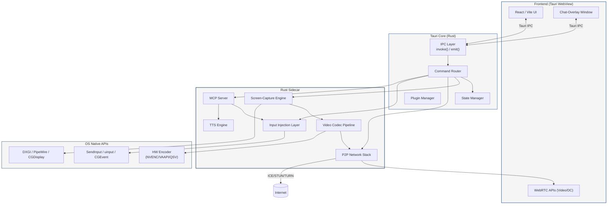
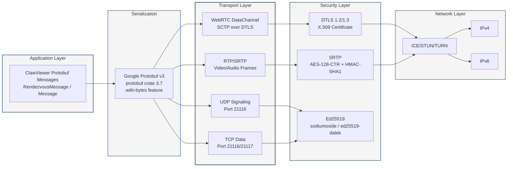

## 1. Technische Architektur-Dokumentation

### 1.1 Systemubersicht und Komponenten-Architektur

#### 1.1.1 Gesamtarchitektur

ClawViewer ist als Tauri v2 Desktop-Anwendung mit einem Rust-Backend und einem React-Frontend konzipiert. Das resultierende Anwendungsbundle erreicht eine Grösse von 3–15 MB [^248^] [^259^], was gegenuber Electron-basierten Alternativen (120–200 MB) eine Reduktion um den Faktor 10–40 darstellt. Die Architektur folgt einem mehrschichtigen Muster, das Web-Technologien fur die Benutzeroberflache mit nativem Rust-Code fur performancekritische Operationen verbindet [^246^].

Die zentrale Designentscheidung besteht in der Trennung zwischen dem Renderer-Prozess (WebView-basierte UI) und dem Main-Prozess (Tauri Core in Rust). Der Renderer-Prozess hostet das React-Frontend und kommuniziert uber Tauris IPC-System (Inter-Process Communication) mit dem Rust-Backend. Diese Trennung erlaubt es, sicherheitskritische und performancekritische Komponenten – wie Screen-Capture, P2P-Netzwerk und Input-Injection – in Rust zu implementieren, wahrend die UI die Flexibilitat von React nutzt [^208^].

Zusatzlich zum Hauptfenster existiert ein Rust-Sidecar-Prozess, der Screen-Capture, P2P-Netzwerkoperationen und Input-Injection kapselt. Dieser Sidecar ist notwendig, da WebViews aufgrund von Sandboxing-Restriktionen keinen direkten Zugriff auf System-APIs wie DXGI Desktop Duplication oder virtuelle Eingabegerate haben. Tauri v2 nutzt Tokio als Async-Runtime [^283^] [^284^], was eine nahtlose Integration mit async-fahigen Rust-Crates wie webrtc-rs oder str0m ermoglicht.

#### 1.1.2 Kernkomponenten

Die ClawViewer-Architektur umfasst sechs Kernkomponenten, die uber definierte Schnittstellen miteinander kommunizieren:

Die **Screen-Capture-Engine** erfasst Bildschirminhalte auf OS-Ebene. Unter Windows nutzt sie die DXGI Desktop Duplication API mit Hardware-beschleunigtem Capture [^34^], unter Linux PipeWire mit DMA-BUF fur Wayland [^40^] und unter macOS CGDisplayStream. Die Capture-Latenz betragt fur 1080p-Auflosung typischerweise 1–3 ms [^34^].

Die **Video-Codec-Pipeline** kodiert die erfassten Frames in Echtzeit. Sie unterstutzt H.264, VP9 und AV1 mit automatischer Hardware-Encoder-Selektion [^204^]. Die Priorisierung folgt dem Schema H.265 > H.264 > AV1 > VP9 > VP8, wobei Hardware-Encoding gegenuber Software-Codecs bevorzugt wird [^204^].

Der **P2P-Netzwerk-Stack** basiert auf WebRTC und implementiert NAT-Traversal mittels STUN/TURN/ICE. Die Rust-Implementierung verwendet webrtc-rs oder str0m [^302^] [^308^] fur den Protokoll-Stack. Die Signalisierung erfolgt uber einen Rendezvous-Server im Stil von RustDesks hbbs [^1^].

Die **Input-Injection-Layer** simuliert Maus- und Tastaturereignisse auf dem Zielsystem. Sie abstrahiert OS-spezifische APIs uber ein enigo-ahnliches Interface: Windows SendInput [^114^], Linux uinput/XTest und macOS CGEvent [^148^].

Der **MCP-Server** (Model Context Protocol) stellt die Integrationsschicht fur KI-Agenten dar. Er kommuniziert uber JSON-RPC 2.0 via stdio oder SSE und exponiert 40+ Tools fur Bildschirmsteuerung und -analyse [^232^] [^235^].

Die **TTS-Engine** (Text-to-Speech) wandelt KI-Ausgaben in gesprochene Sprache um. Als primare Engine dient Piper uber das piper-rs Crate mit einer Latenz von ca. 120 ms auf Intel-i5-Hardware [^461^] [^488^], unterstutzt durch Cloud-Fallbacks (OpenAI TTS, ElevenLabs).

#### 1.1.3 Komponenten-Diagramm und Schnittstellen

Das folgende Diagramm zeigt die Module und ihre Schnittstellen:



Die nachfolgende Tabelle fasst die Komponenten, ihre Technologien und Verantwortlichkeiten zusammen:

| Komponente | Primartechnologie | Schnittstelle | Verantwortlichkeit |
|:---|:---|:---|:---|
| Screen-Capture-Engine | DXGI (Win), PipeWire (Linux), CGDisplay (macOS) | Rust FFI zum OS | Hardware-beschleunigte Bildschirmerfassung, 1–3 ms Latenz fur 1080p [^34^] [^40^] |
| Video-Codec-Pipeline | hwcodec (FFmpeg), vpx, aom | Rust intern | H.264/VP9/AV1-Encoding mit Auto-Selektion, Frame-Pacing fur <50 ms E2E-Latenz [^204^] |
| P2P-Netzwerk-Stack | webrtc-rs oder str0m, tokio | WebRTC DataChannel + Tauri IPC | NAT-Traversal, verschlusselter Transport, <100 ms P2P-Latenz [^302^] [^308^] |
| Input-Injection-Layer | enigo-ahnliche Abstraktion | Tauri Commands + MCP | OS-native Eingabesimulation mit Event-Priorisierung P0–P3 [^114^] [^148^] |
| MCP-Server | rmcp Crate, JSON-RPC 2.0 | stdio / SSE | KI-Agent-Integration, 40+ Tools, Safety-Safeguards [^232^] [^235^] |
| TTS-Engine | piper-rs, rodio, cpal | Rust intern + Tauri Events | Lokale Sprachsynthese, ~120 ms Latenz, Audio-Wiedergabe [^461^] [^504^] |

Die Architektur trennt klar zwischen der UI-Schicht (React im WebView), der Vermittlungsschicht (Tauri Core mit IPC und State Management) und der Ausfuhrungsschicht (Rust Sidecar mit OS-nativen APIs). Diese Drei-Schichten-Architektur ermoglicht unabhangige Testing, sicherheitskritische Isolierung und plattformspezifische Optimierung ohne Code-Duplikation.

#### 1.1.4 Prozess-Architektur

ClawViewer nutzt drei Prozesstypen, die durch Tauri v2 verwaltet werden:

Der **Main-Prozess** (Tauri Core) ist der Elternprozess, der das gesamte Anwendungsleben verwaltet. Er hostet den Command Router, das State Management und den Plugin Manager. Der Main-Prozess hat vollen Zugriff auf das Dateisystem, das Netzwerk und OS-native APIs [^208^].

Der **Renderer-Prozess** ist der WebView-Prozess, der die React-UI rendert. Jeder WebView lauft in einem separaten Renderer-Prozess mit eingeschrankten Berechtigungen. Fur ClawViewer existieren mindestens zwei WebView-Instanzen: das Hauptfenster (Screen-View) und das Chat-Overlay [^211^] [^214^].

Der **Rust-Sidecar** ist ein separater Prozess, der die performancekritischen Komponenten (Screen-Capture, P2P, Input-Injection) isoliert. Diese Isolierung ist notwendig, da Screen-Capture-Operationen unter Umstanden den Renderer-Prozess blockieren konnten. Der Sidecar kommuniziert uber Tauris Channel-API mit dem Main-Prozess [^208^].

### 1.2 P2P-Architektur und NAT-Traversal

#### 1.2.1 RustDesk-ahnliche P2P-Struktur

ClawViewer adaptiert die bewahrte P2P-Architektur von RustDesk, die aus drei Kernkomponenten besteht: dem Rendezvous-Server (hbbs-Analog), dem optionalen Relay-Server (hbbr-Analog) und der direkten Peer-Verbindung [^1^]. Diese Struktur wurde in RustDesk uber mehrere Jahre produktiv erprobt und skaliert auf Millionen von Verbindungen.

Der **Rendezvous-Server** koordiniert die Peer-Discovery und das Signaling. Er lauft auf UDP-Port 21116 und TCP-Port 21116 und verwaltet die Registrierung von Peers uber protobuf-basierte Nachrichten [^7^]. Jeder Peer registriert sich mit einer eindeutigen ID und seinem Ed25519-Public-Key. Der Server speichert Peer-Informationen sowohl im Speicher (HashMap) als auch persistent in SQLite [^9^] [^11^].

Der **Relay-Server** dient als Fallback, wenn die direkte P2P-Verbindung aufgrund von symmetrischem NAT oder Firewall-Restriktionen nicht moglich ist. Er leitet Daten bidirektional zwischen zwei Peers weiter und nutzt dabei Bandwidth-Limiting (1 Gbps Gesamt, 128 Mbps pro Verbindung) [^8^].

Die **direkte Peer-Verbindung** wird nach erfolgreichem NAT-Traversal aufgebaut und ubertragt alle Mediendaten (Video, Audio, Input-Events, Chat) ohne Umweg uber einen Server. Dies minimiert die Latenz und maximiert den Datendurchsatz.

#### 1.2.2 NAT-Traversal mit STUN/TURN/ICE

Das NAT-Traversal in ClawViewer basiert auf dem ICE-Framework (Interactive Connectivity Establishment), das STUN- und TURN-Server koordiniert [^235^]. Die Implementierung nutzt entweder webrtc-rs [^308^] oder str0m [^302^], beides produktionsreife Rust-Implementierungen des WebRTC-Standards.

**STUN** (Session Traversal Utilities for NAT) ermoglicht es Peers, ihre offentliche IP-Adresse und Port zu ermitteln. Ein STUN-Server wird als korrekt funktionierend betrachtet, wenn er Candidates vom Typ `srflx` (server reflexive) generieren kann [^263^].

**TURN** (Traversal Using Relays around NAT) bietet einen Fallback-Mechanismus, wenn direkte P2P-Verbindungen nicht moglich sind. Der TURN-Server weist dem Client eine Relay-Adresse zu, uber die der gesamte Medien-Traffic geleitet wird [^294^]. Fur ClawViewer kommt turn-rs [^313^] als reine Rust-Implementierung infrage, die einen Single-Thread-Durchsatz von bis zu 5 GiB/s und eine Forwarding-Latenz unter 35 Mikrosekunden erreicht [^307^].

**ICE** sammelt drei Kategorien von Candidates: Host Candidates (lokale IPs), Server Reflexive Candidates (uber STUN ermittelte offentliche IPs) und Relay Candidates (uber TURN zugewiesene Adressen). Die Candidate-Paare werden nach Prioritat gepruft: Host-Host-Verbindungen haben die hochste Prioritat (Type Preference 126), gefolgt von Server Reflexive (100) und Relay (0) [^264^] [^326^].

Das ICE Transport State Management folgt einer strengen Zustandsmaschine: `new` -> `checking` -> `connected` -> `completed` [^232^]. Kritische Ruckwartsubergange (Back Edges) sind der Ubergang von `connected` zu `checking` bei Consent-Widerruf und von `connected` zu `disconnected` bei transienten Netzwerkunterbrechungen.

#### 1.2.3 Verbindungsaufbau: 6-Schritt-Handshake

Der Verbindungsaufbau zwischen zwei ClawViewer-Peers folgt dem RustDesk-Punch-Hole-Handshake [^7^] [^14^]:

**Schritt 1 – RegisterPeer:** Beide Peers registrieren sich beim Rendezvous-Server uber UDP. Die Nachricht enthalt die Peer-ID und eine Seriennummer. Der Server antwortet mit `RegisterPeerResponse`, das bei Bedarf eine Public-Key-Registrierung anfordert [^7^].

**Schritt 2 – PunchHoleRequest:** Der initierende Peer (A) sendet eine `PunchHoleRequest` an den Rendezvous-Server mit der ID des Ziel-Peers (B). Die Nachricht enthalt den NAT-Typ des Initiators, einen optionalen Lizenzschlussel und den Verbindungstyp [^7^].

**Schritt 3 – PunchHole:** Der Server leitet eine `PunchHole`-Nachricht an Peer B weiter. Diese enthalt die offentliche Adresse von A sowie die Adresse des Relay-Servers als Fallback [^7^].

**Schritt 4 – PunchHoleSent:** Peer B bestatigt den Erhalt durch `PunchHoleSent` an den Server. B initiiert gleichzeitig einen TCP-Verbindungsversuch zu seiner eigenen Adresse uber denselben lokalen Port, den er fur die Serverkommunikation nutzt – dies ist die zentrale Lochbohr-Technik [^14^].

**Schritt 5 – PunchHoleResponse:** Der Server leitet Bs Bestatigung an A weiter, erganzt um Bs offentliche Adresse und den signierten Public-Key (`IdPk`-Signatur mit Ed25519) [^7^].

**Schritt 6 – Direct Connect:** A versucht eine direkte TCP-Verbindung zu B. Gleichzeitig fuhrt B UDP-Hole-Punching durch, falls aktiviert. Bei Erfolg entsteht eine direkte P2P-Verbindung; bei Misserfolg erfolgt der Fallback auf Relay [^14^].

Sind beide Peers im selben lokalen Netzwerk, optimiert der Server den Verbindungsaufbau durch direkten Austausch der lokalen Adressen via `FetchLocalAddr` statt Hole Punching [^7^].

#### 1.2.4 Protokoll-Stack

Das folgende Diagramm zeigt den vollstandigen Protokoll-Stack von ClawViewer:



ClawViewer verwendet **Google Protocol Buffers v3** als Wire-Format fur alle Signalisierungsnachrichten. Die `RendezvousMessage` ist als `oneof`-Union definiert und enthalt alle moglichen Nachrichtentypen vom `RegisterPeer` bis zum `RequestRelay` [^3^]. Nach dem Verbindungsaufbau wird ein separates `Message`-Protokoll fur die eigentlichen Remote-Desktop-Daten (VideoFrames, MouseEvents, KeyEvents, AudioFrames, Clipboard) verwendet [^4^]. Die Serialisierung nutzt das `protobuf`-Crate (Version 3.7) mit dem `with-bytes`-Feature, das Zero-Copy-Deserialisierung via `Bytes` und `BytesMut` ermoglicht [^13^].

Der Transportlayer verwendet **WebRTC** mit **DTLS-SRTP** fur die Verschlusselung. Der DTLS-Handshake findet uber den von ICE verifizierten Pfad statt: SDP-Fingerprint-Exchange, ClientHello/ServerHello, Zertifikatsverifikation und Schlusselableitung via `use_srtp`-Extension [^284^]. Alle nachfolgenden Medienpakete werden mit AES-128-CTR verschlusselt und mit 80-bit HMAC-SHA1 authentifiziert. Das WebRTC-Okosystem migriert aktiv von DTLS 1.2 zu DTLS 1.3 (RFC 9147), wobei DTLS 1.3 den Handshake von zwei auf einen Round-Trip reduziert [^284^].

#### 1.2.5 Port-Konfiguration und Netzwerk-Topologie

| Komponente | Port | Protokoll | Funktion |
|:---|:---|:---|:---|
| Rendezvous-Server (hbbs) | 21115/tcp | TCP | NAT-Typ-Test [^7^] |
| Rendezvous-Server (hbbs) | 21116/udp | UDP | Haupt-Signaling (RegisterPeer, PunchHole) [^7^] |
| Rendezvous-Server (hbbs) | 21116/tcp | TCP | TCP-Hole-Punching + Verbindungsservice [^7^] |
| Relay-Server (hbbr) | 21117/tcp | TCP | Daten-Relay mit Bandwidth-Limiting [^8^] |
| WebSocket (hbbs) | 21118/tcp | TCP | WebSocket fur Web-Client-Konnektivitat [^7^] |
| WebSocket (hbbr) | 21119/tcp | TCP | WebSocket-Relay fur Web-Clients [^8^] |

Die Port-Belegung folgt direkt dem RustDesk-Schema [^1^], das sich in der Praxis bewahrt hat. Der Rendezvous-Server hort auf drei TCP-Ports und einen UDP-Port gleichzeitig, wobei `tokio::select!` alle Listener in einer einzigen Event-Loop bedient [^7^]. Die WebSocket-Ports ermoglichen die Konnektivitat von Web-Clients, die das Tauri-Frontend via WebView2 (Windows) oder WebKit (macOS) nativ unterstutzt.

### 1.3 Screen-Capture und Video-Pipeline

#### 1.3.1 Windows: DXGI Desktop Duplication API

Auf Windows-Systemen nutzt ClawViewer die DXGI Desktop Duplication API als primaren Capture-Mechanismus [^34^]. Diese API, die Teil von DirectX 11 ist, erfasst nur geanderte Bildschirmbereiche (Deltas) statt des gesamten Frames, was die Bandbreite massiv reduziert.

Die Initialisierung erstellt ein D3D11-Device, das mit dem Adapter des Ziel-Displays verbunden ist. Anschliessend wird `DuplicateOutput()` aufgerufen, um die Desktop-Duplication-Session zu starten [^34^]. Bei Fehlern (z.B. Remote-Desktop-Sitzung ohne GPU-Zugriff) erfolgt ein automatischer Fallback auf GDI (BitBlt).

Frames werden uber `AcquireNextFrame()` abgerufen. Die GPU-Texture wird bei Bedarf in CPU-lesbaren Staging-Speicher kopiert [^34^]. Bei rotierten Displays (Tablets, Convertibles) ubernimmt ein D3D11 VideoProcessor die hardwarebeschleunigte Rotation. Die typische Capture-Latenz betragt 1–3 ms fur 1080p-Auflosung bei 60 Hz.

#### 1.3.2 Linux: PipeWire und DMA-BUF

Unter Linux implementiert ClawViewer zwei Capture-Pfade. Fur Wayland-Systeme wird PipeWire uber das xdg-desktop-portal verwendet [^40^]. Der Capture-Flow umfasst drei Schritte: Session-Erstellung via `org.freedesktop.portal.ScreenCast`, Quellenauswahl und Capture-Start. Der resultierende PipeWire File Descriptor wird in eine GStreamer-Pipeline (`pipewiresrc -> videoconvert -> appsink`) eingespeist, die Frame-Daten im BGRx/RGBx-Format liefert [^40^].

Fur X11-Systeme dient die MIT-SHM (Shared Memory) Extension als Fallback. Diese ermoglicht Zero-Copy-Zugriff auf den Framebuffer ohne Datenkopie durch den X-Server.

#### 1.3.3 macOS: CGDisplayStream

Auf macOS nutzt ClawViewer `CGDisplayStream` als Capture-Methode. Diese CoreGraphics-API liefert Frame-Daten als IOSurface-Objekte, die direkt mit VideoToolbox-Encodern kompatibel sind. Die Implementierung folgt dem Pattern aus RustDesks `libs/scrap/src/quartz/`-Modul [^33^].

#### 1.3.4 Codec-Pipeline und Frame-Pacing

Die Video-Codec-Pipeline implementiert eine automatische Encoder-Selektion mit folgender Prioritat: H.265 (HEVC) > H.264 > AV1 > VP9 > VP8 [^204^]. Die Selektion berucksichtigt dabei die Hardware-Unterstutzung des jeweiligen Systems:

| Codec | Hardware-Encoder | Software-Encoder | Einsatzgebiet |
|:---|:---|:---|:---|
| H.264 | NVENC, QSV, VAAPI, VideoToolbox | libx264 | Kompatibilitat, Hardware verfugbar |
| H.265 | NVENC, QSV, VAAPI, VideoToolbox | libx265 | Beste Kompression bei Hardware-Support |
| VP9 | — | libvpx (VPXEncoder) | Lizenzfreie Alternative |
| AV1 | — | aom (AomEncoder) | Zukunftssicherung |

Die Hardware-Codec-Implementierung basiert auf FFmpeg uber das externe `rustdesk-org/hwcodec`-Repository [^15^]. Fur NVIDIA-GPUs steht zudem VRAM-Encoding (Direct GPU Texture Encoding via D3D11) zur Verfugung, das Frames direkt im GPU-Speicher kodiert ohne CPU-Roundtrip [^204^].

Das Frame-Pacing-System zielt auf eine End-to-End-Latenz von unter 50 ms ab. Der Capture-Encode-Send Loop aus RustDesks `video_service.rs` [^133^] passt dynamisch FPS und Qualitat an die Netzwerkbedingungen an. Bei schwankender Bandbreite wird die Bitrate uber den GCC-Algorithmus (Google Congestion Control) reguliert [^270^] [^272^].

#### 1.3.5 Video-Streaming uber WebRTC

Die kodierten Video-Frames werden uber einen WebRTC Video-Track ubertragen. Der RTCP-Feedback-Mechanismus umfasst NACK (Negative Acknowledgement) fur einzelne verlorene Pakete, PLI (Picture Loss Indication) fur vollstandig verlorene Frames und Transport-Wide Congestion Control (TWCC) fur senderseitige Bandbreitenschatzung [^276^] [^272^].

Fur Remote-Desktop-Anwendungen ist die Optimierung des Playout-Delay kritisch. Der Standard-Jitter-Buffer von 10 Sekunden wird auf 0 ms gesetzt, was eine Latenzreduktion von ca. 90 ms bewirkt – die grosste Einzelverbesserung in der Pipeline [^298^]. Zusatzlich wird die Degradation-Preference auf `maintain-resolution` gesetzt, damit bei Bandbreitenrestriktionen die Framerate reduziert wird, nicht die Auflosung [^334^].

### 1.4 Input-Weiterleitung und Event-System

#### 1.4.1 OS-native Input-Injection

Die Input-Injection-Layer von ClawViewer abstrahiert plattformspezifische APIs uber ein einheitliches Rust-Interface. Auf Windows verwendet sie `SendInput()` mit `MOUSEINPUT`- und `KEYBDINPUT`-Strukturen [^114^]. Die Enigo-Implementierung setzt `dwExtraInfo` auf einen konstanten Wert (`ENIGO_INPUT_EXTRA_VALUE = 100`), um injizierte Events von echten Hardware-Events zu unterscheiden. Absolute Mauspositionen werden uber den virtuellen Desktop mit `MOUSEEVENTF_ABSOLUTE | MOUSEEVENTF_VIRTUALDESK` berechnet [^114^].

Unter Linux existieren drei Input-Pfade: uinput (Kernel-Level, fur Wayland), XTest (X11) und das RemoteDesktop Portal (Wayland ohne Root-Rechte) [^148^]. Die Auswahl erfolgt zur Laufzeit basierend auf der verfugbaren Display-Server-Umgebung.

Auf macOS mussen Input-Events im Main-Thread ausgefuhrt werden, da das System sonst ab macOS 10.15 einen Crash verursacht. Die Implementierung verwendet `dispatch_async` auf die Main-Queue mit einem 12 ms Sleep pro Key-Event [^148^].

#### 1.4.2 JSON-Event-Schema

Alle Input-Events verwenden ein einheitliches JSON-Schema mit Quellendiskriminierung:

```json
{
  "id": "uuid-v4",
  "source": "human" | "ai" | "system",
  "type": "mouse" | "keyboard" | "scroll",
  "priority": "P0" | "P1" | "P2" | "P3",
  "payload": { "x": 1200, "y": 800, "button": "left" },
  "timestamp": 1704067200000,
  "sequence": 42,
  "sessionId": "session-uuid"
}
```

Das Schema erweitert die W3C UI Events-Spezifikation [^473^] um die Felder `source`, `priority` und `aiContext`. Das `source`-Feld identifiziert den Ursprung des Events (Human, KI oder System), das `priority`-Feld steuert die Verarbeitungsreihenfolge, und `aiContext` enthalt bei KI-Events zusatzliche Metadaten wie `agentId`, `confidence` und `intent`.

#### 1.4.3 Event-Prioritats-System

Das Event-System implementiert vier Prioritatsstufen, die eine deterministische Conflict-Resolution ermoglichen:

| Prioritat | Bezeichnung | Quelle | Verhalten |
|:---|:---|:---|:---|
| P0 | Emergency Stop | Human (Hotkey) | Sofortige Ausfuhrung, alle anderen Events abbrechen, AI-Events blockieren [^446^] |
| P1 | Human Input | Human (Maus/Tastatur) | Immer Vorrang vor KI, unterbricht laufende AI-Aktionen |
| P2 | AI mit Bestatigung | KI (explizit bestatigt) | Ausfuhrung nur nach Human-Approval, visuelle Bestatigung erforderlich |
| P3 | AI autonom | KI (autonom) | Ausfuhrung nur wenn kein Human-Input aktiv, wird bei Human-Interaktion pausiert |

Die Forschung zu Shared Autonomy (SARI-Framework) zeigt, dass Level-2-Interleaving (AI assistiert, Human kann intervenieren) die hochste Erfolgsrate von 80,0 % bei einer durchschnittlichen Ausfuhrungszeit von 424,8 s erreicht [^494^]. Dieses Ergebnis rechtfertigt die Entscheidung, P1 (Human Input) immer Vorrang vor P2/P3 (AI) zu geben.

#### 1.4.4 Event-Merging und Ghost-Cursor

Bei gleichzeitiger Human- und AI-Steuerung implementiert ClawViewer ein Ghost-Cursor-System. Der Human-Cursor wird als primarer Zeiger mit voller Deckkraft dargestellt, wahrend der KI-Cursor als halbtransparentes Overlay (60–80 % Deckkraft) in Orange (#FF6B35) oder Lila (#9333EA) gerendert wird [^448^].

Die Event-Koaleszenz-Strategie verwendet das **Last-Wins**-Muster fur Mouse-Move-Events (nur die letzte Position im Zeitfenster wird behalten), **Accumulate** fur Scroll-Deltas (Deltas werden addiert) und **Throttle** fur KI-High-Frequency-Updates (maximal N Events pro Sekunde) [^493^]. Diese Strategien minimieren die Netzwerklast bei gleichzeitig flussiger Benutzererfahrung.

#### 1.4.5 Ubertragung via WebRTC DataChannel

Input-Events werden uber den WebRTC DataChannel ubertragen, der SCTP (Stream Control Transmission Protocol) uber DTLS verwendet [^234^]. Der DataChannel fur Input-Events ist als `ordered: true, reliable: true` konfiguriert, was garantiert, dass Tastatureingaben in korrekter Reihenfolge ankommen und keine Events verloren gehen. Mouse-Move-Events konnen auf einem separaten ungeordneten Kanal mit `maxPacketLifeTime: 50` gesendet werden, um veraltete Positionsupdates zu verwerfen [^312^].

### 1.5 KI-Agent-Integration und MCP-Server

#### 1.5.1 Einklink-Modi

ClawViewer definiert drei Einklink-Modi fur KI-Agenten, die an das QuickDesk-Modell angelehnt sind [^235^]:

Im **Observer-Modus** analysiert die KI den Bildschirmstrom (Screenshots), gibt Empfehlungen aus und fuhrt keine Aktionen aus. Dieser Modus nutzt Tools wie `get_ui_state` und `screen_verify` mit Human-in-the-Loop fur alle Entscheidungen [^230^].

Im **Shared-Modus** fuhrt die KI Aktionen aus, wahrend der Benutzer alles sieht und jederzeit eingreifen kann. Jede Mausbewegung und jeder Tastenanschlag der KI ist in Echtzeit sichtbar. Der Benutzer kann den Steuerungsmodus uber den globalen Emergency-Stop-Hotkey (Ctrl+Shift+F12) sofort auf Human-Only zuruckschalten [^235^].

Im **Full-Control-Modus** hat die KI volle Kontrolle mit aktivierten Safeguards. Der Benutzer kann jederzeit die Kontrolle zuruckubernehmen. Kritische Aktionen (Dateiloschung, Systemeinstellungsanderungen, Passworteingaben, Transaktionsbestatigungen, sudo-Commands) erfordern trotzdem explizite Bestatigung.

#### 1.5.2 MCP-Server-Architektur

Das Model Context Protocol (MCP) ist ein offenes Protokoll, das im November 2024 von Anthropic als Open Source eingefuhrt wurde und von der Linux Foundation betreut wird [^232^] [^233^]. Es standardisiert die Integration zwischen LLM-Anwendungen und externen Tools.

Der MCP-Server in ClawViewer verwendet JSON-RPC 2.0 als Nachrichtenformat [^256^] und unterstutzt beide Transportmethoden: **stdio** (fur lokale KI-Clients, die ClawViewer als Subprozess starten) und **SSE** (Server-Sent Events uber HTTP, fur Multi-Client-Zugriff) [^239^]. Der Server-Lifecycle umfasst drei Phasen: Initialisierung (Capability-Verhandlung), Operation (Tool-Aufrufe) und Shutdown [^231^].

Die Rust-Implementierung basiert auf dem `rmcp`-Crate (offizielles Rust SDK) [^223^], das Schema-Definitionen, Transport-Layer und High-Level-Server-Implementierungen bereitstellt.

#### 1.5.3 MCP-Tool-Ubersicht

Der MCP-Server von ClawViewer exponiert uber 40 Tools, die in funf Kategorien gruppiert sind [^235^]:

| Kategorie | Tools | Beschreibung |
|:---|:---|:---|
| Input/Control | `mouse_click`, `mouse_drag`, `mouse_move`, `mouse_scroll`, `keyboard_type`, `keyboard_hotkey` | Grundlegende Eingabesimulation |
| Screen-Analyse | `screenshot`, `get_ui_state`, `find_element`, `screen_diff_summary`, `screen_verify`, `ocr_recognize`, `ui_element_detect` | Bildschirmerfassung und Analyse |
| Clipboard | `clipboard_read`, `clipboard_write` | Zwischenablagen-Zugriff |
| Event-Driven | `wait_for_event`, `wait_for_screen_change`, `wait_for_clipboard_change` | Asynchrone Ereignisuberwachung |
| System | `sys-info`, `file-ops`, `shell-runner` | Host-System-Informationen und -Operationen |

Jedes Tool wird mit einem strukturierten Schema definiert, das `inputSchema` (Parameter), `outputSchema` (Ruckgabe) und `annotations` (Verhaltenshinweise wie `readOnlyHint`, `destructiveHint`) enthalt [^259^] [^266^]. Tool-Annotations dienen dem Trust & Safety: Clients mussen sie als nicht-vertrauenswurdig betrachten, es sei denn, sie stammen von vertrauenswurdigen Servern [^266^].

#### 1.5.4 Safety-Safeguards

Die Sicherheitsarchitektur fur KI-Agenten implementiert ein mehrschichtiges Permission-Modell. Kritische Aktionen, die die KI **niemals** ohne explizite Bestatigung ausfuhren darf, umfassen: Dateien loschen, Systemeinstellungen andern, Passworter eingeben, Transaktionen bestatigen und sudo-Commands ausfuhren [^235^].

Das MCP-Elicitation-Feature erlaubt dem Server, strukturierte Bestatigungen vom Benutzer anzufordern [^273^]. Beispiel: Vor dem Loschen einer Datei sendet der Server eine `elicitation/requestInput`-Nachricht mit einem Schema, das eine Ja/Nein-Antwort erfordert. Das Task-Centric Access Control (TCAC) Modell gewahrt minimale temporare Berechtigungen pro Aufgabe mit TTL und automatischer Aufhebung nach Task-Ende [^284^].

#### 1.5.5 BYOK-Modell

ClawViewer implementiert das BYOK-Prinzip (Bring Your Own Key): Benutzer bringen ihre eigenen API-Keys fur KI-Provider (OpenAI, Anthropic, Google) mit [^271^] [^274^]. Dies eliminiert Vendor Lock-in, gibt volle Kostenkontrolle und erhoht die Privatsphare, da API-Keys nie mit dem Anwendungsanbieter geteilt werden.

Die Speicherung erfolgt im OS-Keyring uber das `keyring`-Crate v4, das plattformubergreifend DPAPI (Windows), Keychain (macOS) und D-Bus Secret Service (Linux) unterstutzt [^280^]. Die API-Keys sind fur die Anwendung selbst zuganglich, aber durch das Betriebssystem vor externem Zugriff geschutzt.

### 1.6 Chat-Viewer und Real-Time-Kommunikation

#### 1.6.1 Chat-Fenster als separates WebviewWindow

Der Chat-Viewer wird als separates `WebviewWindow` in Tauri implementiert, ahnlich dem MS-Teams-Chat-Fenster [^211^]. Das Fenster ist konfiguriert als `always_on_top: true`, `transparent: true` und `decorations: false`, was ein Overlay-Erlebnis ermoglicht, das den Remote-Desktop nicht verdeckt. Die Erstellung erfolgt uber `WebviewWindowBuilder` mit einem eigenen Capability-Set, das minimale Berechtigungen hat [^211^].

#### 1.6.2 Nachrichten-Format und Ubertragung

Chat-Nachrichten verwenden ein JSON-Format mit Typdiskriminierung und werden uber denselben WebRTC DataChannel wie Input-Events ubertragen:

```json
{
  "type": "chat" | "system" | "ai-action" | "human-override",
  "sender": "user-id" | "ai-agent-id",
  "content": "Nachrichtentext",
  "timestamp": 1704067200000,
  "metadata": { "aiConfidence": 0.85, "actionId": "uuid" }
}
```

Die Wiederverwendung des bestehenden DataChannel fur Chat-Nachrichten vermeidet zusatzliche WebSocket-Verbindungen und nutzt die bereits etablierte P2P-Verbindung mit DTLS-Verschlusselung. Chat-Nachrichten werden auf einem separaten SCTP-Stream mit `ordered: true, reliable: true` ubertragen [^234^].

#### 1.6.3 UI-Komponenten

Der Chat-Viewer umfasst vier UI-Komponenten: den Nachrichten-Thread (chronologische Darstellung aller Chat-Nachrichten mit Quellendiskriminierung), den KI-Status-Indikator (animierter Indikator basierend auf SAP Fiori AI Progress Pattern [^462^]), die Session-Info (Verbindungsstatus, Latenz, Bandbreite) und das Passwort-Display ( temporarer Session-Code mit Auto-Refresh).

#### 1.6.4 Real-Time-Chat-Architektur

Die primare Transportmethode fur Chat-Nachrichten ist der WebRTC DataChannel mit SCTP-Transport. Als Fallback dient ein WebSocket-Channel, der uber den Rendezvous-Server geroutet wird, wenn der P2P-DataChannel vorubergehend unterbrochen ist. Die Chat-Nachrichten sind von den Input-Events getrennt, verwenden aber denselben SCTP-Association, was die Verbindungsverwaltung vereinfacht.

Der SCTP-Transport unterstutzt bis zu 65.534 parallele Streams pro Association [^234^]. ClawViewer nutzt diese Multi-Streaming-Fahigkeit, indem Input-Events auf Stream-ID 0 (hoechste Prioritat, ordered) und Chat-Nachrichten auf Stream-ID 1 (ordered, reliable) ubertragen werden. Diese Trennung gewaehrleistet, dass Chat-Nachrichten nicht durch eine grosse Anzahl von Input-Events verzoegert werden und umgekehrt. Der WebSocket-Fallback wird automatisch aktiviert, wenn der ICE-Transport-Zustand von `connected` auf `disconnected` wechselt [^232^], und deaktiviert, sobald die P2P-Verbindung wiederhergestellt ist. Der Rendezvous-Server leitet WebSocket-Nachrichten transparent an den Ziel-Peer weiter, ohne sie zu entschluesseln oder zu modifizieren [^7^].

### 1.7 Tech-Stack-Ubersicht

#### 1.7.1 Vollstandiger Stack

| Layer | Primartechnologie | Alternative | Begrundung |
|:---|:---|:---|:---|
| Desktop-Framework | Tauri v2 | Electron, Flutter | 3–15 MB Bundle, Rust-Backend, native Performance [^248^] [^259^] |
| UI-Framework | React + Vite | Vue, Svelte | Komponenten-basiert, grosse Okosystem, TypeScript-Support |
| Frontend-Routing | React Router | TanStack Router | De-facto-Standard, Tauri-kompatibel |
| IPC | Tauri invoke/emit | Custom WebSocket | Stark typisiert, integriert in Tauri [^208^] |
| Async-Runtime | tokio | async-std | Produktionsreif, grosses Okosystem, Tauri-Default [^283^] |
| Screen-Capture | scrap-ahnlich (Rust) | Native C++ Libs | DXGI/PipeWire/CGDisplay Abstraktion [^34^] [^40^] |
| Video-Codec | hwcodec (FFmpeg) | OpenH264, libvpx | Hardware-Encoder Auto-Selektion [^15^] [^204^] |
| P2P-Transport | webrtc-rs oder str0m | libwebrtc (C++) | Reine Rust-Implementierung, async-fahig [^302^] [^308^] |
| NAT-Traversal | ICE/STUN/TURN (turn-rs) | coturn (C) | turn-rs: 5 GiB/s Single-Thread, <35 us Latenz [^313^] [^307^] |
| Krypto | ed25519-dalek, x25519-dalek | sodiumoxide | Moderne Rust-Crates, constant-time [^1^] |
| Input-Injection | enigo-ahnlich | Custom FFI | Plattformabstraktion fur SendInput/uinput/CGEvent [^114^] [^148^] |
| MCP-Server | rmcp Crate | Custom JSON-RPC | Offizielles Rust SDK, spec-konform [^223^] |
| TTS | piper-rs | edge-tts, openai-tts | Lokal, ~120 ms, kostenlos, offline [^461^] [^488^] |
| Audio-Wiedergabe | rodio + cpal | miniaudio, cubeb | 5.3M Downloads, Cross-Platform [^504^] [^507^] |
| Protokoll-Format | protobuf v3 | MessagePack, JSON | Binary, effizient, schema-evolution [^3^] [^13^] |
| State-Management | Tauri Managed State | Redux, Zustand | Rust-seitig, typed, persistent [^208^] |
| Bundler | Vite | Webpack | Schneller HMR, Tauri-Default |

Diese Tabelle zeigt den vollstandigen Technologie-Stack von ClawViewer. Die Auswahl jedes Elements basiert auf der Kriterienkombination aus Produktionsreife, Rust-Integration, Performance und Wartbarkeit. Die wesentliche Architekturentscheidung – Tauri v2 mit Rust-Backend statt Electron mit Node.js-Backend – reduziert die Bundle-Grosse um den Faktor 10–40 und die RAM-Nutzung im Leerlauf von 150–400 MB auf 40–80 MB [^259^] [^260^].

#### 1.7.2 Rust-Crate-Okosystem

Das Rust-Backend von ClawViewer baut auf einem koharenten Crate-Okosystem auf:

| Crate | Version | Funktion |
|:---|:---|:---|
| `tokio` | 1.44 | Async-Runtime mit Full-Features [^1^] |
| `webrtc-rs` | 0.12+ oder `str0m` | WebRTC-Implementierung [^308^] [^302^] |
| `ed25519-dalek` | 2.x | Ed25519-Signaturen fur Authentisierung |
| `keyring` | 4.x | OS-Keyring fur API-Key-Speicherung [^280^] |
| `piper-rs` | 0.1.9+ | Lokale TTS-Synthese [^528^] |
| `rodio` | 0.21 | High-Level Audio-Wiedergabe [^504^] |
| `cpal` | 0.15 | Low-Level Audio-I/O [^468^] |
| `enigo` | 0.2+ | Input-Injection-Abstraktion [^114^] |
| `protobuf` | 3.7 | Protobuf-Serialisierung mit with-bytes [^13^] |
| `rmcp` | 0.11+ | MCP-Server-Implementierung [^223^] |
| `bytes` | 1.10 | Zero-Copy-Byte-Buffer [^1^] |
| `serde` + `serde_json` | 1.0 | JSON-Serialisierung [^1^] |

Die Kombination dieser Crates bildet ein konsistentes Okosystem: tokio als gemeinsame Async-Runtime, serde/protobuf fur die Serialisierung, WebRTC-Crates fur den Transport und spezialisierte Crates fur TTS, Audio und Input. Alle Crates verwenden die MIT- oder Apache-2.0-Lizenz und sind damit mit der Open-Source-Lizenzierung von ClawViewer kompatibel.

Besonders hervorzuheben ist die Interoperabilitaet zwischen den Crates: `tokio::sync::mpsc` ermoeglicht die Kommunikation zwischen der WebRTC-Event-Loop und dem Tauri-Command-System, waehrend `serde` eine einheitliche Serialisierung fur IPC-Nachrichten (zwischen Rust-Backend und React-Frontend) sowie fur DataChannel-Payloads (zwischen Peers) bereitstellt. Das `bytes`-Crate wird sowohl von `protobuf` (Zero-Copy-Deserialisierung) als auch von `webrtc-rs` (Frame-Buffers) genutzt, was Memory-Allokationen reduziert. Die Tauri-eigene State-Management-Funktion `Managed State` erlaubt es, Singleton-Instanzen der P2P-Engine, des MCP-Servers und der TTS-Queue im Main-Prozess zu halten und von allen Commands aus zugreifbar zu machen [^208^].

#### 1.7.3 Frontend-Stack

Das React-Frontend nutzt Vite als Build-Tool, was gegenuber Webpack deutlich schnelleres Hot Module Replacement (HMR) und kurzere Build-Zeiten bietet. Die WebRTC-APIs werden direkt im Browser-Kontext verwendet, da Tauris WebView (WebView2 auf Windows, WebKit auf macOS, WebKitGTK auf Linux) vollstandige WebRTC-Unterstutzung bietet [^246^]. Die Kommunikation mit dem Rust-Backend erfolgt ausschliesslich uber Tauris IPC-System: `invoke()` fur Requests vom Frontend zum Backend und `listen()` fur Events vom Backend zum Frontend [^208^]. Diese Trennung erlaubt es, die UI unabhangig vom Backend zu entwickeln und zu testen.

Fur das State-Management im Frontend kommt Zustand zum Einsatz, eine leichtgewichtige Alternative zu Redux, die besonders gut mit der Tauri-Architektur harmoniert. Der globale Anwendungszustand umfasst die aktive P2P-Verbindung, den Steuerungsmodus (Human-Only, AI-Assisted, AI-Supervised, Full-AI), die KI-Agent-Konfiguration und die Chat-Nachrichtenhistorie. Video-Frames vom Remote-Peer werden direkt in ein `<video>`-Element gerendert, das den WebRTC-MediaStream konsumiert, ohne dass Frames uber das Tauri-IPC-System transferiert werden muessen. Dieser Ansatz vermeidet den Performance-Overhead einer Frame-Kopie durch die IPC-Grenze und nutzt die Hardware-Decodierung des WebView direkt.
