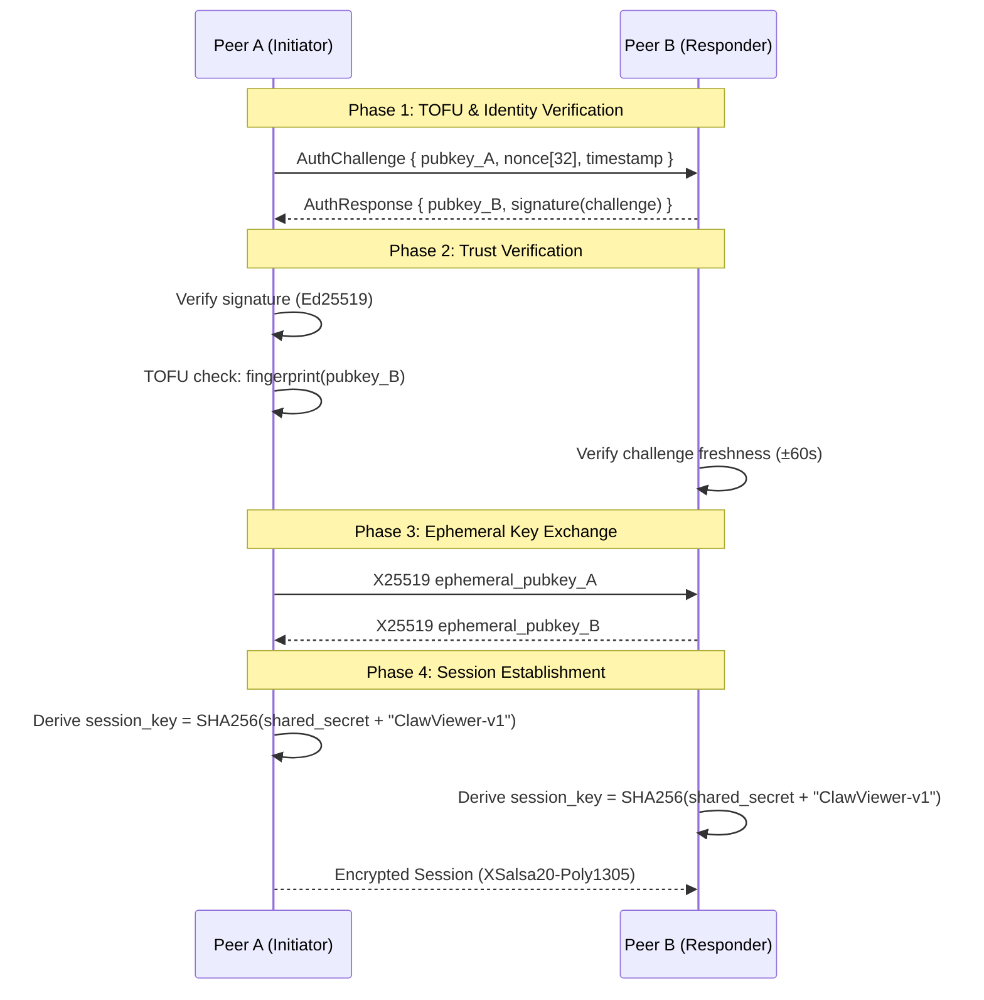
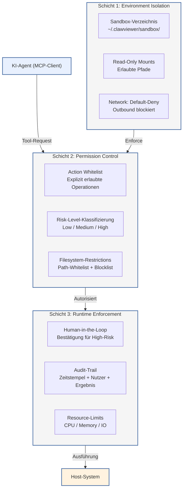

# 2. Sicherheitskonzept

Das Sicherheitskonzept von ClawViewer baut auf einer vierlagigen Schichtenarchitektur auf, bei der jede Schicht unabhängig von den übrigen operiert und auditierbar ist. Die Kombination aus Ed25519-Kryptographie für die Transportsicherheit, sessionspezifischen Einmalpasswörtern für die Authentifizierung, dem OS-Keyring für die Credential-Isolierung und einer dreischichtigen KI-Sandbox für die Agenten-Sicherheit bildet ein Defense-in-Depth-Modell, das auf den bewährten Patterns von RustDesk [^348^], QuickDesk [^235^] und dem Model Context Protocol (MCP) [^233^] basiert. Die nachfolgenden Abschnitte analysieren jede Schicht im Detail und leiten konkrete Implementierungsentscheidungen für den Rust-Code-Stack her.

## 2.1 Authentifizierungs-Architektur

### 2.1.1 Ed25519-Key-Pairs für jede Installation

ClawViewer generiert bei der ersten Installation ein eindeutiges Ed25519-Key-Pair, das als dauerhafte Identität des Geräts dient. Ed25519, ein auf Curve25519 basierendes Signaturverfahren, bietet gegenüber ECDSA mehrere operationale Vorteile: Die Verifikation ist etwa zehnmal schneller, Signaturen sind kompakt (64 Bytes) und Public Keys klein (32 Bytes). Die deterministische Signaturerstellung eliminiert zudem die Abhängigkeit von einem Zufallszahlengenerator während des Signiervorgangs, wodurch Nonce-Kollisionsangriffe ausgeschlossen werden [^97^].

Die Implementierung nutzt das `ed25519-dalek` Crate, das mit über 20 Millionen Downloads pro Monat zu den am weitesten verbreiteten Rust-Kryptographie-Bibliotheken gehört und in 9.562+ abhängigen Crates eingesetzt wird [^379^]. Die Key-Pair-Generierung erfolgt über den Betriebssystem-CSPRNG (Cryptographically Secure Pseudorandom Number Generator), der in Rust durch `rand_core::OsRng` abstrahiert wird und auf Linux den `getrandom(2)`-Syscall, auf Windows `ProcessPrng` und auf macOS `getentropy()` nutzt.

Der private Schlüssel wird in der Datei `id_ed25519` (64 Bytes, Base64-kodiert), der öffentliche Schlüssel in `id_ed25519.pub` (32 Bytes, Base64-kodiert) persistiert. Das Speicherformat folgt der Konvention von sodiumoxide, bei der der öffentliche Schlüssel die zweite Hälfte des 64-Byte-Geheimschlüssels bildet [^348^]. Für die Speichersicherheit wird das `zeroize`-Feature aktiviert, das beim Drop des Schlüsselmaterials den Heap-Speicher mit Nullen überschreibt und Compiler-Optimierungen verhindert [^384^].

Die kryptographische Verbindung zwischen Ed25519 und X25519 ermöglicht es, dasselbe Key-Pair sowohl für Signaturen als auch für den Diffie-Hellman-Key-Exchange zu verwenden. Die mathematische Konversion zwischen der Montgomery-Curve (Curve25519 für X25519) und der twisted-Edwards-Curve (Ed25519) ist in RFC 7748 spezifiziert und kryptographisch sicher [^407^][^411^].

### 2.1.2 Trust-On-First-Use (TOFU)

ClawViewer implementiert ein TOFU-Modell (Trust-On-First-Use) im Stil von SSH, bei dem der öffentliche Schlüssel eines Peers beim ersten Verbindungsaufbau gespeichert und bei nachfolgenden Verbindungen verglichen wird [^352^][^359^]. Der Ablauf gestaltet sich wie folgt:

1. **Erste Verbindung:** Der Client berechnet den SHA-256-Fingerprint des empfangenen Public Keys (erste 128 Bits, hex-kodiert) und speichert ihn zusammen mit der Peer-ID in einem lokalen Trust Store.
2. **Nachfolgende Verbindungen:** Der Fingerprint des eingehenden Public Keys wird mit dem gespeicherten Wert verglichen. Bei Übereinstimmung wird die Verbindung automatisch fortgesetzt.
3. **Mismatch:** Weicht der empfangene Key vom gespeicherten ab, wird eine Warnung angezeigt und die Verbindung blockiert, bis der Nutzer aktiv bestätigt.

Der Fingerprint wird als SHA-256-Hash über die 32 Bytes des Public Keys berechnet, wobei die ersten 16 Bytes (128 Bits) als menschenlesbare hexadezimale Zeichenkette dargestellt werden. Dieses Verfahren bietet einen ausreichenden Kollisionswiderstand bei gleichzeitig kompakter Darstellung.

Die Stärken des TOFU-Ansatzes liegen in der Unabhängigkeit von einer zentralen Certificate Authority (CA), der geringen Infrastruktur-Overhead und der Eignung für rein dezentrale P2P-Netzwerke [^355^]. Als ergänzende Maßnahme zur Abschwächung des bekannten Schwachpunkts – die erste Verbindung ist prinzipiell einem Man-in-the-Middle-Angriff ausgesetzt – unterstützt ClawViewer die Out-of-Band-Verifikation des Fingerprints über QR-Code-Scanning oder Telefon.

### 2.1.3 Challenge-Response-Auth

Die gegenseitige Authentifizierung zwischen zwei Peers erfolgt über ein Challenge-Response-Protokoll unter Verwendung von Protobuf-Nachrichten. Der vollständige Auth-Flow umfasst vier Schritte und kombiniert Ed25519-Signaturen mit einem X25519-Ephemeral-Key-Exchange:



Die Challenge enthält einen 32-Byte-Nonce, der über `OsRng` generiert wird, sowie einen Unix-Timestamp zur Replay-Schutz. Eine Challenge gilt als abgelaufen, wenn der Timestamp mehr als 60 Sekunden vom aktuellen Systemzeitpunkt abweicht. Die Signatur erstreckt sich über die Konkatenation von Nonce und Timestamp, wodurch Replay-Angriffe mit abgefangenen Challenges ausgeschlossen werden. Die Protobuf-Serialisierung nutzt das `protobuf`-Crate in Version 3.7 mit `with-bytes`-Feature für zero-copy Deserialisierung [^348^].

### 2.1.4 Multi-Faktor-Auth

ClawViewer implementiert eine gestufte Authentifizierung, die drei unabhängige Faktoren kombiniert:

1. **Besitzfaktor:** Das Ed25519-Key-Pair, das auf dem Gerät persistiert ist und nicht exportiert werden kann.
2. **Wissensfaktor:** Ein sessionspezifisches Passwort, das der Host für jeden Sitzungsaufbau neu generiert (siehe Abschnitt 2.2).
3. **Optionaler TOTP-Faktor:** Zeitbasierte Einmalpasswörter gemäß RFC 6238, die über Authentifizierungs-Apps wie Google Authenticator oder Bitwarden generiert werden.

Die Verifikation erfolgt in sequentieller Reihenfolge: Zunächst wird die Ed25519-Challenge-response geprüft (Faktor 1), anschließend das Session-Passwort (Faktor 2) und bei Aktivierung das TOTP-Token (Faktor 3). Ein Fehlschlag in einer beliebigen Stufe bricht den Authentifizierungsvorgang ab und erzeugt einen Eintrag im Audit-Log. Die TOTP-Implementierung verwendet das `totp-rs` Crate mit SHA-256 als Hash-Funktion und einem 30-Sekunden-Zeitfenster.

## 2.2 Session-basierte Authentifizierung und Passwort-Generierung

### 2.2.1 Session-Passwort-Generierung

ClawViewer generiert für jede Session ein neues, kryptographisch sicheres Passwort. Das System unterstützt zwei Modi, die der Nutzer vor Sitzungsbeginn wählen kann:

| Passworttyp | Format | Entropie | Brute-Force-Widerstand |
|-------------|--------|----------|------------------------|
| Diceware-Phrase | 6 Wörter (zufällig aus 7.776-Wörterliste) | ~78 Bit | Sehr stark |
| Alphanumerisches Token | 12 Zeichen (A-Z, a-z, 0-9 ohne 0, O, I, l) | ~71 Bit | Stark |
| Numerisches OTP | 8 Ziffern | ~27 Bit | Moderat [^89^] |

Die Standardeinstellung ist die 6-Wort-Diceware-Phrase, die durch das `chbs`-Crate (Correct Horse Battery Staple) generiert wird. Dieses Crate implementiert die EFF-Wörterlisten-Methode mit `OsRng` als Entropiequelle und erzeugt menschenlesbare, aber kryptographisch starke Passphrasen [^395^]. Das alphanumerische Token wird ebenfalls über `OsRng` mit der `rand::distributions::Alphanumeric`-Verteilung erzeugt, wobei visuell verwechselbare Zeichen (0, O, I, l) ausgeschlossen werden, um Übertragungsfehler zu minimieren.

Die Passwortlänge ist konfigurierbar. In Unternehmensumgebungen mit erhöhten Sicherheitsanforderungen kann die Token-Länge auf 16 Zeichen (~95 Bit Entropie) erhöht werden. Die Entropieberechnung für ein $n$-stelliges alphanumerisches Passwort über einem Alphabet der Größe $|\Sigma|$ folgt der Formel $H = n \cdot \log_2(|\Sigma|)$, wobei $|\Sigma| = 58$ für das reduzierte Alphabet gilt.

### 2.2.2 Passwort-Rotation

Ein zentrales Sicherheitsmerkmal von ClawViewer ist die automatische Passwort-Rotation: Bei jedem Sitzungsaufbau wird ein neues Passwort generiert, und es existieren keine persistenten Credentials. Dieses Prinzip minimiert das Angriffsfenster erheblich – selbst bei Kompromittierung eines Passworts ist dieses nach Sitzungsende wertlos.

Die Rotation erfolgt implizit durch die Session-Erstellung. Der Host-Client generiert das Passwort über `rand::OsRng` und zeigt es im UI an. Der Controller-Client muss das Passwort während des Verbindungsaufbaus eingeben. Ein manuelles Zurücksetzen ist jederzeit über einen "Neues Passwort"-Button möglich, der das aktuelle Passwort sofort invalidiert und ein neues generiert.

### 2.2.3 Session-Lifecycle

Der Lebenszyklus einer Session durchläuft fünf definierte Zustände mit klaren Übergangsbedingungen:

| Zustand | Dauer | Übergangsbedingung | Aktion |
|---------|-------|-------------------|--------|
| **Created** | $< 1$ s | Passwort generiert, Verbindungsannahme aktiv | Timer starten, Passwort anzeigen |
| **Active** | Variabel (Nutzer-definiert) | Erfolgreiche Auth + Datenfluss | Verschlüsselte Übertragung, Input-Weiterleitung |
| **Idle** | Max. 5 Min. | Kein Datenverkehr für konfigurierbares Timeout | Bildschirm dimmen, Wiederverbindungsangebot |
| **Expired** | Permanent | Idle-Timeout überschritten oder manuelle Beendigung | Verbindung trennen, Schlüssel zeroizen |
| **Cleanup** | $< 500$ ms | Nach Expired | Speicher bereinigen, Audit-Log finalisieren |

Der Idle-Timeout ist standardmäßig auf 5 Minuten konfiguriert und kann in den Einstellungen zwischen 1 und 60 Minuten variiert werden. Beim Übergang in den Zustand **Expired** werden alle Session-Keys durch `zeroize::ZeroizeOnDrop` sicher überschrieben, und das Passwort wird aus dem Arbeitsspeicher entfernt [^384^].

### 2.2.4 Rust-Implementierung

Die Implementierung der Passwort-Generierung und Session-Verwaltung nutzt folgende Rust-Crates:

```rust
use rand::{Rng, distributions::Alphanumeric};
use rand::rngs::OsRng;
use chbs::prelude::*;
use zeroize::{Zeroize, Zeroizing};

/// Generiert eine Diceware-Passphrase (6 Wörter, ~78 Bit Entropie)
fn generate_diceware_passphrase() -> Zeroizing<String> {
    let mut config = BasicConfig::default();
    config.words = 6;
    config.word_separator = "-".to_string();
    let scheme = config.to_scheme();
    Zeroizing::new(scheme.generate())
}

/// Generiert ein alphanumerisches Token (12 Zeichen, ~71 Bit Entropie)
fn generate_alphanumeric_token(length: usize) -> Zeroizing<String> {
    const CHARSET: &[u8] = b"ABCDEFGHJKLMNPQRSTUVWXYZ\
                            abcdefghijkmnopqrstuvwxyz\
                            23456789";
    let mut rng = OsRng;
    Zeroizing::new(
        (0..length)
            .map(|_| CHARSET[rng.gen_range(0..CHARSET.len())] as char)
            .collect()
    )
}
```

Das `Zeroizing`-Wrapper-Typ sorgt dafür, dass der String-Inhalt beim Verlassen des Scopes automatisch mit Nullen überschrieben wird. Dies ist kritisch, da Rusts Move-Semantik im regulären Betrieb Kopien von sensiblen Daten auf dem Stack erzeugen kann. Die Verwendung von `Zeroizing` auf dem Heap garantiert die sichere Löschung [^422^].

## 2.3 API-Key-Management mit OS-Keyring

### 2.3.1 BYOK-Architektur

ClawViewer folgt dem BYOK-Prinzip (Bring Your Own Key): Die Benutzer bringen ihre eigenen API-Keys für KI-Provider (z. B. OpenAI, Anthropic, Google) mit, und die Anwendung speichert diese ausschließlich lokal. Es findet zu keinem Zeitpunkt eine Übertragung von API-Keys an ClawViewer-Server oder Dritte statt [^271^][^274^].

Diese Architekturentscheidung hat mehrere sicherheitsrelevante Implikationen. Erstens entsteht kein Vendor Lock-in, da die Nutzer jederzeit ihre Keys wechseln oder mehrere Provider parallel nutzen können. Zweitens bleibt die volle Kostenkontrolle beim Nutzer, da keine Abrechnung über einen zentralen Dienst erfolgt. Drittens – und dies ist der zentrale Sicherheitsvorteil – wird die Angriffsfläche auf das lokale Gerät reduziert: Ein Kompromittierung von ClawViewer-Infrastruktur hätte keinen Zugriff auf API-Keys.

### 2.3.2 OS-Keyring-Integration

Die Speicherung der API-Keys erfolgt im jeweiligen plattformspezifischen Credential Store des Betriebssystems, nie im Dateisystem oder in einer Datenbank der Anwendung:

| Plattform | Backend | Technologie | Sicherheitseigenschaft |
|-----------|---------|-------------|----------------------|
| Windows | Windows Credential Manager | DPAPI (Data Protection API) | AES-256-Verschlüsselung, an Benutzerprofil gebunden |
| macOS | Keychain Services | Security Framework | Hardware-geschützte Enklave verfügbar |
| Linux | Secret Service (D-Bus) | AES-256-GCM, Argon2 | GNOME Keyring oder KWallet als Backend |
| iOS | Protected Data Store | FileProtectionComplete | Hardware-verschlüsselt |

Das `keyring` Crate in Version 4.0 bietet eine Cross-Platform-API, die die plattformspezifischen Unterschiede abstrahiert [^393^][^397^]. Auf Windows nutzt es die DPAPI (Data Protection API), die Daten mit AES-256 verschlüsselt und sie an das aktuelle Benutzerprofil bindet. Verschlüsselte DPAPI-Daten können nicht auf einem anderen Rechner oder von einem anderen Benutzer entschlüsselt werden [^347^]. Auf macOS wird der System-Keychain über das Security Framework angesprochen, wobei optional die Secure Enclave für Hardware-geschützte Schlüssel genutzt werden kann. Auf Linux kommuniziert das Crate über D-Bus mit dem Secret Service, der von GNOME Keyring oder KWallet implementiert wird.

Der Service-Name für alle Einträge ist konstant `"clawviewer"`, während der Account-Name pro Provider variiert: `"api_key_openai"`, `"api_key_anthropic"`, `"api_key_google"` etc. Diese Namenskonvention ermöglicht eine eindeutige Zuordnung und verhindert Kollisionen.

### 2.3.3 Rust-Implementierung

```rust
use keyring::Entry;

/// Speichert einen API-Key im OS-Keyring
pub fn store_api_key(provider: &str, key: &str) -> Result<(), String> {
    let entry = Entry::new("clawviewer", &format!("api_key_{}", provider))
        .map_err(|e| e.to_string())?;
    entry.set_password(key).map_err(|e| e.to_string())
}

/// Liest einen API-Key aus dem OS-Keyring
pub fn retrieve_api_key(provider: &str) -> Result<zeroize::Zeroizing<String>, String> {
    let entry = Entry::new("clawviewer", &format!("api_key_{}", provider))
        .map_err(|e| e.to_string())?;
    let password = entry.get_password().map_err(|e| e.to_string())?;
    Ok(zeroize::Zeroizing::new(password))
}

/// Löscht einen API-Key aus dem OS-Keyring
pub fn delete_api_key(provider: &str) -> Result<(), String> {
    let entry = Entry::new("clawviewer", &format!("api_key_{}", provider))
        .map_err(|e| e.to_string())?;
    entry.delete_credential().map_err(|e| e.to_string())
}
```

Der Rückgabetyp `Zeroizing<String>` stellt sicher, dass der API-Key nach Verwendung aus dem Arbeitsspeicher gelöscht wird. Der `keyring` v4 API-Entrypoint `Entry::new()` erfordert einen Service-Namen und einen Account-Namen und abstrahiert die plattformspezifischen Backend-Auswahl über Feature-Flags [^397^].

### 2.3.4 Key-Rotation und Revocation

Für produktive Einsatzszenarien empfiehlt ClawViewer eine Key-Rotation alle 30 bis 90 Tage. Die Rotation erfolgt manuell über die UI: Der Nutzer erzeugt einen neuen Key beim Provider, gibt ihn in ClawViewer ein, und der alte Eintrag wird überschrieben. Die Revocation ist jederzeit über den "Key Löschen"-Button möglich, der den Eintrag aus dem OS-Keyring entfernt und zusätzlich eine Löschbestätigung im Audit-Log vermerkt.

Die One-Click-Revocation ist als Notfallmaßnahme konzipiert: Ein Klick auf den "Alle Keys Sperren"-Button löscht sämtliche API-Key-Einträge aus dem Keyring, invalidiert die lokalen Provider-Konfigurationen und trennt aktive KI-Sessions sofort. Diese Funktion ist über ein Tastaturkürzel (Ctrl+Shift+K) auch während einer laufenden Session erreichbar.

## 2.4 KI-Sandbox und Safety-Safeguards

### 2.4.1 Drei-Schichten-Sandbox

Die Sicherheitsarchitektur für KI-Agenten in ClawViewer basiert auf einem dreischichtigen Modell, das auf den Best Practices für AI-Agent-Sandboxing aufbaut [^377^][^442^]:



**Schicht 1 – Environment:** Die KI operiert innerhalb eines Sandbox-Verzeichnisses (`~/.clawviewer/sandbox/`), das als Arbeitsbereich für Dateioperationen dient. Das Host-Dateisystem wird nur über explizit definierte Mountpoints sichtbar gemacht, wobei sensible Pfade (`/etc`, `~/.ssh`, System-Verzeichnisse) grundsätzlich ausgeschlossen sind. Netzwerkverbindungen sind im Default-Deny-Modus konfiguriert; ausgehender Traffic bedarf einer expliziten Whitelist-Regel [^442^].

**Schicht 2 – Permissions:** Jede vom KI-Agenten angeforderte Aktion wird einer Risk-Level-Klassifizierung unterzogen (siehe Abschnitt 2.4.2). Die Permission-Engine implementiert ein Default-Deny-Modell: Nur explizit erlaubte Aktionen werden durchgeführt, alle nicht gelisteten Operationen werden abgelehnt. Das Filesystem-Permission-Modell kombiniert eine Whitelist erlaubter Pfade mit einer Blocklist sensibler Verzeichnisse und unterstützt Read-Only-Markierungen für bestimmte Pfade [^400^].

**Schicht 3 – Runtime Enforcement:** Während der Ausführung überwacht die Runtime-Engine alle Aktionen in Echtzeit. High-Risk-Operationen erfordern eine explizite Human-in-the-Loop-Bestätigung. Jede Aktion wird mit Zeitstempel, ausführendem Agenten, Parametern und Ergebnis in den Audit-Trail geschrieben. Ressourcelimits (CPU-Zeit, Speicherverbrauch, IO-Rate) verhindern Denial-of-Service-Szenarien.

### 2.4.2 Risk-Level-Klassifizierung

Jede vom KI-Agenten initiierte Aktion wird vor der Ausführung einer Risikobewertung unterzogen. Das Klassifizierungsschema orientiert sich am Vellum Permission Model [^400^]:

| Risk-Level | Farbe | Beispiel-Aktionen | Verhalten |
|------------|-------|-------------------|-----------|
| **Low** | Grün | Screenshot aufnehmen, Text lesen, UI-Element finden, Zwischenablage lesen | Automatische Ausführung ohne Bestätigung |
| **Medium** | Gelb | Text eingeben, Datei öffnen, Maus bewegen/klicken, Zwischenablage schreiben | Ausführung mit Logging, ggf. Bestätigung abhängig von Kontext |
| **High** | Rot | Datei löschen, Shell-Befehl ausführen, System-Command, Datei überschreiben, Privilegienelevation | Immer Bestätigungsdialog vor Ausführung [^410^] |

Ein kritischer Sicherheitsdetail ist das Verhalten bei unbekannten Tool-Namen: Wenn ein KI-Agent einen nicht in der Whitelist definierten Tool-Namen halluziniert, wird diese Aktion automatisch als **High**-Risk klassifiziert und blockiert, bis ein menschlicher Nutzer sie explizit freigibt [^410^]. Dieses Default-Deny-Verhalten verhindert, dass unautorisierte Operationen durch Ausnutzung von Sprachmodell-Halluzinationen ausgeführt werden.

Die Risk-Level-Zuweisung erfolgt über eine statische Map, die jedem registrierten Tool-Namen einen Level zuordnet. Diese Map wird beim Start des MCP-Servers geladen und kann über eine Konfigurationsdatei angepasst werden. Die Zuordnung ist deterministisch und nicht durch den KI-Agenten beeinflussbar.

### 2.4.3 Human-in-the-Loop

Für alle Aktionen der Risk-Kategorie **High** erzwingt ClawViewer einen Bestätigungsdialog. Die Implementierung nutzt das MCP-Elicitation-Pattern [^273^][^276^], bei dem der Server eine strukturierte Benutzereingabe anfordert:

```json
{
  "method": "elicitation/requestInput",
  "params": {
    "message": "Die KI möchte den Shell-Befehl 'rm -rf /home/user/temp' ausführen. Zulassen?",
    "schema": {
      "type": "object",
      "properties": {
        "confirmation": {
          "type": "string",
          "enum": ["Zulassen", "Ablehnen", "Bearbeiten"]
        },
        "reason": {
          "type": "string",
          "description": "Optional: Grund für die Entscheidung"
        }
      },
      "required": ["confirmation"]
    }
  }
}
```

Der Bestätigungsdialog zeigt den vollständigen Methodennamen, die Parameter im JSON-Format und eine menschenlesbare Beschreibung der Aktion. Die Antwortmöglichkeiten sind "Zulassen" (einmalige Ausführung), "Ablehnen" (Aktion abgebrochen) und "Bearbeiten" (Parameter können vom Nutzer modifiziert werden). Die Auswahl "Zulassen" gilt nur für die aktuelle Anfrage; bei wiederholtem Aufruf derselben Aktion wird erneut bestätigt.

### 2.4.4 Action-Whitelist

Das Permission-Modell basiert auf einer expliziten Whitelist erlaubter Aktionen. Alle nicht gelisteten Operationen werden standardmäßig abgelehnt (Default-Deny). Die Whitelist wird als JSON-Datei konfiguriert und enthält für jedes Tool den Tool-Namen, den Risk-Level und optionale Parameter-Constraints:

```json
{
  "tools": {
    "screenshot": { "level": "low", "params": { "scale": { "max": 1.0 } } },
    "mouse_move": { "level": "medium", "params": {} },
    "mouse_click": { "level": "medium", "params": { "button": { "enum": ["left", "right"] } } },
    "keyboard_type": { "level": "medium", "params": { "text": { "max_length": 1000 } } },
    "file_read": { "level": "low", "params": { "path": { "prefix": "~/.clawviewer/sandbox/" } } },
    "file_delete": { "level": "high", "params": {} },
    "shell_execute": { "level": "high", "params": { "command": { "deny_patterns": ["sudo", "rm -rf /"] } } }
  }
}
```

Parameter-Constraints unterstützen Präfix-Prüfungen (für Dateipfade), Maximallängen (für Texteingaben), Enum-Werte (für diskrete Optionen) und Deny-Patterns (für gefährliche Substrings in Shell-Befehlen). Die Whitelist-Datei wird beim Start geladen und kann zur Laufzeit neu geladen werden, ohne den MCP-Server neu zu starten.

### 2.4.5 Audit-Trail

Jede KI-Aktion wird umfassend protokolliert. Der Audit-Trail umfasst folgende Felder pro Eintrag:

| Feld | Beschreibung | Beispiel |
|------|-------------|----------|
| `timestamp` | Unix-Timestamp mit Millisekundenpräzision | `1718901234567` |
| `session_id` | UUID der aktuellen Session | `550e8400-e29b-41d4-a716-446655440000` |
| `tool_name` | Name des aufgerufenen Tools | `keyboard_type` |
| `risk_level` | Klassifizierter Risk-Level | `medium` |
| `params_hash` | SHA-256-Hash der Parameter | `a3f5...` |
| `user_confirmation` | Bestätigungsstatus | `auto_approved` / `approved` / `rejected` |
| `result` | Ausführungsergebnis | `success` / `error: PermissionDenied` |
| `duration_ms` | Ausführungsdauer in Millisekunden | `45` |

Die Audit-Logs werden lokal in einer SQLite-Datenbank gespeichert und sind über die UI durchsuchbar. Die Logs enthalten keine sensiblen Daten (z. B. keine vollständigen API-Keys, keine Passwörter, keine Kreditkartennummern), sondern lediglich Hashes der Parameter. Eine Export-Funktion ermöglicht die Erstellung von Compliance-Berichten im CSV-Format.

Die Datenbank wird mit einer Größenbeschränkung von 100 MB konfiguriert; bei Überschreitung werden älteste Einträge automatisch archiviert und komprimiert. Die Archivierung verwendet eine rotierende Dateinamenskonvention (`audit_YYYY-MM.log`), die es ermöglicht, historische Daten über mehrere Monate vorzuhalten, ohne die aktive Datenbank zu belasten. Dieses Design stellt sicher, dass der Audit-Trail sowohl für Echtzeit-Überwachung als auch für nachträgliche Forensik verfügbar ist.

## 2.5 Transport-Sicherheit und Verschlüsselung

### 2.5.1 DTLS-SRTP

Alle P2P-Datenströme in ClawViewer werden über WebRTC mit obligatorischer DTLS-SRTP-Verschlüsselung übertragen. Dies umfasst sowohl die Videodaten (Bildschirmübertragung) als auch die DataChannel-Nachrichten (Input-Events, Chat, KI-Aktionen). Die Verschlüsselung ist nicht optional und kann nicht deaktiviert werden [^284^][^286^].

Der DTLS-Handshake (Datagram Transport Layer Security) findet über den von ICE etablierten Pfad statt. Jeder Peer enthält den SHA-256-Fingerprint seines selbstsignierten DTLS-Zertifikats im SDP-Austausch. Während des DTLS-Handshakes wird das empfangene Zertifikat gegen den im SDP kommunizierten Fingerprint verifiziert. Ein Angreifer müsste daher sowohl den DTLS-Handshake als auch den Signaling-Channel kompromittieren, um einen Man-in-the-Middle-Angriff durchzuführen [^284^].

Nach erfolgreichem DTLS-Handshake werden die SRTP-Schlüssel (Secure Real-time Transport Protocol) über die DTLS-SRTP-Key-Derivation abgeleitet. Die Migration von DTLS 1.2 zu DTLS 1.3 (RFC 9147) reduziert den Handshake von zwei auf einen Round-Trip und verbessert damit die Verbindungsaufbaugeschwindigkeit [^284^].

### 2.5.2 TLS 1.3

Die Verbindung zum Signaling-Server (Rendezvous) nutzt TLS 1.3 über das `rustls`-Crate. Die Implementierung unterstützt Forward Secrecy durch ECDHE mit Curve25519 und bietet die Cipher Suites AES128-GCM, AES256-GCM sowie ChaCha20-Poly1305 [^382^][^386^]. Bewusst nicht unterstützt werden veraltete Protokolle (SSLv1-3, TLS 1.0/1.1) und unsichere Algorithmen (RC4, DES, 3DES, Non-PFS-Cipher-Suites). Für die post-quantume Sicherheit unterstützt `rustls` mit dem `aws-lc-rs`-Backend den X25519MLKEM768 Key Exchange [^382^].

Der Signaling-Channel muss zwingend über WSS (WebSocket Secure) oder HTTPS erfolgen. Unverschlüsselte WebSocket-Verbindungen (`ws://`) werden von ClawViewer abgelehnt, da ein kompromittierter Signaling-Channel den gesamten DTLS-SRTP-Schutz untergräbt [^284^].

### 2.5.3 Rust-Crypto-Stack

Der kryptographische Stack von ClawViewer ist vollständig in Rust implementiert und nutzt eine kuratierte Auswahl geprüfter Crates:

| Komponente | Crate | Version | Verwendung |
|------------|-------|---------|------------|
| Ed25519-Signaturen | `ed25519-dalek` | ^3.0 | Geräteauthentifizierung, Challenge-Response |
| X25519-Key-Exchange | `x25519-dalek` | ^2.0 | Ephemeral Diffie-Hellman für Session-Keys |
| Authentisierte Verschlüsselung | `crypto_box` | ^0.9 | NaCl crypto_box (XSalsa20-Poly1305) [^394^] |
| TLS 1.3 | `rustls` | ^0.23 | Signaling-Server-Verbindung |
| Sicheres Memory-Clearing | `zeroize` | ^1.8 | Löschung sensibler Daten im Arbeitsspeicher [^384^] |
| Hashing | `sha2` | ^0.10 | Fingerprint-Berechnung, Key-Derivation |
| Passwort-Generierung | `rand` (OsRng) | ^0.8 | CSPRNG für Session-Passwörter |

Das `crypto_box` Crate wurde im Jahr 2024 durch Cure53 auf Sicherheitslücken geprüft; es wurden keine signifikanten Schwachstellen gefunden [^398^]. Die Kombination aus Ed25519 für Signaturen und X25519 für den Key-Exchange orientiert sich direkt am kryptographischen Stack von RustDesk, der auf NaCl (Networking and Cryptography library) basiert und sich in Produktionsumgebungen über mehrere Jahre bewährt hat [^348^].

### 2.5.4 Security-Header und Hardening

Zusätzlich zur Transportverschlüsselung implementiert ClawViewer mehrere Hardening-Maßnahmen:

**Certificate Pinning:** Der Fingerprint des Signaling-Server-Zertifikats kann in der Client-Konfiguration hinterlegt werden. Bei jedem Verbindungsaufbau wird das empfangene Zertifikat gegen den gepinnten Fingerprint verglichen. Ein Mismatch führt zur sofortigen Verbindungsverweigerung.

**Perfect Forward Secrecy (PFS):** Für jede Session werden neue ephemeral X25519-Key-Pairs generiert. Die Kompromittierung eines langfristigen Ed25519-Private-Keys ermöglicht nicht die Entschlüsselung vergangener Session-Daten, da die ephemeral Keys nach Sitzungsende gelöscht werden.

**Anti-Replay-Schutz:** Die Challenge-Response-Authentifizierung verwendet 32-Byte-Nonces, die zufällig generiert und für die Dauer der Challenge-Gültigkeit (60 Sekunden) in einer lokalen HashMap gespeichert werden. Wiederholte Übertragung derselben Challenge wird erkannt und abgelehnt.

**Rate Limiting:** Der Signaling-Server implementiert Rate-Limiting für Auth-Versuche: Maximal 5 fehlgeschlagene Authentifizierungen pro IP-Adresse und Minute. Nach Überschreitung wird die IP-Adresse für 15 Minuten blockiert. Diese Maßnahme erschwert Brute-Force-Angriffe auf das Session-Passwort.

**Memory-Hardening:** Alle sensiblen Datenstrukturen (Private Keys, Session-Keys, API-Keys, Passwörter) verwenden `ZeroizeOnDrop`, das beim Verlassen des Gültigkeitsbereichs den Speicher mit Nullen überschreibt. Das `Zeroizing`-Wrapper-Typ wird für alle String-Typen eingesetzt, die sensitive Daten tragen könnten [^384^][^388^].

Die Kombination dieser Maßnahmen mit der vierlagigen Sicherheitsarchitektur (Ed25519-Auth, Session-Passwörter, OS-Keyring, KI-Sandbox) bildet ein umfassendes Sicherheitskonzept, das auf bewährten kryptographischen Primitiven und modernen Rust-Crates basiert und speziell auf die Anforderungen einer KI-gestützten Remote-Desktop-Anwendung zugeschnitten ist.

Die gewählte Architektur adressiert dabei gezielt die spezifischen Bedrohungsszenarien eines KI-gestützten Remote-Desktop-Systems: Die Ed25519-Challenge-Response schützt gegen unautorisierte Geräteverbindungen, die Session-Passwörter mit automatischer Rotation minimieren das Exposure-Fenster bei Credential-Leaks, der OS-Keyring isoliert KI-Provider-Keys von der Anwendungsebene, und die dreischichtige KI-Sandbox verhindert, dass ein kompromittierter oder fehlgeleiteter KI-Agent Schaden auf dem Host-System anrichten kann. Die mandatorische DTLS-SRTP-Verschlüsselung gewährleistet zudem, dass weder der Signaling-Server noch ein potenzieller Relay-Server Zugriff auf die übertragenen Daten hat – ein Grundprinzip der End-to-End-Verschlüsselung, das für den Schutz sensibler Bildschirminhalte und Eingabedaten unverzichtbar ist.
