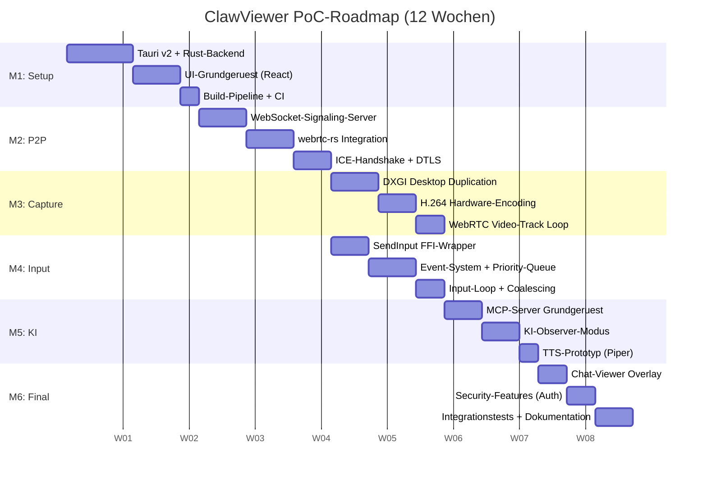
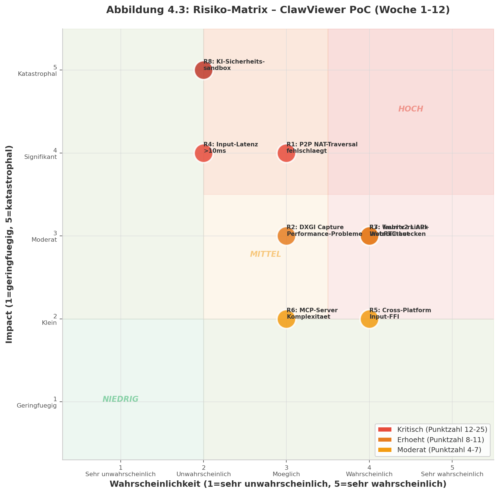

## 4. Proof-of-Concept-Plan

### 4.1 Vision und Ziel des PoC

#### 4.1.1 Zieldefinition: Erste lauffaehige Milestone mit P2P-Handshake, Screen-Capture und Input-Loop

Der Proof-of-Concept (PoC) fuer ClawViewer verfolgt das Ziel, innerhalb von 12 Wochen eine demonstrierbare End-to-End-Pipeline zu etablieren, die die drei Kernfunktionen des Systems integrativ verbindet: Peer-to-Peer-Verbindungsaufbau, Bildschirmerfassung mit Video-Codierung und bidirektionale Eingabeinjektion. Diese drei Komponenten bilden das technische Fundament, auf dem die in den Kapiteln 1 bis 3 analysierte Architektur praktisch validiert wird. Die Architekturanalyse hat gezeigt, dass RustDesk's Kombination aus Google Protobuf v3 fuer das Wire-Protokoll, tokio fuer asynchrone Netzwerkoperationen und sodiumoxide fuer Ed25519-Kryptografie ein vollstaendiges, produktionsreifes Muster bildet, das sich direkt auf ClawViewer uebertragen laesst [^6^]. Der PoC uebernimmt dieses Muster als Master-Blueprint.

Das primaere Ziel des PoC ist nicht die Vollstaendigkeit aller geplanten Features, sondern die technische Validierung der riskantesten Annahmen. Dazu gehoert insbesondere die Hybrid-Architektur aus Tauri v2 WebView-Frontend und Rust-Backend mit webrtc-rs, die in Kapitel 1 als optimale Stack-Entscheidung identifiziert wurde. Tauri's IPC-System (invoke/state/events) ermoeglicht die saubere Trennung zwischen Frontend und Backend; der PoC muss nachweisen, dass Video-Frames und DataChannel-Nachrichten mit ausreichender Geschwindigkeit ueber diese Grenze fliessen koennen [^246^]. Der erste demonstrierbare Meilenstein umfasst den vollstaendigen P2P-Handshake inklusive Signaling-Server-Kommunikation, die Echtzeit-Bildschirmerfassung ueber DXGI (Desktop Duplication API) auf Windows sowie die Injektion von Maus- und Tastaturereignissen via SendInput.

Die sekundaeren Ziele des PoC umfassen die Validierung der Event-Priorisierungsarchitektur, die in Kapitel 3 als wichtigster Differenzierungsfaktor identifiziert wurde. Keines der analysierten Open-Source-Projekte implementiert echte bidirektionale gleichzeitige Steuerung mit Priorisierung; die Forschung zu Shared Autonomy (SARI) zeigt, dass Level-2-Interleaving die beste Success Rate von 80 Prozent erzielt [^494^]. Der PoC implementiert eine erste Version der Priority-Queue mit den Stufen P0 (Emergency) bis P3 (Background), um diesen Forschungstransfer praktisch zu demonstrieren.

#### 4.1.2 Erfolgskriterien: Quantitative Messgroessen

Die Bewertung des PoC erfolgt anhand vierer quantitativer Erfolgskriterien, die sich aus den Latenzanforderungen eines Remote-Desktop-Systems ableiten. Die Werte beruecksichtigen die in Kapitel 2 analysierte Sicherheitsarchitektur, die bestimmte Latenzoverhead (Kryptografie, Permission-Checks) erfordert.

Das erste Kriterium definiert eine Video-Latenz von weniger als 50 Millisekunden (ms) fuer den Roundtrip vom Screen-Capture auf dem Host bis zur Anzeige im Viewer-Fenster. Dieser Wert ergibt sich aus dem Latenz-Budget der WebRTC-Pipeline: Capture (16 ms bei 60 Hz) + Encoding (5-10 ms Hardware) + Network P2P lokal (1-5 ms) + Jitter Buffer (0 ms, deaktiviert) + Decoding (5-10 ms) + Render (16 ms) = 43-57 ms [^321^] [^298^]. Der PoC muss nachweisen, dass dieser Wert im lokalen Netzwerk stabil erreicht wird.

Das zweite Kriterium fordert eine Input-Latenz von weniger als 10 ms fuer die Uebertragung und Injektion von Eingabeereignissen. Dies umfasst den Weg vom Mausklick im Tauri-Frontend ueber den WebRTC-DataChannel (SCTP ueber DTLS) zur SendInput-API auf dem Host. WebRTC's DataChannel fuegt typischerweise weniger als 5 ms Latenz hinzu [^234^]; die verbleibenden 5 ms sind fuer die FFI-Schicht (Tauri IPC + OS-API-Aufrufe) budgetiert.

Das dritte Kriterium verlangt eine stabile P2P-Verbindung mit einer Erfolgsrate von ueber 95 Prozent fuer Verbindungen im selben lokalen Netzwerk. Der P2P-Handshake umfasst ICE-Gathering, Connectivity-Checks und DTLS-Handshake mit einer Gesamtlatenz von 500-700 ms ohne TURN-Relay [^232^]. Der PoC muss demonstrieren, dass dieser Ablauf robust und wiederholbar funktioniert.

Das vierte Kriterium betrifft den KI-Observer-Modus: Der MCP-Server (Model Context Protocol) muss Screenshots des Remote-Desktops ueber ein definiertes Tool-Interface bereitstellen und die Ergebnisse innerhalb von 500 ms zurueckliefern. QuickDesk, als Referenzimplementierung, bietet 40+ MCP-Tools mit einer aehnlichen Architektur [^235^]; der PoC beschraenkt sich auf die fuenf wesentlichsten Tools (screenshot, mouse_click, mouse_move, keyboard_type, get_ui_state).

### 4.2 Meilensteine und Roadmap

Die 12-woechige PoC-Phase ist in sechs zweiwöechige Meilensteine unterteilt. Jeder Meilenstein liefert ein deploybares Inkrement, das unabhaengig getestet werden kann. Die Reihenfolge folgt der technischen Abhaengigkeitskette: Das UI-Grundgeruest (M1) muss vor der P2P-Integration (M2) stehen, die wiederum die Voraussetzung fuer das Streaming (M3) und die Eingabe (M4) bildet.

**Tabelle 4.1: PoC-Meilensteine und Deliverables (Woche 1-12)**

| Milestone | Zeitraum | Kernaufgaben | Deliverables | Abhaengigkeiten |
|-----------|----------|-------------|--------------|-----------------|
| M1: Projekt-Setup | Woche 1-2 | Tauri v2 + Rust-Backend init., UI-Grundgeruest, Build-Pipeline | Kompilierbare Basis-App, Hello-World IPC, CI/CD-Skelett | Keine |
| M2: P2P-Verbindung | Woche 3-4 | WebSocket-Signaling, webrtc-rs Integration, ICE-Handshake | Stabile P2P-Verbindung zwischen zwei Peers, SDP Offer/Answer | M1 |
| M3: Screen-Capture | Woche 5-6 | DXGI-Integration, H.264-Encoding, WebRTC-Video-Track | Echtzeit-Video-Stream mit <50 ms Latenz | M2 |
| M4: Input-Injection | Woche 7-8 | SendInput-Wrapper, Event-System, Priority-Queue | Bidirektionale Eingabe mit <10 ms Latenz, P0-P3-Queue | M2 |
| M5: KI-Integration | Woche 9-10 | MCP-Server-Grundgeruest, Observer-Modus, TTS-Prototyp | MCP-Tools: screenshot, mouse_move, keyboard_type | M3, M4 |
| M6: Integration | Woche 11-12 | Chat-Viewer, Security-Layer, Cross-Platform-Tests | Vollstaendiger PoC mit allen Kernfunktionen | M1-M5 |

Die Tabelle zeigt eine strikte sequentielle Abhaengigkeit zwischen M1 und M2 sowie zwischen M2 und den parallelen Pfaden M3 und M4. Die KI-Integration (M5) benoetigt sowohl Video-Frames (M3) als auch Input-Faehigkeiten (M4), bildet also den letzten grossen Integrationspunkt vor der Finalisierung in M6. Diese Struktur ermoeglicht eine parallele Entwicklung der Streams M3 und M4 ab Woche 5, vorausgesetzt M2 ist termingerecht abgeschlossen.

#### 4.2.1 Milestone 1 (Woche 1-2): Projekt-Setup, Tauri v2 und UI-Grundgeruest

Milestone 1 etabliert die technische Infrastruktur fuer den gesamten PoC. Die Architekturentscheidung aus Kapitel 1 favorisiert Tauri v2 mit Rust-Backend und React-Frontend; dieser Milestone validiert diese Wahl durch eine funktionierende Toolchain. Konkret umfasst M1: (a) Initialisierung des Tauri v2 Projekts mit Cargo-Workspace fuer Multi-Crate-Struktur, (b) Einrichtung des React-Frontends mit TypeScript, (c) Implementierung des ersten Tauri Commands (Ping/Pong) zur IPC-Validierung, (d) Konfiguration der Cross-Compilation Build-Pipeline fuer Windows (primaeres Zielsystem im PoC), und (e) Einrichtung von GitHub Actions fuer CI. Tauri v2's Bundle-Groesse von 3-15 MB (im Vergleich zu 120-200 MB bei Electron) [^259^] wird in diesem Milestone als Baseline gemessen.

#### 4.2.2 Milestone 2 (Woche 3-4): P2P-Verbindung, Signaling-Server und WebRTC-Integration

Milestone 2 implementiert die Netzwerkkommunikation zwischen zwei ClawViewer-Instanzen. Die Analyse in Kapitel 1 hat ergeben, dass der Rust-Backend-Teil mit webrtc-rs eine produktionsreife P2P-Loesung bietet, waehrend das WebView auf Linux keine vollstaendige WebRTC-Implementierung unterstuetzt [^308^]. Daher wird webrtc-rs v0.17.x als Backend-Library verwendet; das Frontend kommuniziert ueber Tauri-Events mit dem Rust-PeerConnection-Objekt. Der Signaling-Server wird als minimalistischer WebSocket-Server in Rust (mit tokio-tungstenite) implementiert, der SDP Offers und Answers zwischen Peers relayed. Der ICE-State-Machine-Flow folgt dem Standard-Pfad: new → gathering → checking → connected → completed [^232^]. TURN-Relay wird als Fallback fuer symmetrisches NAT mit der turn-rs Library (5 GiB/s Single-Thread-Performance) [^313^] vorbereitet, aber nicht vollstaendig im PoC implementiert.

#### 4.2.3 Milestone 3 (Woche 5-6): Windows Screen-Capture, Video-Codec und Streaming-Loop

Milestone 3 realisiert die Video-Pipeline vom Host zum Viewer. Die Code-Analyse in Kapitel 3 hat gezeigt, dass RustDesk's scrap-Crate die DXGI Desktop Duplication API mit automatischem GDI-Fallback verwendet [^34^]. Der PoC uebernimmt dieses Pattern: Die capture-Crate (aequivalent zu scrap) implementiert eine Trait-basierte Abstraktion (ScreenCapture), deren Windows-Implementierung IDXGIOutputDuplication::AcquireNextFrame() aufruft. Die erfassten Frames werden in YUV konvertiert und durch einen H.264-Hardware-Encoder (NVENC ueber FFmpeg-Bindings) geleitet. Die Encoded-Frames werden als RTP-Pakete an die webrtc-rs PeerConnection uebergeben, die den SRTP-verschluesselten Transport zum Remote-Peer durchfuehrt. Auf der Viewer-Seite werden die Frames ueber Tauri's Event-System an das Frontend gestreamt und in einem HTMLVideoElement dargestellt.

#### 4.2.4 Milestone 4 (Woche 7-8): Input-Injection, Event-System und Prioritaets-Queue

Milestone 4 implementiert die Steuerungsrichtung vom Viewer zum Host. Die Analyse hat gezeigt, dass die Windows-Input-Injection ueber SendInput() mit MOUSEINPUT/KEYBDINPUT-Strukturen erfolgt [^114^] und dass Enigo als plattformuebergreifende Abstraktion dient [^42^]. Der PoC erstellt eine eigene Input-Crate (aehnlich Enigo), die ueber Tauri-Commands vom Frontend aufgerufen wird. Das zentrale Innovationselement ist die Event-Priorisierung: Eine BinaryHeap mit Reverse-Ordering verarbeitet Events nach dem Schema P0 (Emergency-Stop) > P1 (Human-Direct-Input) > P2 (AI-Confirmed-Action) > P3 (AI-Autonomous/Background) [^427^]. Der Emergency-Stop wird als globaler Hotkey (Ctrl+Shift+F12) implementiert, der ein AtomicBool setzt, die Queue von AI-Events saeubert und den Control-Mode auf HumanOnly zuruecksetzt.

#### 4.2.5 Milestone 5 (Woche 9-10): MCP-Server-Grundgeruest, KI-Observer-Modus und TTS-Integration

Milestone 5 integriert die KI-Agenten-Schnittstelle. Das Model Context Protocol (MCP), im November 2024 von Anthropic als Open Source eingefuehrt [^232^], wird als universelle Integrations-Schicht verwendet. Der MCP-Server wird als separate Rust-Binaer implementiert, die ueber stdio mit dem KI-Client kommuniziert (JSON-RPC 2.0) [^256^]. Im PoC werden fuenf Tools exponiert: screenshot (liefert base64-kodierte Screenshots), mouse_move, mouse_click, keyboard_type und get_ui_state. Die Sicherheitsanalyse aus Kapitel 2 erfordert ein Permission-Modell nach Risikostufen: Read-Only Operationen (screenshot, get_ui_state) sind automatisch erlaubt, waehrend alle Input-Aktionen eine Bestaetigung durch den Human-Operator erfordern [^400^]. TTS (Text-to-Speech) wird lokal mit Piper TTS (~120 ms Latenz auf Intel i5) [^235^] ueber rodio/cpal implementiert, um Netzwerk-Overhead zu vermeiden.

#### 4.2.6 Milestone 6 (Woche 11-12): Chat-Viewer, Sicherheitsfeatures und Cross-Platform-Tests

Milestone 6 finalisiert den PoC durch Integration aller Komponenten und Hinzufuegen der Sicherheitslayer. Der Chat-Viewer wird als separates Tauri-Fenster (WebviewWindowBuilder mit always_on_top, transparent, decorations=false) [^211^] implementiert und nutzt denselben WebRTC-DataChannel wie Input-Events mit separatem Message-Type (type: "chat"). Die Sicherheitsschicht fuegt Ed25519-Key-Pair-Generierung (ed25519-dalek, 32 Bytes Public Key, 64 Bytes Signatur) [^97^], TOFU (Trust-On-First-Use) mit Fingerprint-Vergleich und Session-Passwort-Generierung hinzu. API-Keys fuer KI-Provider werden im OS-Keyring gespeichert (keyring v4 Crate, DPAPI auf Windows) [^393^]. Cross-Platform-Tests beschraenken sich im PoC auf Windows 10/11 als primaeres Ziel; Linux und macOS werden als sekundaere Ziele mit eingeschraenktem Feature-Set getestet.

### 4.3 Architektur der ersten lauffaehigen Version

#### 4.3.1 Modul-Struktur: Acht Rust-Crates

Die erste lauffaehige Version von ClawViewer gliedert sich in acht Rust-Crates, die als Cargo-Workspace organisiert sind. Diese Aufteilung spiegelt die Schichtenarchitektur wider, die in Kapitel 1 abgeleitet wurde: Trennung von Netzwerk, Erfassung, Codierung, Eingabe, KI-Integration, Sicherheit, Audio und Anwendungslogik. Jede Crate definiert eine klar abgegrenzte Verantwortlichkeit und kommuniziert ueber explizite Trait-Interfaces mit den anderen Crates.

Die network-Crate kapselt die gesamte WebRTC-P2P-Logik auf Basis von webrtc-rs. Sie exponiert eine PeerConnection-Factory, die SDP Offer/Answer erstellen, ICE Candidates sammeln und DataChannels oeffnen kann. Die capture-Crate implementiert die plattformspezifische Bildschirmerfassung (DXGI auf Windows, PipeWire auf Linux, CGDisplay auf macOS) nach dem Vorbild von RustDesk's scrap-Crate [^33^]. Die codec-Crate uebernimmt die Video-Codierung und -Decodierung mit Hardware-Encoder-Auto-Selektion (NVENC > QSV > VAAPI > Software) [^204^]. Die input-Crate stellt die plattformuebergreifende Eingabeinjektion bereit (SendInput auf Windows, uinput auf Linux, CGEvent auf macOS) [^114^]. Die mcp-Crate implementiert den Model Context Protocol Server mit Tool-Registrierung und JSON-RPC-Handler [^232^]. Die security-Crate enthaelt Kryptografie (Ed25519-Signatur, X25519-Key-Exchange), Session-Management und TOFU-Trust-Store [^97^]. Die tts-Crate kapselt die Text-to-Speech-Synthese mit Piper als lokale Engine. Die app-Crate ist das Tauri-Application-Entrypoint, das alle anderen Crates als Dependencies importiert, die Tauri-Commands registriert und den Application-State verwaltet.

#### 4.3.2 Crate-Abhaengigkeiten und Interface-Definitionen

**Tabelle 4.2: Crate-Abhaengigkeiten und Interface-Traits**

| Crate | Dependencies | Kern-Trait | Input-Typen | Output-Typen |
|-------|-------------|------------|-------------|--------------|
| network | webrtc-rs, tokio, serde, protobuf | P2PConnection | SDP, ICE-Candidate, RTP-Packet | Connection-State, Media-Stream |
| capture | windows/DXGI, pipewire, core-graphics | ScreenCapture | Display-ID, Capture-Config | Raw-Frame (NV12/BGRA) |
| codec | hwcodec-FFmpeg, libvpx, aom | VideoEncoder | Raw-Frame, Codec-Config | Encoded-Frame (H264/VP9) |
| input | enigo-Patterns, SendInput, uinput | InputInjector | ClawEvent (P0-P3) | Injection-Result |
| mcp | rmcp, tokio, serde_json | McpServerHandler | Tool-Call-Request | Tool-Result |
| security | ed25519-dalek, x25519-dalek, keyring | CryptoProvider | Plaintext, Peer-ID | Ciphertext, Signature |
| tts | piper-rs, rodio, cpal | TtsEngine | Text-String | Audio-Stream |
| app | Alle obigen, tauri | Application | Tauri-Invoke-Args | Tauri-Command-Result |

Die Abhaengigkeitsstruktur folgt einem gerichteten azyklischen Graphen: Die app-Crate steht an der Spitze und haengt von allen anderen ab. Die security-Crate ist weitgehend unabhaengig und wird von network (fuer DTLS-Signierung), capture (optional fuer verschlusselte Capture-Sessions) und app (fuer Session-Management) verwendet. Die codec-Crate konsumiert Frames von capture und produziert encoded Frames fuer network. Die input-Crate empfaengt Events von app (vom Frontend) und von mcp (vom KI-Agenten), priorisiert sie und fuehrt die OS-Injektion durch. Die mcp-Crate benoetigt Zugriff auf capture (fuer Screenshots) und input (fuer AI-gesteuerte Aktionen), nicht jedoch auf network oder codec.

#### 4.3.3 Frontend-Architektur: React-Komponenten, State-Management und Tauri-IPC-Wrapper

Das Frontend von ClawViewer ist als React-Anwendung mit TypeScript implementiert, die innerhalb des Tauri WebView laeuft. Die Kommunikation mit dem Rust-Backend erfolgt ausschliesslich ueber drei Tauri-IPC-Mechanismen: invoke() fuer Request/Response-Commands, listen() fuer Event-basiertes Streaming vom Backend zum Frontend, und die Channel-API fuer hochvolumige Datenstroeme wie Video-Frames [^208^].

Die Komponentenhierarchie gliedert sich in vier Hauptfenster: Das MainWindow enthaelt den VideoView (HTMLVideoElement fuer den WebRTC-Stream), die ControlStatusBar (Steuerungsmodus-Anzeige) und den Emergency-Stop-Button. Das ChatOverlay ist ein separates transparentes Fenster (always_on_top) fuer Textkommunikation waehrend der Session. Das SettingsWindow konfiguriert Verbindungsparameter, Codecs und KI-Provider. Das ConnectionManager listet gespeicherte Verbindungen mit deren TOFU-Fingerprint-Status auf.

Das State-Management verwendet React Context mit useReducer fuer globale Zustaende (Connection-State, Control-Mode, AI-Activity) und lokale useState-Hooks fuer komponentenspezifische Zustaende. Der Tauri-IPC-Wrapper kapselt alle invoke()-Aufrufe und Event-Listener in einem zentralen ApiService-Modul, das TypeScript-Typen fuer alle Command-Argumente und -Rueckgabewerte definiert. Diese Struktur stellt sicher, dass Frontend- und Backend-Typen durch serde bei der Serialisierung/Deserialisierung konsistent bleiben.

Fuer die Video-Pipeline wird die Channel-API von Tauri v2 verwendet, die einen bidirektionalen Streaming-Kanal mit geringem Overhead zwischen Rust und dem WebView eroeffnet. Im Gegensatz zu einzelnen invoke()-Aufrufen erlaubt die Channel-API das kontinuierliche Senden von Video-Frame-Metadaten ohne den Overhead von seriellen Request/Response-Zyklen. Das Frontend-Event-System nutzt Tauri's emit/listen-Pattern fuer asynchrone Statusupdates: Das Rust-Backend emitted Events wie connection-state-changed, control-mode-transitioned oder ai-activity-update, die im React-Frontend durch zentrale Listener aufgefangen und in den globalen State ueberfuehrt werden. Diese Architektur vermeidet Polling und reduziert die Latenz fuer Statuspropagation auf wenige Millisekunden.

### 4.4 Technische Risiken und Mitigationen

#### 4.4.1 Risiko-Matrix: Acht identifizierte Risiken

Die Risikoanalyse identifiziert acht technische Risiken, die den PoC-Zeitplan oder die Qualitaetsziele gefaehrden koennen. Jedes Risiko wird nach Wahrscheinlichkeit (1-5) und Impact (1-5) bewertet; die Produkt beider Werte ergibt die Risikoprioritaetszahl (RPZ).

**Tabelle 4.3: Risiko-Matrix mit Wahrscheinlichkeit, Impact und Mitigationen**

| ID | Risiko | W | I | RPZ | Mitigation |
|----|--------|---|---|-----|------------|
| R1 | P2P NAT-Traversal schlaegt in >5% der Faelle fehl | 3 | 4 | 12 | TURN-Relay-Server (turn-rs) als Fallback; ICE-Restart-Logik implementieren [^313^] |
| R2 | DXGI Capture verursacht Performance-Einbrueche | 3 | 3 | 9 | GDI-Fallback automatisch aktivieren; Frame-Rate auf 30 FPS begrenzen [^34^] |
| R3 | webrtc-rs API-Aenderungen in v0.18+ | 4 | 3 | 12 | Crate-Version pinnen (v0.17.x); Fork fuer Stabilitaet; str0m als Alternative evaluieren [^302^] |
| R4 | Input-Latenz ueberschreitet 10ms-Budget | 2 | 4 | 8 | Direct Memory Access statt IPC wo moeglich; Input-Coalescing fuer Mouse-Move [^427^] |
| R5 | Cross-Platform Input-FFI komplexer als erwartet | 4 | 2 | 8 | Enigo-Crate als Referenz nutzen; zunaechst Windows-only Fokus [^114^] |
| R6 | MCP-Server Komplexitaet ueberschaetzt Zeitplan | 3 | 2 | 6 | Auf 5 Core-Tools beschraenken; QuickDesk-Pattern als Referenz [^235^] |
| R7 | Tauri v2 Linux WebView-WebRTC-Luecken | 4 | 3 | 12 | webrtc-rs komplett im Backend halten; Frontend nur fuer UI-Rendering [^308^] |
| R8 | KI-Sicherheitssandbox unzureichend fuer PoC | 2 | 5 | 10 | Drei-Schichten-Modell (Env/Permissions/Runtime) inkrementell aufbauen [^377^] |

Die Risikoverteilung zeigt vier Risiken in der erhoehten Kategorie (RPZ 8-12) und eines im kritischen Bereich (R8, RPZ 10). Das hoechste Gesamtrisiko weist R8 (KI-Sicherheitssandbox) auf: Es kombiniert eine katastrophalen Impact (Sicherheitsverletzung durch autonomen KI-Agenten) mit einer moderaten Wahrscheinlichkeit. Die Mitigation besteht in einem inkrementellen Aufbau des dreischichtigen Sicherheitsmodells nach Vorbild von Vellum [^400^]: Environment-Sandboxing (Dateisystem-Isolation), Permission-Enforcement (Tool-Annotationen mit Risk-Leveln) und Runtime-Monitoring (Audit-Log fuer jede Aktion).

Die Risiko-Matrix (Abbildung 4.3) visualisiert die räumliche Verteilung der Risiken. Drei Risiken (R1, R3, R7) konzentrieren sich im rechten oberen Quadranten (erhoehte bis kritische Zone), alle mit Bezug zur WebRTC/P2P-Technologie. Dies bestaetigt die Entscheidung, den P2P-Handshake als fruehesten integrativen Meilenstein (M2, Woche 3-4) zu platzieren, um diese Risiken fruehzeitig zu adressieren. Die zwei Risiken mit niedrigster RPZ (R5, R6) liegen im unteren rechten Bereich und betreffen ueberwiegend die Entwicklungskomplexitaet, nicht die Systemstabilitaet.

#### 4.4.2 Kritischer Pfad-Analyse: Abhaengigkeiten zwischen Modulen

Der kritische Pfad des PoC ist der laengste sequentielle Pfad durch den Meilenstein-Graphen, der die minimale Gesamtdauer bestimmt. Die Analyse ergibt folgende Pfade:

Pfad A (Video-Pipeline): M1 → M2 → M3 → M5 → M6 = 2 + 2 + 2 + 2 + 2 = 10 Wochen
Pfad B (Input-Pipeline): M1 → M2 → M4 → M5 → M6 = 2 + 2 + 2 + 2 + 2 = 10 Wochen
Pfad C (Parallele Integration): M1 → M2 → max(M3, M4) → M5 → M6 = 2 + 2 + 2 + 2 + 2 = 10 Wochen

Der kritische Pfad verlaeuft ueber M1 → M2 → M3/M4 → M5 → M6 mit einer Gesamtdauer von 10 Wochen, wobei 2 Wochen Puffer innerhalb der 12-woechigen Gesamtzeit verbleiben. Die groesste Risikokonzentration liegt auf M2 (P2P-Verbindung): Wenn dieser Meilenstein ueberzogen wird, verschieben sich alle nachfolgenden Aktivitaeten, da sowohl M3 als auch M4 direkt von M2 abhaengen. Die parallele Entwicklung von M3 und M4 ist nur moeglich, wenn M2 termingerecht abgeschlossen wird; andernfalls serialisiert sich der gesamte Rest der Roadmap.

Der zweite Engpass entsteht bei M5 (KI-Integration), das sowohl auf M3 (fuer Screenshot-Tool, das Video-Frames benoetigt) als auch auf M4 (fuer Input-Tools, die Ereignisse in die Queue einspeisen) angewiesen ist. Eine Verzoegerung in einem der parallelen Pfade M3 oder M4 verschiebt automatisch M5. Die Pufferzeit von 2 Wochen ist daher als knapp einzustufen; eine Empfehlung fuer das Projektmanagement ist, M2 mit erhoehter Prioritaet und taeglichen Stand-up-Checks zu ueberwachen.

Zur Risikominimierung auf dem kritischen Pfad empfiehlt sich ein inkrementeller Integrationsansatz: Bereits in Woche 2 (Ende von M1) wird ein minimaler WebSocket-Client prototypisch angebunden, um die Netzwerkkommunikation unabhaengig von der Tauri-App testen zu koennen. Ebenso wird in Woche 4 (M2) ein automatisierter Integrationstest etabliert, der zwei PoC-Instanzen programmatisch verbindet und den ICE-Handshake misst. Diese fruehen Integrationstests dienen als Fruehwarnsystem fuer Verzoegerungen auf dem kritischen Pfad, bevor diese sich auf nachfolgende Meilensteine fortpflanzen koennen.

#### 4.4.3 Fallback-Strategien: WebRTC, Codec und OS-Fallbacks

Der PoC definiert drei Kategorien von Fallback-Strategien, die bei Scheitern der Primaerloesung aktiviert werden.

WebRTC-Fallbacks: Wenn webrtc-rs v0.17.x instabil oder nicht mehr gepflegt ist, steht str0m als Sans-I/O Alternative zur Verfuegung [^302^]. Str0m bietet eine Frame-Level API mit DataChannel-Support, erfordert jedoch mehr manuelle Integration fuer ICE und RTP-Handling. Wenn P2P-Konnektivitaet in bestimmten Netzwerkkonfigurationen (symmetrisches NAT, Corporate Firewalls) nicht erreicht werden kann, wird ein TURN-Relay-Server mit turn-rs (5 GiB/s Single-Thread, Forwarding-Latenz unter 35 Mikrosekunden) [^307^] als Fallback bereitgestellt. Wenn das Tauri-WebView auf Linux keine WebRTC-Unterstuetzung bietet, verbleibt die gesamte WebRTC-Logik im Rust-Backend; das Frontend empfaengt decoded Video-Frames ueber Tauri's Channel-API statt direkt aus einer RTCPeerConnection im Browser-Kontext.

Codec-Fallbacks: Wenn H.264-Hardware-Encoding nicht verfuegbar ist (z.B. aeltere GPUs ohne NVENC/QSV), wird auf VP9-Software-Encoding via libvpx zurueckgefallen. Die Auto-Selektionslogik folgt RustDesk's Prioritaet: H265 > H264 > AV1 > VP9 > VP8 [^204^]. Der PoC implementiert nur H.264 (Hardware) und VP9 (Software); weitere Codecs sind fuer Post-PoC-Phasen geplant. Wenn die Gesamt-Video-Latenz das 50ms-Budget ueberschreitet, wird der Jitter-Buffer auf 0 ms gesetzt (max_playout_delay = 0), was in Tests zu einer Reduktion von ca. 90 ms fuehren kann [^298^].

OS-Fallbacks: Wenn die DXGI Desktop Duplication API nicht verfuegbar ist (z.B. auf aelteren Windows-Versionen ohne DirectX 11), wird auf GDI-BitBlt als Fallback zurueckgegriffen. RustDesk's scrap-Crate implementiert diesen Fallback automatisch [^34^]. Fuer die Input-Injektion ist SendInput() auf Windows die primaere Methode; bei Einschraenkungen (z.B. UAC-Dialoge) wird die UI-Automation-API als Alternative evaluiert. Der PoC beschraenkt sich primaer auf Windows 10/11; Linux- und macOS-Support werden mit reduziertem Feature-Set als sekundaere Ziele verfolgt, wobei PipeWire/CGDisplay fuer Capture und uinput/CGEvent fuer Input als plattformspezifische Backends vorgesehen sind.

Die Kombination dieser Fallback-Strategien stellt sicher, dass der PoC auch unter suboptimalen Bedingungen eine demonstrierbare Pipeline liefern kann. Die Primaerstrategie zielt auf die beste Performance ab (DXGI + H.264 Hardware + P2P direkt), waehrend die Fallback-Kette schrittweise akzeptablere Kompromisse eroeffnet (GDI + VP9 Software + TURN Relay). Diese Abstufung minimiert das Risiko eines kompletten PoC-Scheiterns durch einzelne technische Blocker.

Ein zusaetzlicher Szenario-Fallback betrifft den MCP-Server: Wenn die rmcp-Crate noch nicht stabil genug fuer den PoC ist, wird auf das mcpr-Crate als Alternative zurueckgegriffen, das eine einfachere Server-Konfiguration mit expliziter Tool-Handler-Registrierung bietet [^223^]. Fuer die TTS-Komponente ist Piper TTS die Primaerengine; sollte diese auf dem Zielsystem nicht kompilierbar sein, wird auf die Windows-SAPI5-Schnittstelle als System-Fallback zurueckgegriffen, die ohne externe Dependencies auskommt. Diese mehrschichtige Fallback-Architektur stellt sicher, dass selbst bei simultanen Problemen in mehreren Komponenten stets eine minimale demonstrierbare Konfiguration verfuegbar bleibt.
